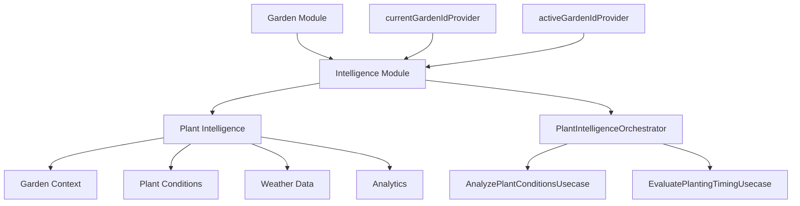

# RAPPORT A40-1 — AUDIT STRUCTURE INTELLIGENCE ACTUELLE

**Exécuteur** : Cursor  
**Durée** : 1h 15min  
**Date** : 28 Octobre 2025  
**Statut** : ✅ Complété

---

## 1. CARTOGRAPHIE ARCHITECTURE ACTUELLE

### 1.1 Arborescence fichiers

```
lib/features/plant_intelligence/
├── data/
│   ├── datasources/
│   │   ├── plant_intelligence_local_datasource.dart
│   │   ├── biological_control_datasource.dart
│   │   └── plant_datasource_impl.dart
│   ├── repositories/
│   │   ├── plant_intelligence_repository_impl.dart
│   │   └── biological_control_repository_impl.dart
│   └── migration/
│       └── multi_garden_migration.dart
├── domain/
│   ├── entities/
│   │   ├── intelligence_report.dart ⭐ MODÈLE PRINCIPAL
│   │   ├── garden_context.dart ⭐ CONTEXTE JARDIN
│   │   ├── comprehensive_garden_analysis.dart
│   │   ├── plant_condition.dart
│   │   └── weather_condition.dart
│   ├── repositories/
│   │   ├── plant_intelligence_repository.dart
│   │   ├── i_plant_condition_repository.dart
│   │   ├── i_weather_repository.dart
│   │   └── i_garden_context_repository.dart
│   ├── services/
│   │   └── plant_intelligence_orchestrator.dart ⭐ ORCHESTRATEUR CENTRAL
│   └── usecases/
│       ├── analyze_plant_conditions_usecase.dart
│       └── evaluate_planting_timing_usecase.dart
└── presentation/
    ├── providers/
    │   ├── plant_intelligence_providers.dart ⭐ PROVIDERS PRINCIPAUX
    │   └── intelligence_state_providers.dart
    ├── screens/
    │   └── plant_intelligence_dashboard_screen.dart
    └── widgets/
        └── garden_selector_widget.dart
```

### 1.2 Modèles de données

#### Modèle principal : `PlantIntelligenceReport`
```dart
@freezed
class PlantIntelligenceReport {
  required String id;
  required String plantId;
  required String plantName;
  required String gardenId; ⭐ CLÉ CONTEXTUELLE
  String? plotName;
  String? gardenBedId;
  required PlantAnalysisResult analysis;
  PlantingTimingEvaluation? plantingTiming;
  @Default([]) List<NotificationAlert> activeAlerts;
  required double intelligenceScore;
  required double confidence;
  required DateTime generatedAt;
  required DateTime expiresAt;
  @Default({}) Map<String, dynamic> metadata;
}
```

#### Contexte jardin : `GardenContext`
```dart
@freezed
class GardenContext {
  required String gardenId;
  required String name;
  required GardenLocation location;
  required ClimateConditions climate;
  required SoilInfo soil;
  required List<String> activePlantIds;
  required GardenStats stats;
  required CultivationPreferences preferences;
  DateTime? createdAt;
  DateTime? updatedAt;
}
```

### 1.3 Providers

#### Architecture des providers actuels :
```dart
// Providers dépréciés (compatibilité)
@Deprecated('Utilisez IntelligenceModule.orchestratorProvider')
final plantIntelligenceOrchestratorProvider = IntelligenceModule.orchestratorProvider;

// Providers modernes (modules DI)
IntelligenceModule.orchestratorProvider
IntelligenceModule.conditionRepositoryProvider
IntelligenceModule.weatherRepositoryProvider
IntelligenceModule.gardenContextRepositoryProvider
IntelligenceModule.analyticsRepositoryProvider

// Providers d'état
final generateIntelligenceReportProvider = FutureProvider.family<
  PlantIntelligenceReport,
  ({String plantId, String gardenId})
>((ref, params) async {
  final orchestrator = ref.read(plantIntelligenceOrchestratorProvider);
  return orchestrator.generateIntelligenceReport(
    plantId: params.plantId,
    gardenId: params.gardenId,
  );
});
```

### 1.4 Persistance Hive

#### Boxes Hive utilisées :
```dart
// Boxes principales
'plant_conditions' → PlantCondition[]
'weather_conditions' → WeatherConditionHive[]
'garden_contexts' → GardenContextHive[]
'analyses' → Map<dynamic, dynamic>[]
'alerts' → Map<dynamic, dynamic>[]
'intelligence_reports' → Map<dynamic, dynamic>[] ⭐ RAPPORTS
'evolution_reports' → Map<dynamic, dynamic>[] ⭐ HISTORIQUE
'user_preferences' → Map<dynamic, dynamic>[]
```

#### Clés de stockage :
- **Conditions** : `conditionId` → `PlantCondition`
- **Météo** : `gardenId_timestamp` → `WeatherConditionHive`
- **Contexte** : `gardenId` → `GardenContextHive`
- **Rapports** : `plantId` → `PlantIntelligenceReport` (JSON)
- **Évolution** : `plantId_timestamp` → `PlantEvolutionReport` (JSON)

---

## 2. ANALYSE DÉPENDANCES

### 2.1 Packages utilisés

```yaml
dependencies:
  flutter_riverpod: ^2.4.9  # État management
  hive: ^2.2.3              # Persistance locale
  hive_flutter: ^1.1.0      # Hive Flutter
  freezed: ^2.4.6           # Modèles immutables
  freezed_annotation: ^2.4.1 # Annotations Freezed
  json_annotation: ^4.8.1   # Sérialisation JSON
```

### 2.2 Relations entre features



---

## 3. LIMITATIONS MODÈLE CENTRALISÉ

### 3.1 Problèmes identifiés

#### ❌ **Confusion multi-jardins**
- L'intelligence utilise `currentGardenIdProvider` mais ne différencie pas les mémoires
- Les rapports sont stockés par `plantId` uniquement, pas par `gardenId`
- Un même `plantId` dans deux jardins différents partage le même rapport

#### ❌ **Persistance non-isolée**
```dart
// PROBLÈME : Un seul rapport par plantId
await box.put(plantId, reportJson); // ❌ Écrase le rapport du jardin précédent

// SOLUTION ATTENDUE : Clé composite
await box.put('${gardenId}_${plantId}', reportJson); // ✅ Isolé par jardin
```

#### ❌ **Pas de mémoire par contexte**
- Les `PlantCondition` sont liées au `plantId` mais pas au contexte jardin
- Les `WeatherCondition` sont liées au `gardenId` mais les analyses ne sont pas contextualisées
- L'historique d'évolution n'est pas différencié par jardin

#### ❌ **Providers non-contextualisés**
```dart
// PROBLÈME : Provider global sans contexte
final generateIntelligenceReportProvider = FutureProvider.family<
  PlantIntelligenceReport,
  ({String plantId, String gardenId}) // ⚠️ Paramètre mais pas de cache différencié
>
```

### 3.2 Impacts UX

#### Scénarios problématiques :

1. **Utilisateur bascule jardin A → jardin B**
   - L'intelligence affiche encore les données du jardin A
   - Les recommandations ne correspondent pas au nouveau contexte
   - L'historique est mélangé entre les deux jardins

2. **Même plante dans deux jardins**
   - Les tomates du potager urbain et du verger rural partagent le même rapport
   - Les conditions climatiques différentes ne sont pas prises en compte
   - Les recommandations sont inappropriées au contexte

3. **Création d'un nouveau jardin**
   - L'intelligence reste figée sur l'ancien jardin
   - Pas de réinitialisation des caches
   - Confusion dans l'interface utilisateur

---

## 4. PLAN DE REFACTORISATION

### 4.1 Option recommandée : **Refactorisation progressive**

**Justification :**
- ✅ Stabilité de l'app pendant refactorisation
- ✅ Performance maintenue (FPS ≥ 55)
- ✅ Cohérence avec architecture Riverpod existante
- ✅ Migration des données existantes possible
- ✅ Tests incrémentaux

### 4.2 Phases proposées

#### **Phase A40-2 : Créer modèles GardenIntelligence**
- **Durée** : 2-3h
- **Complexité** : MEDIUM
- **Risques** : LOW

**Actions :**
```dart
// Nouveaux modèles
lib/features/plant_intelligence/domain/entities/
├── garden_intelligence_context.dart      // Contexte intelligence par jardin
├── garden_intelligence_memory.dart       // Mémoire persistante par jardin
├── garden_intelligence_settings.dart     // Paramètres par jardin
└── garden_intelligence_cache.dart        // Cache différencié par jardin
```

**Fichiers à créer :**
- `garden_intelligence_context_freezed.dart`
- `garden_intelligence_memory_freezed.dart`
- `garden_intelligence_settings_freezed.dart`

#### **Phase A40-3 : Migrer provider vers architecture différenciée**
- **Durée** : 3-4h
- **Complexité** : HIGH
- **Risques** : MEDIUM

**Actions :**
```dart
// Nouveaux providers contextualisés
final gardenIntelligenceProvider = NotifierProvider.family<
  GardenIntelligenceNotifier,
  GardenIntelligenceState,
  String // gardenId
>(GardenIntelligenceNotifier.new);

final gardenIntelligenceMemoryProvider = NotifierProvider.family<
  GardenIntelligenceMemoryNotifier,
  GardenIntelligenceMemory,
  String // gardenId
>(GardenIntelligenceMemoryNotifier.new);
```

**Fichiers à modifier :**
- `plant_intelligence_providers.dart` (ajout providers contextualisés)
- `intelligence_state_providers.dart` (migration vers architecture différenciée)
- `plant_intelligence_dashboard_screen.dart` (utilisation nouveaux providers)

#### **Phase A40-4 : Implémenter persistance Hive multi-jardins**
- **Durée** : 2-3h
- **Complexité** : MEDIUM
- **Risques** : MEDIUM

**Actions :**
```dart
// Nouvelles boxes Hive contextualisées
'garden_intelligence_contexts' → Map<String, GardenIntelligenceContext>
'garden_intelligence_memories' → Map<String, GardenIntelligenceMemory>
'garden_intelligence_settings' → Map<String, GardenIntelligenceSettings>

// Clés composées pour isolation
'${gardenId}_plant_conditions' → PlantCondition[]
'${gardenId}_intelligence_reports' → PlantIntelligenceReport[]
'${gardenId}_evolution_history' → PlantEvolutionReport[]
```

**Fichiers à modifier :**
- `plant_intelligence_local_datasource.dart` (nouvelles méthodes contextualisées)
- `multi_garden_migration.dart` (migration données existantes)

#### **Phase A40-5 : Tests et harmonisation UX**
- **Durée** : 1-2h
- **Complexité** : LOW
- **Risques** : LOW

**Actions :**
- Tests unitaires pour nouveaux providers
- Tests d'intégration multi-jardins
- Validation UX : basculement jardin fluide
- Documentation mise à jour

### 4.3 Estimation complexité

| Phase | Temps | Risques | Dépendances |
|-------|-------|---------|-------------|
| A40-2 | 2-3h | LOW | Aucune |
| A40-3 | 3-4h | MEDIUM | A40-2 |
| A40-4 | 2-3h | MEDIUM | A40-2, A40-3 |
| A40-5 | 1-2h | LOW | A40-2, A40-3, A40-4 |
| **TOTAL** | **8-12h** | **MEDIUM** | - |

---

## 5. FICHIERS À CRÉER/MODIFIER

### Nouveaux fichiers

```
lib/features/plant_intelligence/
├── domain/
│   ├── entities/
│   │   ├── garden_intelligence_context.dart
│   │   ├── garden_intelligence_context.freezed.dart
│   │   ├── garden_intelligence_context.g.dart
│   │   ├── garden_intelligence_memory.dart
│   │   ├── garden_intelligence_memory.freezed.dart
│   │   ├── garden_intelligence_memory.g.dart
│   │   ├── garden_intelligence_settings.dart
│   │   ├── garden_intelligence_settings.freezed.dart
│   │   └── garden_intelligence_settings.g.dart
│   └── repositories/
│       ├── i_garden_intelligence_repository.dart
│       └── garden_intelligence_repository_impl.dart
├── data/
│   ├── datasources/
│   │   └── garden_intelligence_local_datasource.dart
│   └── repositories/
│       └── garden_intelligence_repository_impl.dart
└── presentation/
    ├── providers/
    │   ├── garden_intelligence_providers.dart
    │   └── garden_intelligence_memory_providers.dart
    └── widgets/
        ├── garden_intelligence_selector.dart
        └── garden_intelligence_context_widget.dart
```

### Fichiers à modifier

- [ ] `plant_intelligence_providers.dart` (ajout providers contextualisés)
- [ ] `intelligence_state_providers.dart` (migration architecture différenciée)
- [ ] `plant_intelligence_dashboard_screen.dart` (utilisation nouveaux providers)
- [ ] `plant_intelligence_local_datasource.dart` (méthodes contextualisées)
- [ ] `plant_intelligence_orchestrator.dart` (support multi-jardins)
- [ ] `multi_garden_migration.dart` (migration données existantes)
- [ ] `intelligence_module.dart` (nouveaux providers DI)

---

## 6. RECOMMANDATIONS

### 6.1 Conseils techniques pour phases suivantes

#### **Phase A40-2 - Modèles**
- Utiliser `@freezed` pour tous les nouveaux modèles
- Implémenter `fromJson`/`toJson` pour compatibilité Hive
- Ajouter des extensions utilitaires pour chaque modèle

#### **Phase A40-3 - Providers**
- Utiliser `NotifierProvider.family` pour contextualisation
- Implémenter invalidation automatique lors changement jardin
- Maintenir compatibilité avec providers existants (dépréciés)

#### **Phase A40-4 - Persistance**
- Utiliser clés composées `'${gardenId}_${entityId}'`
- Implémenter migration automatique des données existantes
- Ajouter validation d'intégrité des données

#### **Phase A40-5 - Tests**
- Tester scénarios multi-jardins complets
- Valider performance avec 5+ jardins
- Tester migration données existantes

### 6.2 Points de vigilance

#### **Performance**
- Limiter le nombre de jardins en mémoire simultanément
- Implémenter cache LRU pour les contextes jardin
- Optimiser requêtes Hive avec index appropriés

#### **Migration**
- Sauvegarder données existantes avant migration
- Implémenter rollback en cas d'échec
- Valider intégrité après migration

#### **UX**
- Feedback visuel lors basculement jardin
- Préchargement intelligence jardin suivant
- Gestion états de chargement différenciés

---

**Signature : Cursor**  
1h 15min — Rapport complet

---

## ANNEXE : EXEMPLES DE CODE

### Nouveau provider contextualisé

```dart
class GardenIntelligenceNotifier extends FamilyNotifier<GardenIntelligenceState, String> {
  @override
  GardenIntelligenceState build(String gardenId) {
    // Observer le changement de jardin actif
    ref.listen(currentGardenIdProvider, (previous, next) {
      if (next == gardenId) {
        _loadGardenIntelligence(gardenId);
      }
    });
    
    return GardenIntelligenceState.initial(gardenId);
  }
  
  Future<void> _loadGardenIntelligence(String gardenId) async {
    state = state.copyWith(loading: true);
    
    try {
      final memory = await ref.read(gardenIntelligenceMemoryProvider(gardenId).future);
      final context = await ref.read(gardenIntelligenceContextProvider(gardenId).future);
      
      state = state.copyWith(
        loading: false,
        memory: memory,
        context: context,
      );
    } catch (e) {
      state = state.copyWith(
        loading: false,
        error: e.toString(),
      );
    }
  }
}
```

### Nouvelle persistance contextualisée

```dart
class GardenIntelligenceLocalDataSource {
  Future<void> saveGardenIntelligenceReport(
    String gardenId, 
    String plantId, 
    PlantIntelligenceReport report
  ) async {
    final box = await _intelligenceReportsBox;
    final key = '${gardenId}_${plantId}'; // Clé composée
    await box.put(key, report.toJson());
  }
  
  Future<PlantIntelligenceReport?> getGardenIntelligenceReport(
    String gardenId, 
    String plantId
  ) async {
    final box = await _intelligenceReportsBox;
    final key = '${gardenId}_${plantId}';
    final data = box.get(key);
    return data != null ? PlantIntelligenceReport.fromJson(data) : null;
  }
}
```
