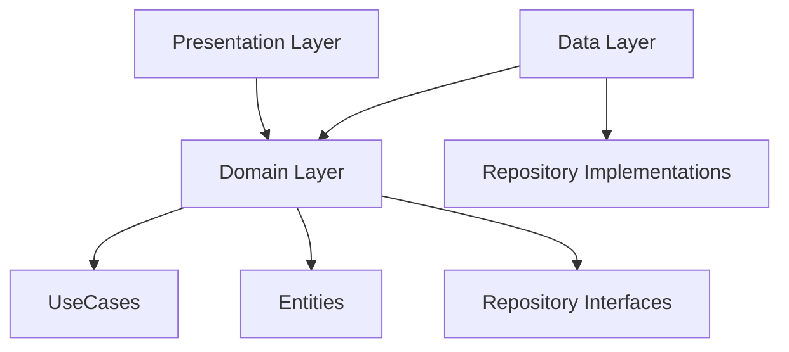
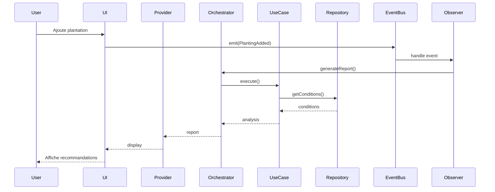

# 🔧 RÉTABLISSEMENT PERMACALENDAR - GUIDE DE REFACTORING STRUCTURÉ

**Date de création:** 8 octobre 2025  
**Version:** 1.0  
**Basé sur:** AUDIT_TECHNIQUE_COMPLET.md  
**Objectif:** Restaurer l'architecture Clean, corriger les violations SOLID, et rendre l'Intelligence Végétale pleinement opérationnelle

---

## 📋 TABLE DES MATIÈRES

1. [Vue d'ensemble et stratégie](#vue-densemble-et-stratégie)
2. [Graphe de dépendances des prompts](#graphe-de-dépendances-des-prompts)
3. [Prompts de rétablissement (ordre d'exécution)](#prompts-de-rétablissement)
   - Prompt 1: Créer les entités domain composites
   - Prompt 2: Compléter les UseCases d'Intelligence Végétale
   - Prompt 3: Créer l'orchestrateur domain
   - Prompt 4: Refactoriser le repository (ISP)
   - Prompt 5: Implémenter les tests unitaires critiques
   - Prompt 6: Connecter Intelligence Végétale aux événements jardin
   - Prompt 7: Nettoyer la duplication de modèles Garden
   - Prompt 8: Restructurer l'injection de dépendances
   - Prompt 9: Normaliser plants.json
   - Prompt 10: Documenter l'architecture
4. [Critères de validation globaux](#critères-de-validation-globaux)
5. [Checklist finale](#checklist-finale)

---

## 🎯 VUE D'ENSEMBLE ET STRATÉGIE

### Contexte

Le projet PermaCalendar v2.1 présente :
- ✅ Une architecture feature-based solide
- ❌ Des violations Clean Architecture et SOLID
- ❌ Une fonctionnalité Intelligence Végétale incomplète (40% opérationnelle)
- ⚠️ Une duplication massive de modèles
- ⚠️ Un manque de tests critiques

### Stratégie de rétablissement

**Approche : PROGRESSIVE ET INCRÉMENTALE**

Nous adoptons une approche en 10 étapes ordonnées, chacune apportant une amélioration incrémentale sans casser l'existant. Chaque prompt est conçu pour être exécuté par une instance d'IA indépendante, avec une vision claire de l'objectif, des fichiers concernés, et des critères d'acceptation.

**Principes directeurs :**
1. ✅ **Non-destructif** : Ne jamais supprimer avant d'avoir migré
2. ✅ **Testable** : Chaque modification doit être testable
3. ✅ **Incrémental** : Chaque prompt apporte de la valeur immédiate
4. ✅ **Documenté** : Chaque changement doit être expliqué
5. ✅ **Compatible** : Maintenir la compatibilité pendant la migration

### Durée estimée totale

**6 semaines** (30 jours ouvrés) avec 10 prompts répartis comme suit :
- Prompts 1-3 : **Semaine 1-2** (Intelligence Végétale opérationnelle)
- Prompts 4-5 : **Semaine 3** (Refactoring + Tests)
- Prompts 6-7 : **Semaine 4** (Intégration + Nettoyage)
- Prompts 8-9 : **Semaine 5** (DI + Normalisation données)
- Prompt 10 : **Semaine 6** (Documentation)

---

## 📊 GRAPHE DE DÉPENDANCES DES PROMPTS

```
Prompt 1 (Entités domain)
    ↓
Prompt 2 (UseCases) ← dépend de Prompt 1
    ↓
Prompt 3 (Orchestrator) ← dépend de Prompt 2
    ↓
    ├─→ Prompt 4 (Repository ISP) ← peut démarrer après Prompt 3
    ├─→ Prompt 5 (Tests) ← dépend de Prompt 2
    └─→ Prompt 6 (Intégration) ← dépend de Prompt 3
    
Prompt 7 (Modèles) ← indépendant, peut démarrer après Prompt 3
    ↓
Prompt 8 (DI) ← dépend de Prompts 3, 4, 7

Prompt 9 (plants.json) ← indépendant, peut démarrer immédiatement

Prompt 10 (Documentation) ← doit être le dernier
```

**Ordre d'exécution recommandé :**
1. **Séquence critique** : Prompts 1 → 2 → 3 (séquentiels, bloquants)
2. **Parallélisation possible** : Prompts 4, 5, 6, 7, 9 (après Prompt 3)
3. **Consolidation** : Prompt 8 (après Prompts 4, 7)
4. **Finalisation** : Prompt 10 (dernier)

---

## 🔧 PROMPTS DE RÉTABLISSEMENT

---

### ⚡ PROMPT 1 : Créer les entités domain composites

**Priorité :** 🔴 CRITIQUE  
**Durée estimée :** 2 jours  
**Dépendances :** Aucune  
**Impact :** ⭐⭐⭐

#### Objectif

Créer les entités domain manquantes pour encapsuler les résultats d'analyse de l'Intelligence Végétale. Actuellement, `AnalyzePlantConditionsUsecase` retourne seulement une `PlantCondition` (température) au lieu d'un résultat d'analyse complet.

#### Contexte technique

**Fichiers à lire pour comprendre le contexte :**
- `lib/features/plant_intelligence/domain/entities/plant_condition.dart`
- `lib/features/plant_intelligence/domain/entities/recommendation.dart`
- `lib/features/plant_intelligence/domain/entities/notification_alert.dart`
- `lib/features/plant_intelligence/domain/usecases/analyze_plant_conditions_usecase.dart` (ligne 47 : TODO)

**Problème actuel :**
```dart
// analyze_plant_conditions_usecase.dart:47
// IMPLÉMENTATION PARTIELLE : Retourner la condition de température
// TODO: Dans une implémentation complète, retourner une entité composite
return temperatureCondition;  // ❌ Seulement température!
```

#### Tâches à réaliser

##### 1. Créer l'entité `PlantAnalysisResult`

**Fichier à créer :** `lib/features/plant_intelligence/domain/entities/analysis_result.dart`

```dart
import 'package:freezed_annotation/freezed_annotation.dart';
import 'plant_condition.dart';

part 'analysis_result.freezed.dart';
part 'analysis_result.g.dart';

/// Résultat complet d'une analyse de plante
/// 
/// Encapsule toutes les conditions analysées (température, humidité, lumière, sol)
/// ainsi qu'un état de santé global calculé
@freezed
class PlantAnalysisResult with _$PlantAnalysisResult {
  const factory PlantAnalysisResult({
    /// ID unique de l'analyse
    required String id,
    
    /// ID de la plante analysée
    required String plantId,
    
    /// Condition de température
    required PlantCondition temperature,
    
    /// Condition d'humidité
    required PlantCondition humidity,
    
    /// Condition de luminosité
    required PlantCondition light,
    
    /// Condition du sol
    required PlantCondition soil,
    
    /// État de santé global calculé (excellent, good, fair, poor, critical)
    required ConditionStatus overallHealth,
    
    /// Score de santé (0-100)
    required double healthScore,
    
    /// Liste des avertissements détectés
    required List<String> warnings,
    
    /// Liste des points positifs
    required List<String> strengths,
    
    /// Recommandations d'action prioritaires
    required List<String> priorityActions,
    
    /// Confidence de l'analyse (0-1)
    required double confidence,
    
    /// Date de l'analyse
    required DateTime analyzedAt,
    
    /// Métadonnées additionnelles
    @Default({}) Map<String, dynamic> metadata,
  }) = _PlantAnalysisResult;
  
  factory PlantAnalysisResult.fromJson(Map<String, dynamic> json) =>
      _$PlantAnalysisResultFromJson(json);
}

/// Extension pour calculer des métriques dérivées
extension PlantAnalysisResultExtension on PlantAnalysisResult {
  /// Vérifie si l'analyse indique un état critique nécessitant action immédiate
  bool get isCritical => overallHealth == ConditionStatus.critical || 
                         overallHealth == ConditionStatus.poor;
  
  /// Vérifie si la plante est en bonne santé
  bool get isHealthy => overallHealth == ConditionStatus.excellent || 
                        overallHealth == ConditionStatus.good;
  
  /// Nombre total de conditions critiques
  int get criticalConditionsCount {
    int count = 0;
    if (temperature.status == ConditionStatus.critical) count++;
    if (humidity.status == ConditionStatus.critical) count++;
    if (light.status == ConditionStatus.critical) count++;
    if (soil.status == ConditionStatus.critical) count++;
    return count;
  }
  
  /// Récupère la condition la plus critique
  PlantCondition get mostCriticalCondition {
    final conditions = [temperature, humidity, light, soil];
    conditions.sort((a, b) => a.status.index.compareTo(b.status.index));
    return conditions.first;
  }
}
```

##### 2. Créer l'entité `PlantIntelligenceReport`

**Fichier à créer :** `lib/features/plant_intelligence/domain/entities/intelligence_report.dart`

```dart
import 'package:freezed_annotation/freezed_annotation.dart';
import 'analysis_result.dart';
import 'recommendation.dart';
import 'notification_alert.dart';

part 'intelligence_report.freezed.dart';
part 'intelligence_report.g.dart';

/// Rapport complet d'intelligence végétale pour une plante
/// 
/// Combine l'analyse des conditions, les recommandations, le timing de plantation,
/// et les alertes actives en un seul rapport cohérent
@freezed
class PlantIntelligenceReport with _$PlantIntelligenceReport {
  const factory PlantIntelligenceReport({
    /// ID unique du rapport
    required String id,
    
    /// ID de la plante
    required String plantId,
    
    /// Nom commun de la plante
    required String plantName,
    
    /// ID du jardin
    required String gardenId,
    
    /// Résultat de l'analyse des conditions
    required PlantAnalysisResult analysis,
    
    /// Liste des recommandations générées
    required List<Recommendation> recommendations,
    
    /// Évaluation du timing de plantation
    PlantingTimingEvaluation? plantingTiming,
    
    /// Alertes actives pour cette plante
    @Default([]) List<NotificationAlert> activeAlerts,
    
    /// Score global d'intelligence (0-100)
    required double intelligenceScore,
    
    /// Confiance globale du rapport (0-1)
    required double confidence,
    
    /// Date de génération du rapport
    required DateTime generatedAt,
    
    /// Date d'expiration du rapport (après laquelle il devrait être régénéré)
    required DateTime expiresAt,
    
    /// Métadonnées additionnelles
    @Default({}) Map<String, dynamic> metadata,
  }) = _PlantIntelligenceReport;
  
  factory PlantIntelligenceReport.fromJson(Map<String, dynamic> json) =>
      _$PlantIntelligenceReportFromJson(json);
}

/// Évaluation du timing de plantation
@freezed
class PlantingTimingEvaluation with _$PlantingTimingEvaluation {
  const factory PlantingTimingEvaluation({
    /// Est-ce le bon moment pour planter?
    required bool isOptimalTime,
    
    /// Score de timing (0-100)
    required double timingScore,
    
    /// Raison de la recommandation
    required String reason,
    
    /// Date optimale recommandée pour planter (si pas maintenant)
    DateTime? optimalPlantingDate,
    
    /// Facteurs favorables actuels
    @Default([]) List<String> favorableFactors,
    
    /// Facteurs défavorables actuels
    @Default([]) List<String> unfavorableFactors,
    
    /// Risques identifiés si plantation maintenant
    @Default([]) List<String> risks,
  }) = _PlantingTimingEvaluation;
  
  factory PlantingTimingEvaluation.fromJson(Map<String, dynamic> json) =>
      _$PlantingTimingEvaluationFromJson(json);
}

/// Extension pour faciliter l'utilisation du rapport
extension PlantIntelligenceReportExtension on PlantIntelligenceReport {
  /// Vérifie si le rapport nécessite une action urgente
  bool get requiresUrgentAction => 
      analysis.isCritical || 
      activeAlerts.any((alert) => alert.priority == NotificationPriority.critical);
  
  /// Récupère les recommandations par priorité
  List<Recommendation> getRecommendationsByPriority(String priority) {
    return recommendations.where((r) => r.priority == priority).toList();
  }
  
  /// Récupère les recommandations non appliquées
  List<Recommendation> get pendingRecommendations {
    return recommendations.where((r) => r.status != RecommendationStatus.applied).toList();
  }
  
  /// Vérifie si le rapport est encore valide
  bool get isExpired => DateTime.now().isAfter(expiresAt);
  
  /// Durée de validité restante
  Duration get remainingValidity => expiresAt.difference(DateTime.now());
}
```

##### 3. Mettre à jour les entités existantes si nécessaire

**Vérifier et compléter :** `lib/features/plant_intelligence/domain/entities/recommendation.dart`

S'assurer que l'entité `Recommendation` a bien les propriétés :
- `status` (RecommendationStatus : pending, applied, ignored)
- `priority` (String : high, medium, low)
- `appliedAt` (DateTime?)
- `ignoredAt` (DateTime?)

##### 4. Générer le code Freezed

Exécuter :
```bash
flutter pub run build_runner build --delete-conflicting-outputs
```

#### Critères d'acceptation

✅ **Critère 1 :** L'entité `PlantAnalysisResult` existe et compile sans erreur  
✅ **Critère 2 :** L'entité `PlantIntelligenceReport` existe et compile sans erreur  
✅ **Critère 3 :** L'entité `PlantingTimingEvaluation` existe et compile sans erreur  
✅ **Critère 4 :** Les fichiers `.freezed.dart` et `.g.dart` sont générés avec succès  
✅ **Critère 5 :** Les extensions des entités fournissent des méthodes utiles  
✅ **Critère 6 :** Aucune erreur de linter après génération  
✅ **Critère 7 :** Les entités sont documentées (dartdoc comments)

#### Fichiers créés

- ✅ `lib/features/plant_intelligence/domain/entities/analysis_result.dart`
- ✅ `lib/features/plant_intelligence/domain/entities/analysis_result.freezed.dart` (généré)
- ✅ `lib/features/plant_intelligence/domain/entities/analysis_result.g.dart` (généré)
- ✅ `lib/features/plant_intelligence/domain/entities/intelligence_report.dart`
- ✅ `lib/features/plant_intelligence/domain/entities/intelligence_report.freezed.dart` (généré)
- ✅ `lib/features/plant_intelligence/domain/entities/intelligence_report.g.dart` (généré)

#### Validation

Créer un test simple pour valider :

**Fichier :** `test/features/plant_intelligence/domain/entities/analysis_result_test.dart`

```dart
import 'package:flutter_test/flutter_test.dart';
import 'package:permacalendar/features/plant_intelligence/domain/entities/analysis_result.dart';
import 'package:permacalendar/features/plant_intelligence/domain/entities/plant_condition.dart';

void main() {
  group('PlantAnalysisResult', () {
    test('should create a valid PlantAnalysisResult', () {
      final result = PlantAnalysisResult(
        id: 'test_1',
        plantId: 'tomato',
        temperature: _createMockCondition(ConditionStatus.good),
        humidity: _createMockCondition(ConditionStatus.excellent),
        light: _createMockCondition(ConditionStatus.good),
        soil: _createMockCondition(ConditionStatus.fair),
        overallHealth: ConditionStatus.good,
        healthScore: 75.0,
        warnings: ['Surveiller l\'arrosage'],
        strengths: ['Température optimale'],
        priorityActions: [],
        confidence: 0.85,
        analyzedAt: DateTime.now(),
      );
      
      expect(result.isHealthy, true);
      expect(result.isCritical, false);
    });
    
    test('should detect critical status correctly', () {
      final result = PlantAnalysisResult(
        id: 'test_2',
        plantId: 'tomato',
        temperature: _createMockCondition(ConditionStatus.critical),
        humidity: _createMockCondition(ConditionStatus.poor),
        light: _createMockCondition(ConditionStatus.fair),
        soil: _createMockCondition(ConditionStatus.fair),
        overallHealth: ConditionStatus.critical,
        healthScore: 30.0,
        warnings: ['Température critique!'],
        strengths: [],
        priorityActions: ['Protéger du gel immédiatement'],
        confidence: 0.90,
        analyzedAt: DateTime.now(),
      );
      
      expect(result.isCritical, true);
      expect(result.criticalConditionsCount, 1);
    });
  });
}

PlantCondition _createMockCondition(ConditionStatus status) {
  return PlantCondition(
    id: 'mock',
    plantId: 'test',
    type: ConditionType.temperature,
    status: status,
    value: 20.0,
    optimalValue: 22.0,
    minValue: 15.0,
    maxValue: 28.0,
    unit: '°C',
    description: 'Test condition',
    recommendations: [],
    measuredAt: DateTime.now(),
    createdAt: DateTime.now(),
  );
}
```

---

### ⚡ PROMPT 2 : Compléter les UseCases d'Intelligence Végétale

**Priorité :** 🔴 CRITIQUE  
**Durée estimée :** 3 jours  
**Dépendances :** Prompt 1 (entités composites)  
**Impact :** ⭐⭐⭐

#### Objectif

Compléter les UseCases partiellement implémentés pour qu'ils retournent des résultats complets et utilisent les nouvelles entités domain créées dans le Prompt 1.

#### Contexte technique

**Fichiers actuels à modifier :**
- `lib/features/plant_intelligence/domain/usecases/analyze_plant_conditions_usecase.dart` (partiel)
- `lib/features/plant_intelligence/domain/usecases/generate_recommendations_usecase.dart` (à implémenter)
- `lib/features/plant_intelligence/domain/usecases/evaluate_planting_timing_usecase.dart` (à implémenter)

**Problèmes actuels :**
1. `AnalyzePlantConditionsUsecase` ne retourne que la température
2. `GenerateRecommendationsUsecase` reçoit une liste vide de conditions
3. `EvaluatePlantingTimingUsecase` n'est pas pleinement implémenté

#### Tâches à réaliser

##### 1. Modifier `AnalyzePlantConditionsUsecase`

**Fichier à modifier :** `lib/features/plant_intelligence/domain/usecases/analyze_plant_conditions_usecase.dart`

**Changements :**

```dart
import 'package:permacalendar/features/plant_intelligence/domain/entities/analysis_result.dart'; // NOUVEAU
// ... autres imports existants

class AnalyzePlantConditionsUsecase {
  const AnalyzePlantConditionsUsecase();

  /// Exécute l'analyse complète des conditions pour une plante donnée
  /// 
  /// [plant] - La plante à analyser
  /// [weather] - Les conditions météorologiques actuelles
  /// [garden] - Le contexte du jardin
  /// 
  /// Retourne un [PlantAnalysisResult] avec l'analyse complète
  Future<PlantAnalysisResult> execute({  // ✅ CHANGÉ : PlantCondition → PlantAnalysisResult
    required PlantFreezed plant,
    required WeatherCondition weather,
    required GardenContext garden,
  }) async {
    try {
      // Validation des paramètres d'entrée
      _validateInputs(plant, weather, garden);

      // Analyse de la température
      final temperatureCondition = _createTemperatureCondition(plant, weather);
      
      // Analyse de l'humidité
      final humidityCondition = _createHumidityCondition(plant, weather);
      
      // Analyse de la luminosité
      final lightCondition = _createLightCondition(plant, garden);
      
      // Analyse du sol
      final soilCondition = _createSoilCondition(plant, garden);

      // ✅ NOUVEAU : Calculer l'état de santé global
      final overallHealth = _calculateOverallHealth([
        temperatureCondition,
        humidityCondition,
        lightCondition,
        soilCondition,
      ]);
      
      // ✅ NOUVEAU : Calculer le score de santé
      final healthScore = _calculateHealthScore([
        temperatureCondition,
        humidityCondition,
        lightCondition,
        soilCondition,
      ]);
      
      // ✅ NOUVEAU : Générer warnings et strengths
      final warnings = _generateWarnings([
        temperatureCondition,
        humidityCondition,
        lightCondition,
        soilCondition,
      ]);
      
      final strengths = _generateStrengths([
        temperatureCondition,
        humidityCondition,
        lightCondition,
        soilCondition,
      ]);
      
      final priorityActions = _generatePriorityActions([
        temperatureCondition,
        humidityCondition,
        lightCondition,
        soilCondition,
      ]);
      
      // ✅ NOUVEAU : Créer le résultat composite
      return PlantAnalysisResult(
        id: '${plant.id}_analysis_${DateTime.now().millisecondsSinceEpoch}',
        plantId: plant.id,
        temperature: temperatureCondition,
        humidity: humidityCondition,
        light: lightCondition,
        soil: soilCondition,
        overallHealth: overallHealth,
        healthScore: healthScore,
        warnings: warnings,
        strengths: strengths,
        priorityActions: priorityActions,
        confidence: _calculateConfidence(weather, garden),
        analyzedAt: DateTime.now(),
        metadata: {
          'weatherAge': DateTime.now().difference(weather.measuredAt).inHours,
          'gardenId': garden.gardenId,
        },
      );
    } catch (e) {
      throw Exception('Erreur lors de l\'analyse des conditions pour ${plant.commonName}: $e');
    }
  }
  
  // ✅ NOUVELLES MÉTHODES PRIVÉES
  
  /// Calcule l'état de santé global basé sur toutes les conditions
  ConditionStatus _calculateOverallHealth(List<PlantCondition> conditions) {
    // Si une condition est critique, l'état global est critique
    if (conditions.any((c) => c.status == ConditionStatus.critical)) {
      return ConditionStatus.critical;
    }
    
    // Si plus de la moitié sont poor ou critical, l'état est poor
    final poorOrCritical = conditions.where(
      (c) => c.status == ConditionStatus.poor || c.status == ConditionStatus.critical
    ).length;
    if (poorOrCritical >= conditions.length / 2) {
      return ConditionStatus.poor;
    }
    
    // Si toutes sont excellent, l'état est excellent
    if (conditions.every((c) => c.status == ConditionStatus.excellent)) {
      return ConditionStatus.excellent;
    }
    
    // Si la majorité est good ou excellent, l'état est good
    final goodOrExcellent = conditions.where(
      (c) => c.status == ConditionStatus.good || c.status == ConditionStatus.excellent
    ).length;
    if (goodOrExcellent >= conditions.length * 0.7) {
      return ConditionStatus.good;
    }
    
    // Sinon, l'état est fair
    return ConditionStatus.fair;
  }
  
  /// Calcule le score de santé (0-100) basé sur toutes les conditions
  double _calculateHealthScore(List<PlantCondition> conditions) {
    final scores = conditions.map((condition) {
      switch (condition.status) {
        case ConditionStatus.excellent:
          return 100.0;
        case ConditionStatus.good:
          return 80.0;
        case ConditionStatus.fair:
          return 60.0;
        case ConditionStatus.poor:
          return 40.0;
        case ConditionStatus.critical:
          return 20.0;
      }
    });
    
    return scores.reduce((a, b) => a + b) / conditions.length;
  }
  
  /// Génère la liste des avertissements basés sur les conditions critiques/poor
  List<String> _generateWarnings(List<PlantCondition> conditions) {
    final warnings = <String>[];
    
    for (final condition in conditions) {
      if (condition.status == ConditionStatus.critical || 
          condition.status == ConditionStatus.poor) {
        warnings.add('${_getConditionTypeName(condition.type)} : ${condition.description}');
      }
    }
    
    return warnings;
  }
  
  /// Génère la liste des points forts basés sur les conditions excellent/good
  List<String> _generateStrengths(List<PlantCondition> conditions) {
    final strengths = <String>[];
    
    for (final condition in conditions) {
      if (condition.status == ConditionStatus.excellent || 
          condition.status == ConditionStatus.good) {
        strengths.add('${_getConditionTypeName(condition.type)} optimale');
      }
    }
    
    return strengths;
  }
  
  /// Génère les actions prioritaires basées sur les conditions critiques
  List<String> _generatePriorityActions(List<PlantCondition> conditions) {
    final actions = <String>[];
    
    for (final condition in conditions) {
      if (condition.status == ConditionStatus.critical) {
        // Extraire la première recommandation comme action prioritaire
        if (condition.recommendations.isNotEmpty) {
          actions.add(condition.recommendations.first);
        }
      }
    }
    
    return actions;
  }
  
  /// Calcule la confiance de l'analyse basée sur la fraîcheur des données
  double _calculateConfidence(WeatherCondition weather, GardenContext garden) {
    final weatherAge = DateTime.now().difference(weather.measuredAt).inHours;
    
    // Confiance diminue avec l'âge des données météo
    if (weatherAge < 1) return 0.95;
    if (weatherAge < 6) return 0.85;
    if (weatherAge < 12) return 0.75;
    if (weatherAge < 24) return 0.65;
    return 0.50;
  }
  
  /// Retourne le nom lisible d'un type de condition
  String _getConditionTypeName(ConditionType type) {
    switch (type) {
      case ConditionType.temperature:
        return 'Température';
      case ConditionType.humidity:
        return 'Humidité';
      case ConditionType.light:
        return 'Luminosité';
      case ConditionType.soil:
        return 'Sol';
      default:
        return type.toString();
    }
  }
  
  // ... (garder toutes les méthodes existantes : _createTemperatureCondition, etc.)
}
```

##### 2. Implémenter `GenerateRecommendationsUsecase`

**Fichier à modifier :** `lib/features/plant_intelligence/domain/usecases/generate_recommendations_usecase.dart`

**Implémentation complète :**

```dart
import 'package:permacalendar/features/plant_intelligence/domain/entities/plant_condition.dart';
import 'package:permacalendar/features/plant_intelligence/domain/entities/weather_condition.dart';
import 'package:permacalendar/features/plant_intelligence/domain/entities/garden_context.dart';
import 'package:permacalendar/features/plant_intelligence/domain/entities/recommendation.dart';
import 'package:permacalendar/features/plant_intelligence/domain/entities/analysis_result.dart';
import 'package:permacalendar/features/plant_catalog/domain/entities/plant_entity.dart';
import 'package:uuid/uuid.dart';

/// Use case pour générer des recommandations intelligentes basées sur l'analyse
class GenerateRecommendationsUsecase {
  const GenerateRecommendationsUsecase();

  /// Génère des recommandations personnalisées pour une plante
  /// 
  /// [plant] - La plante concernée
  /// [analysisResult] - Résultat de l'analyse des conditions
  /// [weather] - Conditions météorologiques actuelles
  /// [garden] - Contexte du jardin
  /// [historicalConditions] - Historique des conditions (optionnel)
  /// 
  /// Retourne une liste de [Recommendation] priorisées
  Future<List<Recommendation>> execute({
    required PlantFreezed plant,
    required PlantAnalysisResult analysisResult,
    required WeatherCondition weather,
    required GardenContext garden,
    List<PlantCondition>? historicalConditions,
  }) async {
    final recommendations = <Recommendation>[];
    final uuid = const Uuid();
    
    // 1. Recommandations basées sur les conditions critiques
    recommendations.addAll(_generateCriticalRecommendations(
      plant: plant,
      analysisResult: analysisResult,
      uuid: uuid,
    ));
    
    // 2. Recommandations basées sur la météo
    recommendations.addAll(_generateWeatherRecommendations(
      plant: plant,
      weather: weather,
      analysisResult: analysisResult,
      uuid: uuid,
    ));
    
    // 3. Recommandations basées sur le calendrier cultural
    recommendations.addAll(_generateSeasonalRecommendations(
      plant: plant,
      garden: garden,
      uuid: uuid,
    ));
    
    // 4. Recommandations basées sur l'historique (si disponible)
    if (historicalConditions != null && historicalConditions.isNotEmpty) {
      recommendations.addAll(_generateHistoricalRecommendations(
        plant: plant,
        historicalConditions: historicalConditions,
        uuid: uuid,
      ));
    }
    
    // 5. Trier par priorité (critical > high > medium > low)
    recommendations.sort((a, b) => _getPriorityWeight(b.priority).compareTo(_getPriorityWeight(a.priority)));
    
    return recommendations;
  }
  
  /// Génère des recommandations pour les conditions critiques
  List<Recommendation> _generateCriticalRecommendations({
    required PlantFreezed plant,
    required PlantAnalysisResult analysisResult,
    required Uuid uuid,
  }) {
    final recommendations = <Recommendation>[];
    
    // Température critique
    if (analysisResult.temperature.status == ConditionStatus.critical) {
      recommendations.add(Recommendation(
        id: uuid.v4(),
        plantId: plant.id,
        type: RecommendationType.protection,
        priority: RecommendationPriority.critical,
        title: 'Protéger du froid/chaleur extrême',
        description: analysisResult.temperature.recommendations.join('. '),
        actionSteps: [
          'Vérifier la température actuelle',
          'Installer une protection si nécessaire (voile, ombrage)',
          'Surveiller l\'évolution',
        ],
        expectedImpact: 'Évite le stress thermique et potentiellement la mort de la plante',
        effort: RecommendationEffort.medium,
        status: RecommendationStatus.pending,
        createdAt: DateTime.now(),
        validUntil: DateTime.now().add(const Duration(days: 3)),
      ));
    }
    
    // Humidité critique
    if (analysisResult.humidity.status == ConditionStatus.critical) {
      recommendations.add(Recommendation(
        id: uuid.v4(),
        plantId: plant.id,
        type: RecommendationType.watering,
        priority: RecommendationPriority.critical,
        title: 'Ajuster l\'arrosage immédiatement',
        description: analysisResult.humidity.recommendations.join('. '),
        actionSteps: [
          'Vérifier l\'humidité du sol',
          'Arroser ou améliorer le drainage selon le cas',
          'Surveiller quotidiennement',
        ],
        expectedImpact: 'Prévient le dessèchement ou la pourriture des racines',
        effort: RecommendationEffort.low,
        status: RecommendationStatus.pending,
        createdAt: DateTime.now(),
        validUntil: DateTime.now().add(const Duration(days: 2)),
      ));
    }
    
    // Luminosité critique
    if (analysisResult.light.status == ConditionStatus.critical) {
      recommendations.add(Recommendation(
        id: uuid.v4(),
        plantId: plant.id,
        type: RecommendationType.positioning,
        priority: RecommendationPriority.high,
        title: 'Repositionner la plante',
        description: analysisResult.light.recommendations.join('. '),
        actionSteps: [
          'Identifier un emplacement avec meilleure exposition',
          'Déplacer la plante si possible',
          'Ou installer un éclairage/ombrage artificiel',
        ],
        expectedImpact: 'Améliore la croissance et la santé de la plante',
        effort: RecommendationEffort.high,
        status: RecommendationStatus.pending,
        createdAt: DateTime.now(),
        validUntil: DateTime.now().add(const Duration(days: 7)),
      ));
    }
    
    // Sol critique
    if (analysisResult.soil.status == ConditionStatus.critical) {
      recommendations.add(Recommendation(
        id: uuid.v4(),
        plantId: plant.id,
        type: RecommendationType.soilImprovement,
        priority: RecommendationPriority.high,
        title: 'Améliorer la qualité du sol',
        description: analysisResult.soil.recommendations.join('. '),
        actionSteps: [
          'Ajouter du compost ou amendement organique',
          'Vérifier le pH si possible',
          'Pailler pour protéger',
        ],
        expectedImpact: 'Améliore la nutrition et la structure du sol',
        effort: RecommendationEffort.medium,
        status: RecommendationStatus.pending,
        createdAt: DateTime.now(),
        validUntil: DateTime.now().add(const Duration(days: 14)),
      ));
    }
    
    return recommendations;
  }
  
  /// Génère des recommandations basées sur les prévisions météo
  List<Recommendation> _generateWeatherRecommendations({
    required PlantFreezed plant,
    required WeatherCondition weather,
    required PlantAnalysisResult analysisResult,
    required Uuid uuid,
  }) {
    final recommendations = <Recommendation>[];
    
    // Risque de gel
    if (weather.value < 5.0 && plant.metadata['frostSensitive'] == true) {
      recommendations.add(Recommendation(
        id: uuid.v4(),
        plantId: plant.id,
        type: RecommendationType.protection,
        priority: RecommendationPriority.critical,
        title: 'Risque de gel détecté',
        description: 'La température va descendre en dessous de 5°C. ${plant.commonName} est sensible au gel.',
        actionSteps: [
          'Installer un voile d\'hivernage',
          'Pailler abondamment',
          'Rentrer les plantes en pot si possible',
        ],
        expectedImpact: 'Protection contre le gel qui pourrait endommager ou tuer la plante',
        effort: RecommendationEffort.medium,
        status: RecommendationStatus.pending,
        createdAt: DateTime.now(),
        validUntil: DateTime.now().add(const Duration(days: 2)),
      ));
    }
    
    // Forte chaleur
    if (weather.value > 30.0) {
      recommendations.add(Recommendation(
        id: uuid.v4(),
        plantId: plant.id,
        type: RecommendationType.watering,
        priority: RecommendationPriority.high,
        title: 'Canicule prévue',
        description: 'Températures élevées attendues. Augmenter la fréquence d\'arrosage.',
        actionSteps: [
          'Arroser tôt le matin ou tard le soir',
          'Installer un paillage pour conserver l\'humidité',
          'Ombrer si possible pendant les heures les plus chaudes',
        ],
        expectedImpact: 'Prévient le stress hydrique',
        effort: RecommendationEffort.low,
        status: RecommendationStatus.pending,
        createdAt: DateTime.now(),
        validUntil: DateTime.now().add(const Duration(days: 5)),
      ));
    }
    
    return recommendations;
  }
  
  /// Génère des recommandations basées sur la saison et le calendrier
  List<Recommendation> _generateSeasonalRecommendations({
    required PlantFreezed plant,
    required GardenContext garden,
    required Uuid uuid,
  }) {
    final recommendations = <Recommendation>[];
    final now = DateTime.now();
    final currentMonth = now.month;
    
    // Vérifier si c'est la période de semis
    if (plant.sowingMonths.contains(_getMonthAbbreviation(currentMonth))) {
      recommendations.add(Recommendation(
        id: uuid.v4(),
        plantId: plant.id,
        type: RecommendationType.planting,
        priority: RecommendationPriority.medium,
        title: 'Période de semis favorable',
        description: 'C\'est la période idéale pour semer ${plant.commonName}.',
        actionSteps: [
          'Préparer le sol',
          'Semer selon les recommandations (profondeur: ${plant.depth}cm, espacement: ${plant.spacing}cm)',
          'Arroser régulièrement',
        ],
        expectedImpact: 'Maximise les chances de réussite',
        effort: RecommendationEffort.medium,
        status: RecommendationStatus.pending,
        createdAt: DateTime.now(),
        validUntil: DateTime.now().add(const Duration(days: 30)),
      ));
    }
    
    // Vérifier si c'est la période de récolte
    if (plant.harvestMonths.contains(_getMonthAbbreviation(currentMonth))) {
      recommendations.add(Recommendation(
        id: uuid.v4(),
        plantId: plant.id,
        type: RecommendationType.harvesting,
        priority: RecommendationPriority.medium,
        title: 'Période de récolte',
        description: 'C\'est le moment de récolter ${plant.commonName}.',
        actionSteps: [
          'Vérifier la maturité des fruits/légumes',
          'Récolter au bon moment de la journée',
          'Consommer ou conserver rapidement',
        ],
        expectedImpact: 'Maximise la qualité et le goût',
        effort: RecommendationEffort.low,
        status: RecommendationStatus.pending,
        createdAt: DateTime.now(),
        validUntil: DateTime.now().add(const Duration(days: 30)),
      ));
    }
    
    return recommendations;
  }
  
  /// Génère des recommandations basées sur l'historique
  List<Recommendation> _generateHistoricalRecommendations({
    required PlantFreezed plant,
    required List<PlantCondition> historicalConditions,
    required Uuid uuid,
  }) {
    final recommendations = <Recommendation>[];
    
    // Analyser les tendances dans l'historique
    // Par exemple : si l'humidité diminue constamment, recommander un arrosage préventif
    
    final recentConditions = historicalConditions
        .where((c) => c.type == ConditionType.humidity)
        .toList()
      ..sort((a, b) => b.measuredAt.compareTo(a.measuredAt));
    
    if (recentConditions.length >= 3) {
      // Vérifier si tendance à la baisse
      final isDecreasing = recentConditions[0].value < recentConditions[1].value &&
                          recentConditions[1].value < recentConditions[2].value;
      
      if (isDecreasing) {
        recommendations.add(Recommendation(
          id: uuid.v4(),
          plantId: plant.id,
          type: RecommendationType.watering,
          priority: RecommendationPriority.medium,
          title: 'Tendance à la baisse de l\'humidité',
          description: 'L\'humidité du sol diminue progressivement. Prévoir un arrosage.',
          actionSteps: [
            'Vérifier l\'humidité du sol',
            'Arroser si nécessaire',
            'Surveiller l\'évolution',
          ],
          expectedImpact: 'Prévient le stress hydrique',
          effort: RecommendationEffort.low,
          status: RecommendationStatus.pending,
          createdAt: DateTime.now(),
          validUntil: DateTime.now().add(const Duration(days: 7)),
        ));
      }
    }
    
    return recommendations;
  }
  
  /// Convertit un numéro de mois en abréviation
  String _getMonthAbbreviation(int month) {
    const abbr = ['J', 'F', 'M', 'A', 'M', 'J', 'J', 'A', 'S', 'O', 'N', 'D'];
    return abbr[month - 1];
  }
  
  /// Retourne le poids d'une priorité pour le tri
  int _getPriorityWeight(RecommendationPriority priority) {
    switch (priority) {
      case RecommendationPriority.critical:
        return 4;
      case RecommendationPriority.high:
        return 3;
      case RecommendationPriority.medium:
        return 2;
      case RecommendationPriority.low:
        return 1;
    }
  }
}

/// Types de recommandations
enum RecommendationType {
  watering,
  protection,
  positioning,
  soilImprovement,
  planting,
  harvesting,
  pruning,
  fertilizing,
  pestControl,
  other,
}

/// Priorités de recommandations
enum RecommendationPriority {
  critical,
  high,
  medium,
  low,
}

/// Effort requis pour appliquer une recommandation
enum RecommendationEffort {
  low,     // < 15 minutes
  medium,  // 15-60 minutes
  high,    // > 1 heure
}

/// Statut d'une recommandation
enum RecommendationStatus {
  pending,
  applied,
  ignored,
  expired,
}
```

##### 3. Implémenter `EvaluatePlantingTimingUsecase`

**Fichier à modifier :** `lib/features/plant_intelligence/domain/usecases/evaluate_planting_timing_usecase.dart`

**Implémentation complète :**

```dart
import 'package:permacalendar/features/plant_intelligence/domain/entities/weather_condition.dart';
import 'package:permacalendar/features/plant_intelligence/domain/entities/garden_context.dart';
import 'package:permacalendar/features/plant_intelligence/domain/entities/intelligence_report.dart';
import 'package:permacalendar/features/plant_catalog/domain/entities/plant_entity.dart';

/// Use case pour évaluer le timing optimal de plantation
class EvaluatePlantingTimingUsecase {
  const EvaluatePlantingTimingUsecase();

  /// Évalue si c'est le bon moment pour planter une espèce donnée
  /// 
  /// [plant] - La plante à évaluer
  /// [weather] - Conditions météorologiques actuelles
  /// [garden] - Contexte du jardin
  /// 
  /// Retourne une [PlantingTimingEvaluation]
  Future<PlantingTimingEvaluation> execute({
    required PlantFreezed plant,
    required WeatherCondition weather,
    required GardenContext garden,
  }) async {
    final now = DateTime.now();
    final currentMonth = now.month;
    final currentMonthAbbr = _getMonthAbbreviation(currentMonth);
    
    // 1. Vérifier si on est dans la période de semis
    final isInSowingPeriod = plant.sowingMonths.contains(currentMonthAbbr);
    
    // 2. Vérifier les conditions météo
    final favorableFactors = <String>[];
    final unfavorableFactors = <String>[];
    final risks = <String>[];
    
    // Température
    if (plant.metadata.containsKey('germination')) {
      final germination = plant.metadata['germination'] as Map<String, dynamic>;
      final optimalTemp = germination['optimalTemperature'] as Map<String, dynamic>;
      final minTemp = optimalTemp['min'] as num;
      final maxTemp = optimalTemp['max'] as num;
      
      if (weather.value >= minTemp && weather.value <= maxTemp) {
        favorableFactors.add('Température optimale pour la germination (${weather.value.toStringAsFixed(1)}°C)');
      } else if (weather.value < minTemp) {
        unfavorableFactors.add('Température trop basse (${weather.value.toStringAsFixed(1)}°C < ${minTemp}°C)');
        risks.add('Risque de mauvaise germination');
      } else {
        unfavorableFactors.add('Température trop élevée (${weather.value.toStringAsFixed(1)}°C > ${maxTemp}°C)');
        risks.add('Risque de stress thermique');
      }
    }
    
    // Saison
    if (isInSowingPeriod) {
      favorableFactors.add('Période de semis recommandée');
    } else {
      unfavorableFactors.add('Hors période de semis recommandée');
    }
    
    // Risque de gel
    if (weather.value < 5.0 && plant.metadata['frostSensitive'] == true) {
      unfavorableFactors.add('Risque de gel (température < 5°C)');
      risks.add('Plante sensible au gel - risque de mort');
    }
    
    // Sol
    if (garden.soil.ph >= 6.0 && garden.soil.ph <= 7.5) {
      favorableFactors.add('pH du sol favorable');
    } else {
      unfavorableFactors.add('pH du sol non optimal (${garden.soil.ph})');
    }
    
    // 3. Calculer le score de timing
    final timingScore = _calculateTimingScore(
      isInSowingPeriod: isInSowingPeriod,
      favorableFactors: favorableFactors.length,
      unfavorableFactors: unfavorableFactors.length,
      risks: risks.length,
    );
    
    // 4. Déterminer si c'est le moment optimal
    final isOptimalTime = timingScore >= 70.0 && risks.isEmpty;
    
    // 5. Calculer la date optimale si pas maintenant
    DateTime? optimalPlantingDate;
    if (!isOptimalTime) {
      optimalPlantingDate = _calculateOptimalPlantingDate(plant, now);
    }
    
    // 6. Générer la raison
    final reason = _generateReason(
      isOptimalTime: isOptimalTime,
      isInSowingPeriod: isInSowingPeriod,
      timingScore: timingScore,
      risks: risks,
    );
    
    return PlantingTimingEvaluation(
      isOptimalTime: isOptimalTime,
      timingScore: timingScore,
      reason: reason,
      optimalPlantingDate: optimalPlantingDate,
      favorableFactors: favorableFactors,
      unfavorableFactors: unfavorableFactors,
      risks: risks,
    );
  }
  
  /// Calcule le score de timing (0-100)
  double _calculateTimingScore({
    required bool isInSowingPeriod,
    required int favorableFactors,
    required int unfavorableFactors,
    required int risks,
  }) {
    double score = 50.0; // Score de base
    
    // Bonus si période de semis
    if (isInSowingPeriod) {
      score += 30.0;
    }
    
    // Bonus pour chaque facteur favorable
    score += favorableFactors * 10.0;
    
    // Malus pour chaque facteur défavorable
    score -= unfavorableFactors * 10.0;
    
    // Malus important pour les risques
    score -= risks * 20.0;
    
    // Limiter entre 0 et 100
    return score.clamp(0.0, 100.0);
  }
  
  /// Calcule la date optimale de plantation
  DateTime _calculateOptimalPlantingDate(PlantFreezed plant, DateTime now) {
    // Trouver le prochain mois de semis
    final currentMonth = now.month;
    
    for (int i = 1; i <= 12; i++) {
      final nextMonth = (currentMonth + i - 1) % 12 + 1;
      final nextMonthAbbr = _getMonthAbbreviation(nextMonth);
      
      if (plant.sowingMonths.contains(nextMonthAbbr)) {
        // Calculer le nombre de mois à ajouter
        int monthsToAdd = i;
        if (nextMonth < currentMonth) {
          monthsToAdd += 12;
        }
        
        return DateTime(now.year, now.month + monthsToAdd, 15); // 15ème jour du mois
      }
    }
    
    // Si aucun mois trouvé, retourner dans 1 an
    return DateTime(now.year + 1, now.month, 15);
  }
  
  /// Génère la raison de la recommandation
  String _generateReason({
    required bool isOptimalTime,
    required bool isInSowingPeriod,
    required double timingScore,
    required List<String> risks,
  }) {
    if (isOptimalTime) {
      return 'C\'est le moment idéal pour planter ! Les conditions sont optimales.';
    }
    
    if (risks.isNotEmpty) {
      return 'Plantation déconseillée : ${risks.join(', ')}';
    }
    
    if (!isInSowingPeriod) {
      return 'Nous sommes hors de la période de semis recommandée. Attendez la prochaine saison.';
    }
    
    if (timingScore < 50.0) {
      return 'Les conditions actuelles ne sont pas favorables. Il est préférable d\'attendre.';
    }
    
    return 'Les conditions sont moyennes. Vous pouvez planter mais surveillez attentivement.';
  }
  
  /// Convertit un numéro de mois en abréviation
  String _getMonthAbbreviation(int month) {
    const abbr = ['J', 'F', 'M', 'A', 'M', 'J', 'J', 'A', 'S', 'O', 'N', 'D'];
    return abbr[month - 1];
  }
}
```

#### Critères d'acceptation

✅ **Critère 1 :** `AnalyzePlantConditionsUsecase` retourne un `PlantAnalysisResult` complet  
✅ **Critère 2 :** `GenerateRecommendationsUsecase` génère des recommandations réalistes  
✅ **Critère 3 :** `EvaluatePlantingTimingUsecase` évalue correctement le timing  
✅ **Critère 4 :** Tous les UseCases compilent sans erreur  
✅ **Critère 5 :** Les méthodes sont documentées (dartdoc)  
✅ **Critère 6 :** Aucune erreur de linter  
✅ **Critère 7 :** Les enums nécessaires sont définis

#### Fichiers modifiés/créés

- ✅ `lib/features/plant_intelligence/domain/usecases/analyze_plant_conditions_usecase.dart` (modifié)
- ✅ `lib/features/plant_intelligence/domain/usecases/generate_recommendations_usecase.dart` (complété)
- ✅ `lib/features/plant_intelligence/domain/usecases/evaluate_planting_timing_usecase.dart` (complété)

#### Validation

Créer des tests unitaires :

**Fichier :** `test/features/plant_intelligence/domain/usecases/analyze_plant_conditions_usecase_test.dart`

```dart
import 'package:flutter_test/flutter_test.dart';
import 'package:permacalendar/features/plant_intelligence/domain/usecases/analyze_plant_conditions_usecase.dart';
// ... imports

void main() {
  group('AnalyzePlantConditionsUsecase', () {
    late AnalyzePlantConditionsUsecase usecase;
    
    setUp(() {
      usecase = const AnalyzePlantConditionsUsecase();
    });
    
    test('should return complete PlantAnalysisResult with all conditions', () async {
      // Arrange
      final plant = _createMockPlant();
      final weather = _createMockWeather();
      final garden = _createMockGarden();
      
      // Act
      final result = await usecase.execute(
        plant: plant,
        weather: weather,
        garden: garden,
      );
      
      // Assert
      expect(result.temperature, isNotNull);
      expect(result.humidity, isNotNull);
      expect(result.light, isNotNull);
      expect(result.soil, isNotNull);
      expect(result.overallHealth, isNotNull);
      expect(result.healthScore, greaterThanOrEqualTo(0.0));
      expect(result.healthScore, lessThanOrEqualTo(100.0));
    });
    
    test('should calculate correct overall health when all conditions are excellent', () async {
      // Test implementation...
    });
    
    test('should generate warnings for critical conditions', () async {
      // Test implementation...
    });
  });
}
```

---

### ⚡ PROMPT 3 : Créer l'orchestrateur domain

**Priorité :** 🔴 CRITIQUE  
**Durée estimée :** 2 jours  
**Dépendances :** Prompt 2 (UseCases complets)  
**Impact :** ⭐⭐⭐

#### Objectif

Créer un orchestrateur dans la couche domain pour coordonner les UseCases et générer des rapports complets d'intelligence végétale. Cet orchestrateur remplacera la logique métier actuellement présente dans `PlantIntelligenceEngine` (qui est un service infrastructure).

#### Contexte technique

**Problème actuel :**
- `PlantIntelligenceEngine` est dans `core/services/` mais contient de la logique métier
- Viole la Clean Architecture (service infrastructure avec logique business)
- Responsabilités mixtes : cache + orchestration + récupération données

**Solution :**
- Créer `PlantIntelligenceOrchestrator` dans le domain
- Orchestrer les 3 UseCases pour générer un `PlantIntelligenceReport`
- Laisser `PlantIntelligenceEngine` comme simple cache (ou le supprimer)

#### Tâches à réaliser

##### 1. Créer `PlantIntelligenceOrchestrator`

**Fichier à créer :** `lib/features/plant_intelligence/domain/services/plant_intelligence_orchestrator.dart`

```dart
import 'dart:developer' as developer;
import '../entities/plant_condition.dart';
import '../entities/weather_condition.dart';
import '../entities/garden_context.dart';
import '../entities/analysis_result.dart';
import '../entities/intelligence_report.dart';
import '../entities/recommendation.dart';
import '../repositories/plant_intelligence_repository.dart';
import '../usecases/analyze_plant_conditions_usecase.dart';
import '../usecases/evaluate_planting_timing_usecase.dart';
import '../usecases/generate_recommendations_usecase.dart';
import '../../../plant_catalog/domain/entities/plant_entity.dart';
import 'package:uuid/uuid.dart';

/// Orchestrateur domain pour l'intelligence végétale
/// 
/// Coordonne les différents UseCases pour générer des rapports complets
/// d'intelligence végétale. Fait partie de la couche domain.
class PlantIntelligenceOrchestrator {
  final PlantIntelligenceRepository _repository;
  final AnalyzePlantConditionsUsecase _analyzeUsecase;
  final EvaluatePlantingTimingUsecase _evaluateTimingUsecase;
  final GenerateRecommendationsUsecase _generateRecommendationsUsecase;
  
  PlantIntelligenceOrchestrator({
    required PlantIntelligenceRepository repository,
    required AnalyzePlantConditionsUsecase analyzeUsecase,
    required EvaluatePlantingTimingUsecase evaluateTimingUsecase,
    required GenerateRecommendationsUsecase generateRecommendationsUsecase,
  }) : _repository = repository,
       _analyzeUsecase = analyzeUsecase,
       _evaluateTimingUsecase = evaluateTimingUsecase,
       _generateRecommendationsUsecase = generateRecommendationsUsecase;

  /// Génère un rapport complet d'intelligence pour une plante
  /// 
  /// [plantId] - ID de la plante à analyser
  /// [gardenId] - ID du jardin
  /// [plant] - Entité plante (optionnel, sera récupérée si non fournie)
  /// 
  /// Retourne un [PlantIntelligenceReport] complet
  Future<PlantIntelligenceReport> generateIntelligenceReport({
    required String plantId,
    required String gardenId,
    PlantFreezed? plant,
  }) async {
    developer.log(
      'Génération rapport intelligence pour plante $plantId',
      name: 'PlantIntelligenceOrchestrator',
    );
    
    try {
      // 1. Récupérer les données nécessaires
      final resolvedPlant = plant ?? await _getPlant(plantId);
      final gardenContext = await _repository.getGardenContext(gardenId);
      final weather = await _repository.getCurrentWeatherCondition(gardenId);
      
      if (gardenContext == null) {
        throw PlantIntelligenceOrchestratorException(
          'Contexte jardin $gardenId non trouvé'
        );
      }
      
      if (weather == null) {
        throw PlantIntelligenceOrchestratorException(
          'Conditions météo pour jardin $gardenId non disponibles'
        );
      }
      
      // 2. Exécuter l'analyse des conditions
      developer.log('Analyse des conditions...', name: 'PlantIntelligenceOrchestrator');
      final analysisResult = await _analyzeUsecase.execute(
        plant: resolvedPlant,
        weather: weather,
        garden: gardenContext,
      );
      
      // 3. Évaluer le timing de plantation
      developer.log('Évaluation timing plantation...', name: 'PlantIntelligenceOrchestrator');
      final plantingTiming = await _evaluateTimingUsecase.execute(
        plant: resolvedPlant,
        weather: weather,
        garden: gardenContext,
      );
      
      // 4. Récupérer l'historique des conditions (pour recommandations contextuelles)
      final historicalConditions = await _repository.getPlantConditionHistory(
        plantId: plantId,
        startDate: DateTime.now().subtract(const Duration(days: 30)),
        limit: 100,
      );
      
      // 5. Générer les recommandations
      developer.log('Génération recommandations...', name: 'PlantIntelligenceOrchestrator');
      final recommendations = await _generateRecommendationsUsecase.execute(
        plant: resolvedPlant,
        analysisResult: analysisResult,
        weather: weather,
        garden: gardenContext,
        historicalConditions: historicalConditions.isNotEmpty ? historicalConditions : null,
      );
      
      // 6. Récupérer les alertes actives
      final activeAlerts = await _repository.getActiveAlerts(plantId: plantId);
      
      // 7. Sauvegarder l'analyse et les recommandations
      await _saveResults(analysisResult, recommendations, plantId);
      
      // 8. Calculer le score global d'intelligence
      final intelligenceScore = _calculateIntelligenceScore(
        analysisResult: analysisResult,
        recommendations: recommendations,
        plantingTiming: plantingTiming,
      );
      
      // 9. Calculer la confiance globale
      final confidence = _calculateOverallConfidence(
        analysisResult: analysisResult,
        weather: weather,
      );
      
      // 10. Créer le rapport
      final report = PlantIntelligenceReport(
        id: const Uuid().v4(),
        plantId: plantId,
        plantName: resolvedPlant.commonName,
        gardenId: gardenId,
        analysis: analysisResult,
        recommendations: recommendations,
        plantingTiming: plantingTiming,
        activeAlerts: _convertAlertsToNotifications(activeAlerts),
        intelligenceScore: intelligenceScore,
        confidence: confidence,
        generatedAt: DateTime.now(),
        expiresAt: DateTime.now().add(const Duration(hours: 6)),
        metadata: {
          'weatherAge': DateTime.now().difference(weather.measuredAt).inHours,
          'historicalDataPoints': historicalConditions.length,
        },
      );
      
      developer.log(
        'Rapport généré avec succès (score: ${intelligenceScore.toStringAsFixed(1)})',
        name: 'PlantIntelligenceOrchestrator',
      );
      
      return report;
    } catch (e, stackTrace) {
      developer.log(
        'Erreur génération rapport',
        name: 'PlantIntelligenceOrchestrator',
        error: e,
        stackTrace: stackTrace,
      );
      rethrow;
    }
  }
  
  /// Génère un rapport pour tout le jardin
  /// 
  /// Génère un rapport pour chaque plante active du jardin
  Future<List<PlantIntelligenceReport>> generateGardenIntelligenceReport({
    required String gardenId,
  }) async {
    developer.log(
      'Génération rapport intelligence pour jardin $gardenId',
      name: 'PlantIntelligenceOrchestrator',
    );
    
    try {
      // Récupérer toutes les plantes du jardin
      final plants = await _repository.getGardenPlants(gardenId);
      
      developer.log(
        '${plants.length} plantes à analyser',
        name: 'PlantIntelligenceOrchestrator',
      );
      
      // Générer un rapport pour chaque plante
      final reports = <PlantIntelligenceReport>[];
      
      for (final plant in plants) {
        try {
          final report = await generateIntelligenceReport(
            plantId: plant.id,
            gardenId: gardenId,
            plant: plant,
          );
          reports.add(report);
        } catch (e) {
          developer.log(
            'Erreur génération rapport pour plante ${plant.id}: $e',
            name: 'PlantIntelligenceOrchestrator',
            level: 900,
          );
          // Continue avec les autres plantes
        }
      }
      
      developer.log(
        '${reports.length}/${plants.length} rapports générés',
        name: 'PlantIntelligenceOrchestrator',
      );
      
      return reports;
    } catch (e, stackTrace) {
      developer.log(
        'Erreur génération rapport jardin',
        name: 'PlantIntelligenceOrchestrator',
        error: e,
        stackTrace: stackTrace,
      );
      rethrow;
    }
  }
  
  /// Analyse uniquement les conditions d'une plante (sans rapport complet)
  Future<PlantAnalysisResult> analyzePlantConditions({
    required String plantId,
    required String gardenId,
    PlantFreezed? plant,
  }) async {
    final resolvedPlant = plant ?? await _getPlant(plantId);
    final gardenContext = await _repository.getGardenContext(gardenId);
    final weather = await _repository.getCurrentWeatherCondition(gardenId);
    
    if (gardenContext == null || weather == null) {
      throw PlantIntelligenceOrchestratorException('Données manquantes');
    }
    
    return await _analyzeUsecase.execute(
      plant: resolvedPlant,
      weather: weather,
      garden: gardenContext,
    );
  }
  
  // ==================== MÉTHODES PRIVÉES ====================
  
  /// Récupère une plante depuis le repository
  Future<PlantFreezed> _getPlant(String plantId) async {
    final plants = await _repository.searchPlants({'id': plantId});
    if (plants.isEmpty) {
      throw PlantIntelligenceOrchestratorException('Plante $plantId non trouvée');
    }
    return plants.first;
  }
  
  /// Sauvegarde les résultats d'analyse et recommandations
  Future<void> _saveResults(
    PlantAnalysisResult analysis,
    List<Recommendation> recommendations,
    String plantId,
  ) async {
    try {
      // Sauvegarder chaque condition
      await _repository.savePlantCondition(
        plantId: plantId,
        condition: analysis.temperature,
      );
      await _repository.savePlantCondition(
        plantId: plantId,
        condition: analysis.humidity,
      );
      await _repository.savePlantCondition(
        plantId: plantId,
        condition: analysis.light,
      );
      await _repository.savePlantCondition(
        plantId: plantId,
        condition: analysis.soil,
      );
      
      // Sauvegarder les recommandations
      for (final recommendation in recommendations) {
        await _repository.saveRecommendation(
          plantId: plantId,
          recommendation: recommendation,
        );
      }
      
      // Sauvegarder le résultat d'analyse complet
      await _repository.saveAnalysisResult(
        plantId: plantId,
        analysisType: 'complete_analysis',
        result: {
          'overallHealth': analysis.overallHealth.toString(),
          'healthScore': analysis.healthScore,
          'confidence': analysis.confidence,
          'warnings': analysis.warnings,
          'strengths': analysis.strengths,
        },
        confidence: analysis.confidence,
      );
    } catch (e) {
      developer.log(
        'Erreur sauvegarde résultats (non bloquant): $e',
        name: 'PlantIntelligenceOrchestrator',
        level: 900,
      );
      // Ne pas bloquer si la sauvegarde échoue
    }
  }
  
  /// Calcule le score global d'intelligence (0-100)
  double _calculateIntelligenceScore({
    required PlantAnalysisResult analysisResult,
    required List<Recommendation> recommendations,
    required PlantingTimingEvaluation plantingTiming,
  }) {
    // Base sur le score de santé
    double score = analysisResult.healthScore * 0.6;
    
    // Bonus si le timing est optimal
    score += plantingTiming.timingScore * 0.2;
    
    // Bonus si peu de recommandations critiques (plante en bonne santé)
    final criticalRecommendations = recommendations
        .where((r) => r.priority == RecommendationPriority.critical)
        .length;
    
    if (criticalRecommendations == 0) {
      score += 20.0;
    } else {
      score += (20.0 - criticalRecommendations * 5.0).clamp(0.0, 20.0);
    }
    
    return score.clamp(0.0, 100.0);
  }
  
  /// Calcule la confiance globale du rapport (0-1)
  double _calculateOverallConfidence({
    required PlantAnalysisResult analysisResult,
    required WeatherCondition weather,
  }) {
    // Base sur la confiance de l'analyse
    double confidence = analysisResult.confidence;
    
    // Réduire si les données météo sont anciennes
    final weatherAge = DateTime.now().difference(weather.measuredAt).inHours;
    if (weatherAge > 12) {
      confidence *= 0.8;
    }
    if (weatherAge > 24) {
      confidence *= 0.7;
    }
    
    return confidence.clamp(0.0, 1.0);
  }
  
  /// Convertit les alertes brutes en NotificationAlert
  List<NotificationAlert> _convertAlertsToNotifications(List<Map<String, dynamic>> alerts) {
    // TODO: Implémenter la conversion
    // Pour l'instant retourner une liste vide
    return [];
  }
}

/// Exception personnalisée pour l'orchestrateur
class PlantIntelligenceOrchestratorException implements Exception {
  final String message;
  const PlantIntelligenceOrchestratorException(this.message);
  
  @override
  String toString() => 'PlantIntelligenceOrchestratorException: $message';
}
```

##### 2. Créer le provider pour l'orchestrateur

**Fichier à modifier :** `lib/features/plant_intelligence/presentation/providers/plant_intelligence_providers.dart`

Ajouter :

```dart
/// Provider pour l'orchestrateur domain
final plantIntelligenceOrchestratorProvider = Provider<PlantIntelligenceOrchestrator>((ref) {
  final repository = ref.read(plantIntelligenceRepositoryProvider);
  return PlantIntelligenceOrchestrator(
    repository: repository,
    analyzeUsecase: const AnalyzePlantConditionsUsecase(),
    evaluateTimingUsecase: const EvaluatePlantingTimingUsecase(),
    generateRecommendationsUsecase: const GenerateRecommendationsUsecase(),
  );
});

/// Provider pour générer un rapport complet
final generateIntelligenceReportProvider = FutureProvider.family<
  PlantIntelligenceReport,
  ({String plantId, String gardenId})
>((ref, params) async {
  final orchestrator = ref.read(plantIntelligenceOrchestratorProvider);
  return orchestrator.generateIntelligenceReport(
    plantId: params.plantId,
    gardenId: params.gardenId,
  );
});

/// Provider pour générer un rapport jardin complet
final generateGardenIntelligenceReportProvider = FutureProvider.family<
  List<PlantIntelligenceReport>,
  String
>((ref, gardenId) async {
  final orchestrator = ref.read(plantIntelligenceOrchestratorProvider);
  return orchestrator.generateGardenIntelligenceReport(gardenId: gardenId);
});
```

##### 3. Décider du sort de PlantIntelligenceEngine

**Options :**

**Option A : Garder comme simple cache (recommandé)**
- Renommer en `PlantIntelligenceCacheService`
- Supprimer toute logique métier
- Conserver uniquement le cache et les métriques

**Option B : Supprimer complètement**
- Utiliser directement l'orchestrateur
- Implémenter un cache au niveau des providers Riverpod

**Recommandation : Option A**

#### Critères d'acceptation

✅ **Critère 1 :** `PlantIntelligenceOrchestrator` existe et compile  
✅ **Critère 2 :** L'orchestrateur génère des rapports complets  
✅ **Critère 3 :** Les 3 UseCases sont correctement orchestrés  
✅ **Critère 4 :** Les providers sont créés et fonctionnels  
✅ **Critère 5 :** La logique métier est dans le domain (pas dans core/services)  
✅ **Critère 6 :** Gestion d'erreurs robuste  
✅ **Critère 7 :** Logging approprié

#### Fichiers créés/modifiés

- ✅ `lib/features/plant_intelligence/domain/services/plant_intelligence_orchestrator.dart` (nouveau)
- ✅ `lib/features/plant_intelligence/presentation/providers/plant_intelligence_providers.dart` (modifié)

#### Validation

Test d'intégration :

```dart
import 'package:flutter_test/flutter_test.dart';
// imports...

void main() {
  group('PlantIntelligenceOrchestrator Integration', () {
    late PlantIntelligenceOrchestrator orchestrator;
    late MockPlantIntelligenceRepository mockRepository;
    
    setUp(() {
      mockRepository = MockPlantIntelligenceRepository();
      orchestrator = PlantIntelligenceOrchestrator(
        repository: mockRepository,
        analyzeUsecase: const AnalyzePlantConditionsUsecase(),
        evaluateTimingUsecase: const EvaluatePlantingTimingUsecase(),
        generateRecommendationsUsecase: const GenerateRecommendationsUsecase(),
      );
    });
    
    test('should generate complete intelligence report', () async {
      // Arrange
      _setupMockRepository(mockRepository);
      
      // Act
      final report = await orchestrator.generateIntelligenceReport(
        plantId: 'tomato',
        gardenId: 'garden_1',
      );
      
      // Assert
      expect(report.analysis, isNotNull);
      expect(report.recommendations, isNotEmpty);
      expect(report.plantingTiming, isNotNull);
      expect(report.intelligenceScore, greaterThan(0.0));
    });
  });
}
```

---

### ⚡ PROMPT 4 : Refactoriser PlantIntelligenceRepository (ISP)

**Priorité :** 🟡 HAUTE  
**Durée estimée :** 5 jours  
**Dépendances :** Prompt 3 (Orchestrateur)  
**Impact :** ⭐⭐

#### Objectif

Découper l'interface `PlantIntelligenceRepository` trop large (~40 méthodes) en plusieurs interfaces spécialisées selon le principe ISP (Interface Segregation Principle). Un client ne devrait dépendre que des interfaces dont il a besoin.

#### Contexte technique

**Problème actuel :**
```dart
// plant_intelligence_repository.dart (464 lignes)
abstract class PlantIntelligenceRepository {
  // ====== 40 méthodes regroupées en 10 catégories ======
  Future<String> savePlantCondition(...);
  Future<PlantCondition?> getCurrentPlantCondition(...);
  // ... 38 autres méthodes
}
```

❌ **Violation ISP** : Interface trop large, clients dépendent de méthodes inutilisées

#### Tâches à réaliser

##### 1. Créer les interfaces spécialisées

**Fichiers à créer :**

**a) `IPlantConditionRepository`**
```dart
// lib/features/plant_intelligence/domain/repositories/plant_condition_repository.dart
abstract class IPlantConditionRepository {
  Future<String> savePlantCondition({required String plantId, required PlantCondition condition});
  Future<PlantCondition?> getCurrentPlantCondition(String plantId);
  Future<List<PlantCondition>> getPlantConditionHistory({
    required String plantId,
    DateTime? startDate,
    DateTime? endDate,
    int limit = 100,
  });
  Future<bool> updatePlantCondition({required String conditionId, required PlantCondition condition});
  Future<bool> deletePlantCondition(String conditionId);
}
```

**b) `IWeatherRepository`**
```dart
// lib/features/plant_intelligence/domain/repositories/weather_repository.dart
abstract class IWeatherRepository {
  Future<String> saveWeatherCondition({required String gardenId, required WeatherCondition weather});
  Future<WeatherCondition?> getCurrentWeatherCondition(String gardenId);
  Future<List<WeatherCondition>> getWeatherHistory({
    required String gardenId,
    DateTime? startDate,
    DateTime? endDate,
    int limit = 100,
  });
}
```

**c) `IGardenContextRepository`**
```dart
// lib/features/plant_intelligence/domain/repositories/garden_context_repository.dart
abstract class IGardenContextRepository {
  Future<String> saveGardenContext(GardenContext garden);
  Future<GardenContext?> getGardenContext(String gardenId);
  Future<bool> updateGardenContext(GardenContext garden);
  Future<List<GardenContext>> getUserGardens(String userId);
}
```

**d) `IRecommendationRepository`**
```dart
// lib/features/plant_intelligence/domain/repositories/recommendation_repository.dart
abstract class IRecommendationRepository {
  Future<String> saveRecommendation({required String plantId, required Recommendation recommendation});
  Future<List<Recommendation>> getActiveRecommendations({required String plantId, int limit = 10});
  Future<List<Recommendation>> getRecommendationsByPriority({required String plantId, required String priority});
  Future<bool> markRecommendationAsApplied({required String recommendationId, DateTime? appliedAt, String? notes});
  Future<bool> markRecommendationAsIgnored({required String recommendationId, String? reason});
  Future<bool> deleteRecommendation(String recommendationId);
}
```

**e) `IAnalyticsRepository`**
```dart
// lib/features/plant_intelligence/domain/repositories/analytics_repository.dart
abstract class IAnalyticsRepository {
  Future<Map<String, dynamic>> getPlantHealthStats({required String plantId, int period = 30});
  Future<Map<String, dynamic>> getGardenPerformanceMetrics({required String gardenId, int period = 30});
  Future<List<Map<String, dynamic>>> getTrendData({required String plantId, required String metric, int period = 90});
  Future<String> saveAnalysisResult({required String plantId, required String analysisType, required Map<String, dynamic> result, required double confidence});
  Future<Map<String, dynamic>?> getLatestAnalysis({required String plantId, required String analysisType});
}
```

##### 2. Adapter l'implémentation

**Fichier à modifier :** `lib/features/plant_intelligence/data/repositories/plant_intelligence_repository_impl.dart`

```dart
class PlantIntelligenceRepositoryImpl implements 
    IPlantConditionRepository,
    IWeatherRepository,
    IGardenContextRepository,
    IRecommendationRepository,
    IAnalyticsRepository {
  
  // ... garder toutes les méthodes existantes
  // L'implémentation reste la même, seules les interfaces changent
}
```

##### 3. Mettre à jour l'orchestrateur

**Fichier à modifier :** `lib/features/plant_intelligence/domain/services/plant_intelligence_orchestrator.dart`

```dart
class PlantIntelligenceOrchestrator {
  final IPlantConditionRepository _conditionRepository;
  final IWeatherRepository _weatherRepository;
  final IGardenContextRepository _gardenRepository;
  final IRecommendationRepository _recommendationRepository;
  // ...
  
  PlantIntelligenceOrchestrator({
    required IPlantConditionRepository conditionRepository,
    required IWeatherRepository weatherRepository,
    required IGardenContextRepository gardenRepository,
    required IRecommendationRepository recommendationRepository,
    // ...
  }) : _conditionRepository = conditionRepository,
       _weatherRepository = weatherRepository,
       _gardenRepository = gardenRepository,
       _recommendationRepository = recommendationRepository;
}
```

##### 4. Mettre à jour les providers

```dart
// plant_intelligence_providers.dart

// Provider unique qui implémente toutes les interfaces
final plantIntelligenceRepositoryImplProvider = Provider<PlantIntelligenceRepositoryImpl>((ref) {
  // ...
});

// Providers spécialisés qui exposent les interfaces
final plantConditionRepositoryProvider = Provider<IPlantConditionRepository>((ref) {
  return ref.read(plantIntelligenceRepositoryImplProvider);
});

final weatherRepositoryProvider = Provider<IWeatherRepository>((ref) {
  return ref.read(plantIntelligenceRepositoryImplProvider);
});

// ... etc pour les autres interfaces
```

##### 5. Déprécier l'ancienne interface

```dart
// plant_intelligence_repository.dart
@Deprecated('Use specialized interfaces (IPlantConditionRepository, IWeatherRepository, etc.) instead. Will be removed in v3.0')
abstract class PlantIntelligenceRepository {
  // ... garder temporairement pour compatibilité
}
```

#### Critères d'acceptation

✅ **Critère 1 :** 5 interfaces spécialisées créées  
✅ **Critère 2 :** `PlantIntelligenceRepositoryImpl` implémente toutes les interfaces  
✅ **Critère 3 :** L'orchestrateur utilise les interfaces spécialisées  
✅ **Critère 4 :** Les providers exposent les interfaces, pas l'implémentation  
✅ **Critère 5 :** Ancienne interface dépréciée  
✅ **Critère 6 :** Aucune régression fonctionnelle  
✅ **Critère 7 :** Code compile sans erreur

#### Fichiers créés/modifiés

- ✅ `lib/features/plant_intelligence/domain/repositories/plant_condition_repository.dart` (nouveau)
- ✅ `lib/features/plant_intelligence/domain/repositories/weather_repository.dart` (nouveau)
- ✅ `lib/features/plant_intelligence/domain/repositories/garden_context_repository.dart` (nouveau)
- ✅ `lib/features/plant_intelligence/domain/repositories/recommendation_repository.dart` (nouveau)
- ✅ `lib/features/plant_intelligence/domain/repositories/analytics_repository.dart` (nouveau)
- ✅ `lib/features/plant_intelligence/data/repositories/plant_intelligence_repository_impl.dart` (modifié)
- ✅ `lib/features/plant_intelligence/domain/services/plant_intelligence_orchestrator.dart` (modifié)
- ✅ `lib/features/plant_intelligence/presentation/providers/plant_intelligence_providers.dart` (modifié)

---

### ⚡ PROMPT 5 : Implémenter les tests unitaires critiques

**Priorité :** 🟡 HAUTE  
**Durée estimée :** 4 jours  
**Dépendances :** Prompts 1, 2 (Entités et UseCases)  
**Impact :** ⭐⭐⭐

#### Objectif

Créer une couverture de tests unitaires pour les composants critiques de l'Intelligence Végétale, avec une cible de 80% de couverture pour les UseCases et entités domain.

#### Contexte technique

**Situation actuelle :**
- ❌ Aucun test pour `plant_intelligence`
- ⚠️ Couverture globale estimée < 20%

**Cible :**
- ✅ 80% de couverture pour les UseCases
- ✅ 90% pour les entités (via constructeurs et méthodes)

#### Tâches à réaliser

##### 1. Tests des entités domain

**Fichier :** `test/features/plant_intelligence/domain/entities/analysis_result_test.dart`

```dart
void main() {
  group('PlantAnalysisResult', () {
    test('should create valid PlantAnalysisResult', () { /* ... */ });
    test('should calculate isHealthy correctly', () { /* ... */ });
    test('should calculate isCritical correctly', () { /* ... */ });
    test('should count critical conditions', () { /* ... */ });
    test('should identify most critical condition', () { /* ... */ });
    test('should serialize to/from JSON correctly', () { /* ... */ });
  });
}
```

**Fichier :** `test/features/plant_intelligence/domain/entities/intelligence_report_test.dart`

```dart
void main() {
  group('PlantIntelligenceReport', () {
    test('should create valid report', () { /* ... */ });
    test('should detect urgent action requirement', () { /* ... */ });
    test('should filter recommendations by priority', () { /* ... */ });
    test('should check expiration correctly', () { /* ... */ });
    test('should calculate remaining validity', () { /* ... */ });
  });
}
```

##### 2. Tests des UseCases

**Fichier :** `test/features/plant_intelligence/domain/usecases/analyze_plant_conditions_usecase_test.dart`

```dart
void main() {
  group('AnalyzePlantConditionsUsecase', () {
    late AnalyzePlantConditionsUsecase usecase;
    
    setUp(() {
      usecase = const AnalyzePlantConditionsUsecase();
    });
    
    test('should return complete PlantAnalysisResult', () async {
      // Arrange
      final plant = _createMockPlant();
      final weather = _createMockWeather(temperature: 22.0);
      final garden = _createMockGarden();
      
      // Act
      final result = await usecase.execute(
        plant: plant,
        weather: weather,
        garden: garden,
      );
      
      // Assert
      expect(result.temperature, isNotNull);
      expect(result.humidity, isNotNull);
      expect(result.light, isNotNull);
      expect(result.soil, isNotNull);
      expect(result.healthScore, inRange(0.0, 100.0));
    });
    
    test('should calculate excellent health when all conditions optimal', () async {
      // Test avec conditions optimales
    });
    
    test('should calculate critical health when temperature critical', () async {
      // Test avec température critique
    });
    
    test('should generate warnings for poor conditions', () async {
      // Test génération warnings
    });
    
    test('should throw exception when weather data too old', () async {
      // Test validation
    });
  });
}
```

**Fichier :** `test/features/plant_intelligence/domain/usecases/generate_recommendations_usecase_test.dart`

```dart
void main() {
  group('GenerateRecommendationsUsecase', () {
    late GenerateRecommendationsUsecase usecase;
    
    setUp(() {
      usecase = const GenerateRecommendationsUsecase();
    });
    
    test('should generate critical recommendations for critical conditions', () async {
      // Arrange
      final analysisResult = _createAnalysisWithCriticalTemp();
      
      // Act
      final recommendations = await usecase.execute(
        plant: _createMockPlant(),
        analysisResult: analysisResult,
        weather: _createMockWeather(),
        garden: _createMockGarden(),
      );
      
      // Assert
      expect(recommendations, isNotEmpty);
      expect(
        recommendations.any((r) => r.priority == RecommendationPriority.critical),
        isTrue,
      );
    });
    
    test('should generate weather-based recommendations', () async {
      // Test recommandations météo
    });
    
    test('should generate seasonal recommendations', () async {
      // Test recommandations saisonnières
    });
    
    test('should sort recommendations by priority', () async {
      // Test tri des recommandations
    });
  });
}
```

**Fichier :** `test/features/plant_intelligence/domain/usecases/evaluate_planting_timing_usecase_test.dart`

```dart
void main() {
  group('EvaluatePlantingTimingUsecase', () {
    // Tests similaires...
  });
}
```

##### 3. Tests de l'orchestrateur

**Fichier :** `test/features/plant_intelligence/domain/services/plant_intelligence_orchestrator_test.dart`

```dart
import 'package:mockito/mockito.dart';
import 'package:mockito/annotations.dart';

@GenerateMocks([
  IPlantConditionRepository,
  IWeatherRepository,
  IGardenContextRepository,
  IRecommendationRepository,
])
void main() {
  group('PlantIntelligenceOrchestrator', () {
    late PlantIntelligenceOrchestrator orchestrator;
    late MockIPlantConditionRepository mockConditionRepo;
    late MockIWeatherRepository mockWeatherRepo;
    late MockIGardenContextRepository mockGardenRepo;
    late MockIRecommendationRepository mockRecommendationRepo;
    
    setUp(() {
      mockConditionRepo = MockIPlantConditionRepository();
      mockWeatherRepo = MockIWeatherRepository();
      mockGardenRepo = MockIGardenContextRepository();
      mockRecommendationRepo = MockIRecommendationRepository();
      
      orchestrator = PlantIntelligenceOrchestrator(
        conditionRepository: mockConditionRepo,
        weatherRepository: mockWeatherRepo,
        gardenRepository: mockGardenRepo,
        recommendationRepository: mockRecommendationRepo,
        analyzeUsecase: const AnalyzePlantConditionsUsecase(),
        evaluateTimingUsecase: const EvaluatePlantingTimingUsecase(),
        generateRecommendationsUsecase: const GenerateRecommendationsUsecase(),
      );
    });
    
    test('should generate complete intelligence report', () async {
      // Arrange
      _setupMockRepositories(/* ... */);
      
      // Act
      final report = await orchestrator.generateIntelligenceReport(
        plantId: 'tomato',
        gardenId: 'garden_1',
      );
      
      // Assert
      expect(report.analysis, isNotNull);
      expect(report.recommendations, isNotEmpty);
      expect(report.plantingTiming, isNotNull);
      verify(mockConditionRepo.getPlantConditionHistory(/* ... */)).called(1);
      verify(mockWeatherRepo.getCurrentWeatherCondition(/* ... */)).called(1);
    });
    
    test('should throw exception when garden context not found', () async {
      // Test error handling
    });
  });
}
```

##### 4. Helper pour les mocks

**Fichier :** `test/helpers/plant_intelligence_test_helpers.dart`

```dart
import 'package:permacalendar/features/plant_intelligence/domain/entities/plant_condition.dart';
// ... autres imports

/// Crée une plante mock pour les tests
PlantFreezed createMockPlant({
  String id = 'tomato',
  String commonName = 'Tomate',
  Map<String, dynamic>? metadata,
}) {
  return PlantFreezed(
    id: id,
    commonName: commonName,
    scientificName: 'Solanum lycopersicum',
    family: 'Solanaceae',
    plantingSeason: 'Printemps',
    harvestSeason: 'Été',
    daysToMaturity: 80,
    spacing: 60,
    depth: 0.5,
    sunExposure: 'Plein soleil',
    waterNeeds: 'Moyen',
    description: 'Test plant',
    sowingMonths: ['M', 'A', 'M'],
    harvestMonths: ['J', 'J', 'A'],
    metadata: metadata ?? {},
    createdAt: DateTime.now(),
    updatedAt: DateTime.now(),
  );
}

/// Crée des conditions météo mock
WeatherCondition createMockWeather({
  double temperature = 20.0,
  DateTime? measuredAt,
}) {
  return WeatherCondition(
    id: 'weather_test',
    gardenId: 'garden_1',
    type: WeatherType.temperature,
    value: temperature,
    unit: '°C',
    description: 'Test weather',
    measuredAt: measuredAt ?? DateTime.now(),
    source: 'test',
    metadata: {},
    createdAt: DateTime.now(),
  );
}

/// Crée un contexte jardin mock
GardenContext createMockGarden({
  String id = 'garden_1',
  double ph = 6.5,
}) {
  return GardenContext(
    gardenId: id,
    name: 'Test Garden',
    description: 'Test description',
    location: GardenLocation(
      latitude: 48.8566,
      longitude: 2.3522,
      altitude: 100.0,
      address: 'Paris, France',
    ),
    soil: SoilInfo(
      type: SoilType.loamy,
      ph: ph,
      texture: SoilTexture.medium,
      organicMatter: 5.0,
      waterRetention: 0.7,
      drainage: SoilDrainage.good,
      depth: 30.0,
      nutrients: NutrientLevels(
        nitrogen: NutrientLevel.adequate,
        phosphorus: NutrientLevel.adequate,
        potassium: NutrientLevel.adequate,
      ),
      biologicalActivity: BiologicalActivity.high,
    ),
    climate: ClimateConditions(
      averageTemperature: 15.0,
      minTemperature: 5.0,
      maxTemperature: 25.0,
      averagePrecipitation: 600.0,
      averageHumidity: 70.0,
      frostDays: 20,
      growingSeasonLength: 180,
      dominantWindDirection: 'W',
      averageWindSpeed: 15.0,
      averageSunshineHours: 1800.0,
    ),
    activePlantIds: [],
    historicalPlantIds: [],
    stats: GardenStats(
      totalPlants: 0,
      activePlants: 0,
      totalArea: 100.0,
      activeArea: 50.0,
      totalYield: 0.0,
      currentYearYield: 0.0,
      harvestsThisYear: 0,
      plantingsThisYear: 0,
      successRate: 0.0,
      totalInputCosts: 0.0,
      totalHarvestValue: 0.0,
    ),
    preferences: CultivationPreferences(
      method: CultivationMethod.organic,
      usePesticides: false,
      useChemicalFertilizers: false,
      useOrganicFertilizers: true,
      cropRotation: true,
      companionPlanting: true,
      mulching: true,
      automaticIrrigation: false,
      regularMonitoring: true,
      objectives: ['sustainability', 'yield'],
    ),
    createdAt: DateTime.now(),
    updatedAt: DateTime.now(),
  );
}
```

##### 5. Configurer la couverture de code

**Fichier :** `.github/workflows/tests.yml` (si CI/CD)

```yaml
- name: Run tests with coverage
  run: flutter test --coverage

- name: Upload coverage to Codecov
  uses: codecov/codecov-action@v3
  with:
    file: ./coverage/lcov.info
```

#### Critères d'acceptation

✅ **Critère 1 :** Tests créés pour toutes les entités composites  
✅ **Critère 2 :** Tests créés pour les 3 UseCases  
✅ **Critère 3 :** Tests créés pour l'orchestrateur  
✅ **Critère 4 :** Tous les tests passent (100%)  
✅ **Critère 5 :** Couverture >= 80% pour le domain  
✅ **Critère 6 :** Helpers de test réutilisables créés  
✅ **Critère 7 :** Mocks configurés avec Mockito

#### Fichiers créés

- ✅ `test/features/plant_intelligence/domain/entities/analysis_result_test.dart`
- ✅ `test/features/plant_intelligence/domain/entities/intelligence_report_test.dart`
- ✅ `test/features/plant_intelligence/domain/usecases/analyze_plant_conditions_usecase_test.dart`
- ✅ `test/features/plant_intelligence/domain/usecases/generate_recommendations_usecase_test.dart`
- ✅ `test/features/plant_intelligence/domain/usecases/evaluate_planting_timing_usecase_test.dart`
- ✅ `test/features/plant_intelligence/domain/services/plant_intelligence_orchestrator_test.dart`
- ✅ `test/helpers/plant_intelligence_test_helpers.dart`

---

### ⚡ PROMPT 6 : Connecter Intelligence Végétale aux événements jardin

**Priorité :** 🟡 HAUTE  
**Durée estimée :** 3 jours  
**Dépendances :** Prompt 3 (Orchestrateur)  
**Impact :** ⭐⭐⭐

#### Objectif

Connecter l'Intelligence Végétale aux événements du jardin pour déclencher des analyses automatiques lors de :
- Nouvelles plantations
- Changements météorologiques significatifs
- Actions utilisateur (arrosage, fertilisation, etc.)
- Alertes automatiques (gel, canicule, sécheresse)

#### Contexte technique

**Service existant :** `GardenEventObserverService` (initialisé dans `app_initializer.dart`)

**Problème :** Le service est initialisé mais les événements ne sont pas émis par les autres features.

#### Tâches à réaliser

##### 1. Définir les événements domain

**Fichier à créer :** `lib/core/events/garden_events.dart`

```dart
import 'package:freezed_annotation/freezed_annotation.dart';

part 'garden_events.freezed.dart';

/// Événement domain pour les actions dans le jardin
@freezed
class GardenEvent with _$GardenEvent {
  const factory GardenEvent.plantingAdded({
    required String gardenId,
    required String plantingId,
    required String plantId,
    required DateTime timestamp,
    Map<String, dynamic>? metadata,
  }) = PlantingAddedEvent;
  
  const factory GardenEvent.plantingHarvested({
    required String gardenId,
    required String plantingId,
    required double yield,
    required DateTime timestamp,
  }) = PlantingHarvestedEvent;
  
  const factory GardenEvent.weatherChanged({
    required String gardenId,
    required double previousTemperature,
    required double currentTemperature,
    required DateTime timestamp,
  }) = WeatherChangedEvent;
  
  const factory GardenEvent.activityPerformed({
    required String gardenId,
    required String activityType,  // watering, fertilizing, etc.
    required String? targetId,  // planting ou bed
    required DateTime timestamp,
  }) = ActivityPerformedEvent;
}
```

##### 2. Créer un EventBus simple

**Fichier à créer :** `lib/core/events/garden_event_bus.dart`

```dart
import 'dart:async';
import 'garden_events.dart';

/// Event Bus simple pour les événements du jardin
class GardenEventBus {
  static final GardenEventBus _instance = GardenEventBus._internal();
  factory GardenEventBus() => _instance;
  GardenEventBus._internal();
  
  final _controller = StreamController<GardenEvent>.broadcast();
  
  /// Stream des événements
  Stream<GardenEvent> get events => _controller.stream;
  
  /// Émet un événement
  void emit(GardenEvent event) {
    _controller.add(event);
  }
  
  /// Ferme le bus (cleanup)
  void dispose() {
    _controller.close();
  }
}
```

##### 3. Modifier GardenEventObserverService pour écouter le bus

**Fichier à modifier :** `lib/core/services/garden_event_observer_service.dart`

```dart
import 'package:permacalendar/core/events/garden_event_bus.dart';
import 'package:permacalendar/core/events/garden_events.dart';
import 'package:permacalendar/features/plant_intelligence/domain/services/plant_intelligence_orchestrator.dart';
import 'dart:developer' as developer;

class GardenEventObserverService {
  static final GardenEventObserverService _instance = GardenEventObserverService._internal();
  factory GardenEventObserverService() => _instance;
  static GardenEventObserverService get instance => _instance;
  
  GardenEventObserverService._internal();
  
  PlantIntelligenceOrchestrator? _orchestrator;
  StreamSubscription<GardenEvent>? _eventSubscription;
  
  /// Initialise le service avec l'orchestrateur
  void initialize({
    required PlantIntelligenceOrchestrator orchestrator,
  }) {
    _orchestrator = orchestrator;
    
    // S'abonner aux événements
    _eventSubscription = GardenEventBus().events.listen(_handleEvent);
    
    developer.log(
      'GardenEventObserverService initialisé et écoute les événements',
      name: 'GardenEventObserverService',
    );
  }
  
  /// Gère un événement
  Future<void> _handleEvent(GardenEvent event) async {
    developer.log(
      'Événement reçu: ${event.runtimeType}',
      name: 'GardenEventObserverService',
    );
    
    try {
      await event.when(
        plantingAdded: (gardenId, plantingId, plantId, timestamp, metadata) async {
          developer.log('Nouvelle plantation détectée: $plantId', name: 'GardenEventObserverService');
          
          // Déclencher une analyse pour cette plante
          await _orchestrator?.generateIntelligenceReport(
            plantId: plantId,
            gardenId: gardenId,
          );
          
          developer.log('Analyse déclenchée suite à plantation', name: 'GardenEventObserverService');
        },
        
        weatherChanged: (gardenId, prevTemp, currTemp, timestamp) async {
          final tempDiff = (currTemp - prevTemp).abs();
          
          // Si changement significatif (> 5°C), analyser toutes les plantes
          if (tempDiff > 5.0) {
            developer.log('Changement météo significatif: ${tempDiff.toStringAsFixed(1)}°C', name: 'GardenEventObserverService');
            
            await _orchestrator?.generateGardenIntelligenceReport(gardenId: gardenId);
            
            developer.log('Analyses déclenchées suite à changement météo', name: 'GardenEventObserverService');
          }
        },
        
        activityPerformed: (gardenId, activityType, targetId, timestamp) async {
          // Certaines activités déclenchent une analyse
          if (activityType == 'watering' || activityType == 'fertilizing') {
            developer.log('Activité $activityType détectée', name: 'GardenEventObserverService');
            
            if (targetId != null) {
              // Analyser la plante spécifique
              // TODO: Récupérer plantId depuis plantingId
            }
          }
        },
        
        plantingHarvested: (gardenId, plantingId, yield, timestamp) async {
          // Pas d'analyse nécessaire pour une récolte
          developer.log('Récolte enregistrée: $plantingId', name: 'GardenEventObserverService');
        },
      );
    } catch (e) {
      developer.log(
        'Erreur traitement événement: $e',
        name: 'GardenEventObserverService',
        level: 1000,
        error: e,
      );
    }
  }
  
  /// Nettoie les ressources
  void dispose() {
    _eventSubscription?.cancel();
    _orchestrator = null;
  }
}
```

##### 4. Émettre des événements depuis les features

**a) Depuis garden_management (plantation ajoutée)**

**Fichier à modifier :** `lib/features/garden_management/presentation/screens/garden_detail_screen.dart`

```dart
import 'package:permacalendar/core/events/garden_event_bus.dart';
import 'package:permacalendar/core/events/garden_events.dart';

// Dans la méthode qui ajoute une plantation :
void _onPlantingAdded(String plantingId, String plantId) {
  // Émettre l'événement
  GardenEventBus().emit(
    GardenEvent.plantingAdded(
      gardenId: widget.gardenId,
      plantingId: plantingId,
      plantId: plantId,
      timestamp: DateTime.now(),
    ),
  );
}
```

**b) Depuis weather (changement météo)**

**Fichier à créer/modifier :** `lib/features/weather/services/weather_monitor_service.dart`

```dart
import 'package:permacalendar/core/events/garden_event_bus.dart';
import 'package:permacalendar/core/events/garden_events.dart';

class WeatherMonitorService {
  double? _lastTemperature;
  
  /// Vérifie et émet un événement si changement significatif
  void checkTemperatureChange(String gardenId, double currentTemperature) {
    if (_lastTemperature != null) {
      final diff = (currentTemperature - _lastTemperature!).abs();
      
      if (diff > 5.0) {
        // Changement significatif
        GardenEventBus().emit(
          GardenEvent.weatherChanged(
            gardenId: gardenId,
            previousTemperature: _lastTemperature!,
            currentTemperature: currentTemperature,
            timestamp: DateTime.now(),
          ),
        );
      }
    }
    
    _lastTemperature = currentTemperature;
  }
}
```

##### 5. Mettre à jour app_initializer.dart

**Fichier à modifier :** `lib/app_initializer.dart`

```dart
// Dans _initializeConditionalServices()

// Créer l'orchestrateur
final orchestrator = PlantIntelligenceOrchestrator(
  // ... dépendances
);

// Initialiser le service d'observation avec l'orchestrateur
GardenEventObserverService.instance.initialize(
  orchestrator: orchestrator,
);
```

#### Critères d'acceptation

✅ **Critère 1 :** `GardenEvent` défini avec Freezed  
✅ **Critère 2 :** `GardenEventBus` créé et fonctionnel  
✅ **Critère 3 :** `GardenEventObserverService` écoute le bus  
✅ **Critère 4 :** Événements émis depuis garden_management  
✅ **Critère 5 :** Analyses déclenchées automatiquement  
✅ **Critère 6 :** Logs montrent les événements traités  
✅ **Critère 7 :** Pas de régression fonctionnelle

#### Fichiers créés/modifiés

- ✅ `lib/core/events/garden_events.dart` (nouveau)
- ✅ `lib/core/events/garden_event_bus.dart` (nouveau)
- ✅ `lib/core/services/garden_event_observer_service.dart` (modifié)
- ✅ `lib/features/garden_management/presentation/screens/garden_detail_screen.dart` (modifié)
- ✅ `lib/app_initializer.dart` (modifié)

---

### ⚡ PROMPT 7 : Nettoyer la duplication de modèles Garden

**Priorité :** 🟡 MOYENNE  
**Durée estimée :** 7 jours  
**Dépendances :** Prompt 3 (après orchestrateur stable)  
**Impact :** ⭐⭐

#### Objectif

Réduire la duplication de modèles Garden de 5 versions à 1 version unifiée + adaptateurs de migration temporaires.

#### Contexte technique

**Modèles actuels :**
1. `Garden` (core/models/garden.dart)
2. `GardenV2` (core/models/garden_v2.dart)
3. `GardenHive` (core/models/garden_hive.dart)
4. `GardenFreezed` (core/models/garden_freezed.dart)
5. `UnifiedGardenContext` (core/models/unified_garden_context.dart)

**Décision :** ✅ Garder `GardenFreezed` comme modèle cible

#### Tâches à réaliser

##### 1. Créer des adaptateurs de migration

**Fichier à créer :** `lib/core/adapters/garden_migration_adapters.dart`

```dart
import '../models/garden.dart';
import '../models/garden_v2.dart';
import '../models/garden_hive.dart';
import '../models/garden_freezed.dart';

/// Adaptateurs pour migrer les anciens modèles vers GardenFreezed
class GardenMigrationAdapters {
  /// Convertit Garden (legacy) vers GardenFreezed
  static GardenFreezed fromLegacy(Garden legacy) {
    return GardenFreezed(
      id: legacy.id,
      name: legacy.name,
      description: legacy.description,
      location: legacy.location,
      area: legacy.area,
      beds: [],  // TODO: Migrer les beds
      createdAt: legacy.createdAt,
      updatedAt: legacy.updatedAt ?? DateTime.now(),
      // ... mapping complet
    );
  }
  
  /// Convertit GardenV2 vers GardenFreezed
  static GardenFreezed fromV2(GardenV2 v2) {
    return GardenFreezed(
      id: v2.id,
      name: v2.name,
      // ... mapping complet
    );
  }
  
  /// Convertit GardenHive vers GardenFreezed
  static GardenFreezed fromHive(GardenHive hive) {
    return GardenFreezed(
      id: hive.id,
      name: hive.name,
      // ... mapping complet
    );
  }
}
```

##### 2. Déprécier les anciens modèles

```dart
// core/models/garden.dart
@Deprecated('Use GardenFreezed instead. Will be removed in v3.0')
class Garden {
  // ... code existant
}

// core/models/garden_v2.dart
@Deprecated('Use GardenFreezed instead. Will be removed in v3.0')
class GardenV2 {
  // ... code existant
}
```

##### 3. Migrer les usages progressivement

**Priorité 1 : Repositories**
- Modifier `GardenHiveRepository` pour utiliser `GardenFreezed` partout
- Ajouter des adaptateurs temporaires si nécessaire

**Priorité 2 : Services**
- Modifier les services pour utiliser `GardenFreezed`

**Priorité 3 : Providers**
- Modifier les providers

**Priorité 4 : UI**
- Modifier les widgets/screens

##### 4. Tests de migration

**Fichier :** `test/core/adapters/garden_migration_adapters_test.dart`

```dart
void main() {
  group('GardenMigrationAdapters', () {
    test('should convert legacy Garden to GardenFreezed', () {
      // Test conversion
    });
    
    test('should convert GardenV2 to GardenFreezed', () {
      // Test conversion
    });
    
    test('should preserve all data during migration', () {
      // Test intégrité des données
    });
  });
}
```

##### 5. Créer un script de migration des données

**Fichier :** `lib/core/data/migration/garden_data_migration.dart`

```dart
/// Script de migration unique pour convertir toutes les données vers GardenFreezed
class GardenDataMigration {
  static Future<void> migrateAllGardens() async {
    // 1. Lire tous les jardins des anciennes boxes
    // 2. Convertir vers GardenFreezed
    // 3. Sauvegarder dans la nouvelle box
    // 4. Vérifier l'intégrité
  }
}
```

#### Critères d'acceptation

✅ **Critère 1 :** Adaptateurs de migration créés et testés  
✅ **Critère 2 :** Anciens modèles marqués @Deprecated  
✅ **Critère 3 :** `GardenHiveRepository` utilise uniquement `GardenFreezed`  
✅ **Critère 4 :** Script de migration des données créé  
✅ **Critère 5 :** Tests de migration passent (100%)  
✅ **Critère 6 :** Aucune régression fonctionnelle  
✅ **Critère 7 :** Documentation de migration créée

#### Fichiers créés/modifiés

- ✅ `lib/core/adapters/garden_migration_adapters.dart` (nouveau)
- ✅ `lib/core/data/migration/garden_data_migration.dart` (nouveau)
- ✅ `lib/core/models/garden.dart` (déprécié)
- ✅ `lib/core/models/garden_v2.dart` (déprécié)
- ✅ `lib/core/repositories/garden_hive_repository.dart` (modifié)
- ✅ `test/core/adapters/garden_migration_adapters_test.dart` (nouveau)

---

### ⚡ PROMPT 8 : Restructurer l'injection de dépendances

**Priorité :** 🟢 MOYENNE  
**Durée estimée :** 3 jours  
**Dépendances :** Prompts 3, 4, 7  
**Impact :** ⭐⭐

#### Objectif

Créer une structure d'injection de dépendances propre et modulaire pour éviter les instanciations directes dans `AppInitializer` et les providers.

#### Contexte technique

**Problème actuel :**
```dart
// app_initializer.dart:230
final localDataSource = PlantIntelligenceLocalDataSourceImpl(Hive);
final intelligenceRepository = PlantIntelligenceRepositoryImpl(
  localDataSource: localDataSource,
  aggregationHub: aggregationHub,
);
```
❌ Instanciations directes dans AppInitializer

#### Tâches à réaliser

##### 1. Créer des modules DI

**Fichier :** `lib/core/di/intelligence_module.dart`

```dart
import 'package:flutter_riverpod/flutter_riverpod.dart';
import 'package:hive/hive.dart';
// ... imports

/// Module DI pour l'Intelligence Végétale
class IntelligenceModule {
  // === DATA SOURCES ===
  
  static final localDataSourceProvider = Provider<IPlantIntelligenceLocalDataSource>((ref) {
    return PlantIntelligenceLocalDataSourceImpl(Hive);
  });
  
  static final weatherDataSourceProvider = Provider<IWeatherDataSource>((ref) {
    return WeatherDataSourceImpl(OpenMeteoService.instance);
  });
  
  // === REPOSITORIES ===
  
  static final repositoryProvider = Provider<PlantIntelligenceRepositoryImpl>((ref) {
    final localDataSource = ref.read(localDataSourceProvider);
    final hub = ref.read(GardenModule.aggregationHubProvider);
    final weatherDataSource = ref.read(weatherDataSourceProvider);
    
    return PlantIntelligenceRepositoryImpl(
      localDataSource: localDataSource,
      aggregationHub: hub,
      weatherDataSource: weatherDataSource,
    );
  });
  
  // Interfaces spécialisées
  static final conditionRepositoryProvider = Provider<IPlantConditionRepository>((ref) {
    return ref.read(repositoryProvider);
  });
  
  static final weatherRepositoryProvider = Provider<IWeatherRepository>((ref) {
    return ref.read(repositoryProvider);
  });
  
  // ... autres interfaces
  
  // === USE CASES ===
  
  static final analyzeConditionsUsecaseProvider = Provider<AnalyzePlantConditionsUsecase>((ref) {
    return const AnalyzePlantConditionsUsecase();
  });
  
  static final evaluateTimingUsecaseProvider = Provider<EvaluatePlantingTimingUsecase>((ref) {
    return const EvaluatePlantingTimingUsecase();
  });
  
  static final generateRecommendationsUsecaseProvider = Provider<GenerateRecommendationsUsecase>((ref) {
    return const GenerateRecommendationsUsecase();
  });
  
  // === ORCHESTRATOR ===
  
  static final orchestratorProvider = Provider<PlantIntelligenceOrchestrator>((ref) {
    return PlantIntelligenceOrchestrator(
      conditionRepository: ref.read(conditionRepositoryProvider),
      weatherRepository: ref.read(weatherRepositoryProvider),
      gardenRepository: ref.read(gardenContextRepositoryProvider),
      recommendationRepository: ref.read(recommendationRepositoryProvider),
      analyzeUsecase: ref.read(analyzeConditionsUsecaseProvider),
      evaluateTimingUsecase: ref.read(evaluateTimingUsecaseProvider),
      generateRecommendationsUsecase: ref.read(generateRecommendationsUsecaseProvider),
    );
  });
}
```

**Fichier :** `lib/core/di/garden_module.dart`

```dart
/// Module DI pour les jardins
class GardenModule {
  static final aggregationHubProvider = Provider<GardenAggregationHub>((ref) {
    return GardenAggregationHub();
  });
  
  static final gardenRepositoryProvider = Provider<GardenHiveRepository>((ref) {
    return GardenHiveRepository();
  });
  
  // ... autres providers
}
```

##### 2. Simplifier AppInitializer

**Fichier à modifier :** `lib/app_initializer.dart`

```dart
static Future<void> _initializeConditionalServices() async {
  // Plus d'instanciation directe !
  // Tout est géré par les modules DI via Riverpod
  
  print('✅ Services conditionnels prêts (gérés par DI)');
}
```

##### 3. Utiliser les modules dans les providers

**Fichier à modifier :** `lib/features/plant_intelligence/presentation/providers/plant_intelligence_providers.dart`

```dart
// Remplacer les providers existants par des références aux modules

final plantIntelligenceOrchestratorProvider = IntelligenceModule.orchestratorProvider;

final generateIntelligenceReportProvider = FutureProvider.family<
  PlantIntelligenceReport,
  ({String plantId, String gardenId})
>((ref, params) async {
  final orchestrator = ref.read(IntelligenceModule.orchestratorProvider);
  return orchestrator.generateIntelligenceReport(
    plantId: params.plantId,
    gardenId: params.gardenId,
  );
});
```

#### Critères d'acceptation

✅ **Critère 1 :** Modules DI créés (IntelligenceModule, GardenModule)  
✅ **Critère 2 :** AppInitializer ne fait plus d'instanciations directes  
✅ **Critère 3 :** Providers utilisent les modules  
✅ **Critère 4 :** Aucune instanciation directe dans le code  
✅ **Critère 5 :** L'application fonctionne sans régression  
✅ **Critère 6 :** Les dépendances sont injectées correctement

#### Fichiers créés/modifiés

- ✅ `lib/core/di/intelligence_module.dart` (nouveau)
- ✅ `lib/core/di/garden_module.dart` (nouveau)
- ✅ `lib/app_initializer.dart` (simplifié)
- ✅ `lib/features/plant_intelligence/presentation/providers/plant_intelligence_providers.dart` (modifié)

---

### ⚡ PROMPT 9 : Normaliser plants.json

**Priorité :** 🟢 BASSE  
**Durée estimée :** 2 jours  
**Dépendances :** Aucune (peut démarrer immédiatement)  
**Impact :** ⭐

#### Objectif

Normaliser le fichier `plants.json` pour améliorer sa cohérence, sa maintenabilité et ajouter versioning + métadonnées.

#### Contexte technique

**Problèmes identifiés :**
1. ⚠️ `plantingSeason` est string, `sowingMonths` est array (redondant)
2. ⚠️ Pas de versioning
3. ⚠️ Pas de métadonnées globales
4. ⚠️ `notificationSettings` trop couplés à la logique applicative

#### Tâches à réaliser

##### 1. Créer un nouveau schéma

**Structure cible :**

```json
{
  "schema_version": "2.1.0",
  "metadata": {
    "version": "2.1.0",
    "updated_at": "2025-10-08",
    "total_plants": 50,
    "source": "PermaCalendar Team",
    "description": "Base de données des plantes pour permaculture"
  },
  "plants": [
    {
      "id": "tomato",
      "commonName": "Tomate",
      "scientificName": "Solanum lycopersicum",
      "family": "Solanaceae",
      "sowingMonths": ["M", "A", "M"],
      "harvestMonths": ["J", "J", "A", "S", "O"],
      "daysToMaturity": 80,
      "spacing": 60,
      "depth": 0.5,
      "sunExposure": "Plein soleil",
      "waterNeeds": "Moyen",
      "description": "...",
      
      "marketPricePerKg": 3.5,
      "defaultUnit": "kg",
      "nutritionPer100g": { ... },
      
      "germination": { ... },
      "growth": { ... },
      "watering": { ... },
      "thinning": { ... },
      "weeding": { ... },
      "culturalTips": [ ... ],
      "biologicalControl": { ... },
      "companionPlanting": { ... }
      
      // ❌ SUPPRIMÉ: notificationSettings (déplacé dans la logique métier)
    }
  ]
}
```

##### 2. Créer un script de migration

**Fichier :** `tools/migrate_plants_json.dart`

```dart
import 'dart:convert';
import 'dart:io';

void main() async {
  print('🔄 Migration de plants.json...');
  
  // 1. Lire l'ancien fichier
  final oldFile = File('assets/data/plants.json');
  final oldContent = await oldFile.readAsString();
  final List<dynamic> oldPlants = json.decode(oldContent);
  
  // 2. Transformer
  final newStructure = {
    'schema_version': '2.1.0',
    'metadata': {
      'version': '2.1.0',
      'updated_at': DateTime.now().toIso8601String(),
      'total_plants': oldPlants.length,
      'source': 'PermaCalendar Team',
    },
    'plants': oldPlants.map((plant) {
      // Supprimer plantingSeason et harvestSeason (redondants)
      plant.remove('plantingSeason');
      plant.remove('harvestSeason');
      
      // Supprimer notificationSettings
      plant.remove('notificationSettings');
      
      return plant;
    }).toList(),
  };
  
  // 3. Sauvegarder
  final newFile = File('assets/data/plants_v2.json');
  await newFile.writeAsString(
    const JsonEncoder.withIndent('  ').convert(newStructure),
  );
  
  print('✅ Migration terminée: ${newFile.path}');
  print('   ${oldPlants.length} plantes migrées');
}
```

##### 3. Créer un validateur JSON Schema

**Fichier :** `tools/plants_json_schema.json`

```json
{
  "$schema": "http://json-schema.org/draft-07/schema#",
  "type": "object",
  "required": ["schema_version", "metadata", "plants"],
  "properties": {
    "schema_version": {
      "type": "string",
      "pattern": "^[0-9]+\\.[0-9]+\\.[0-9]+$"
    },
    "metadata": {
      "type": "object",
      "required": ["version", "updated_at", "total_plants"],
      "properties": {
        "version": { "type": "string" },
        "updated_at": { "type": "string", "format": "date-time" },
        "total_plants": { "type": "integer", "minimum": 0 }
      }
    },
    "plants": {
      "type": "array",
      "items": {
        "type": "object",
        "required": ["id", "commonName", "scientificName", "family"],
        "properties": {
          "id": { "type": "string" },
          "commonName": { "type": "string" },
          "scientificName": { "type": "string" },
          "family": { "type": "string" },
          "sowingMonths": {
            "type": "array",
            "items": { "type": "string", "pattern": "^[JFMASOND]$" }
          }
        }
      }
    }
  }
}
```

##### 4. Mettre à jour PlantHiveRepository

**Fichier à modifier :** `lib/features/plant_catalog/data/repositories/plant_hive_repository.dart`

```dart
Future<void> initializeFromJson() async {
  final String jsonString = await rootBundle.loadString('assets/data/plants.json');
  final Map<String, dynamic> jsonData = json.decode(jsonString);
  
  // Vérifier la version du schéma
  final schemaVersion = jsonData['schema_version'] as String?;
  if (schemaVersion == null) {
    // Ancien format, migrer à la volée
    final List<dynamic> plants = jsonData as List;
    // ... traiter comme avant
  } else {
    // Nouveau format
    final metadata = jsonData['metadata'] as Map<String, dynamic>;
    final List<dynamic> plants = jsonData['plants'] as List;
    
    developer.log('Chargement plants.json v${metadata['version']} (${metadata['total_plants']} plantes)');
    
    // ... traiter les plantes
  }
}
```

#### Critères d'acceptation

✅ **Critère 1 :** Script de migration créé et testé  
✅ **Critère 2 :** Nouveau fichier `plants_v2.json` généré  
✅ **Critère 3 :** JSON Schema créé  
✅ **Critère 4 :** PlantHiveRepository supporte les 2 formats  
✅ **Critère 5 :** Validation du schéma automatisée  
✅ **Critère 6 :** Documentation mise à jour  
✅ **Critère 7 :** Aucune régression dans l'application

#### Fichiers créés/modifiés

- ✅ `tools/migrate_plants_json.dart` (nouveau)
- ✅ `tools/plants_json_schema.json` (nouveau)
- ✅ `assets/data/plants_v2.json` (généré)
- ✅ `lib/features/plant_catalog/data/repositories/plant_hive_repository.dart` (modifié)

---

### ⚡ PROMPT 10 : Documenter l'architecture

**Priorité :** 🟢 BASSE  
**Durée estimée :** 2 jours  
**Dépendances :** Tous les prompts précédents  
**Impact :** ⭐

#### Objectif

Créer une documentation complète de l'architecture du projet après tous les refactorings.

#### Contexte technique

**Besoin :** Documentation claire pour :
- Nouveaux développeurs
- Maintenance future
- Décisions architecturales

#### Tâches à réaliser

##### 1. Créer ARCHITECTURE.md

**Fichier à créer :** `ARCHITECTURE.md`

```markdown
# Architecture PermaCalendar v2.1

## Vue d'ensemble

PermaCalendar suit une architecture **Clean Architecture** avec une approche **feature-based**.

### Principes

1. **Clean Architecture** : Séparation stricte domain / data / presentation
2. **SOLID** : Respect des 5 principes
3. **Feature-based** : Code organisé par fonctionnalité métier
4. **Dependency Injection** : Via Riverpod modules

## Structure

```
lib/
├── core/
│   ├── domain/         # Entités core partagées
│   ├── data/           # Services data génériques
│   ├── di/             # Modules d'injection de dépendances
│   └── events/         # Event bus domain
├── features/
│   ├── plant_intelligence/
│   │   ├── domain/
│   │   │   ├── entities/
│   │   │   ├── repositories/  # Interfaces
│   │   │   ├── usecases/
│   │   │   └── services/      # Orchestrators
│   │   ├── data/
│   │   │   ├── datasources/
│   │   │   └── repositories/  # Implémentations
│   │   └── presentation/
│   │       ├── providers/
│   │       ├── screens/
│   │       └── widgets/
│   └── ...
└── shared/
    ├── widgets/
    └── utils/
```

## Couches

### Domain Layer

**Responsabilités :**
- Entités métier
- Règles métier (UseCases)
- Interfaces repositories
- Orchestrators

**Dépendances :** Aucune (ne dépend d'aucune autre couche)

### Data Layer

**Responsabilités :**
- Implémentations repositories
- DataSources (local, remote)
- Modèles de persistance
- Conversions data ↔ domain

**Dépendances :** Domain (interfaces uniquement)

### Presentation Layer

**Responsabilités :**
- UI (Widgets, Screens)
- State Management (Riverpod providers)
- Navigation

**Dépendances :** Domain (via providers)

## Patterns utilisés

### Repository Pattern

Les repositories implémentent des interfaces définies dans le domain.

### UseCase Pattern

Chaque cas d'usage métier est isolé dans un UseCase.

### Orchestrator Pattern

Les orchestrators coordonnent plusieurs UseCases pour des flux complexes.

### Event Bus Pattern

Un EventBus domain permet la communication asynchrone entre features.

## Intelligence Végétale

### Architecture

```
User Action
    ↓
GardenEventBus.emit(event)
    ↓
GardenEventObserverService
    ↓
PlantIntelligenceOrchestrator
    ↓
├─→ AnalyzePlantConditionsUsecase
├─→ EvaluatePlantingTimingUsecase
└─→ GenerateRecommendationsUsecase
    ↓
PlantIntelligenceReport
```

### Flux de données

1. **Événement trigger** (plantation, météo, etc.)
2. **Observer** détecte et déclenche analyse
3. **Orchestrator** coordonne les UseCases
4. **UseCases** exécutent la logique métier
5. **Repositories** persistent les résultats
6. **Providers** exposent à l'UI
7. **UI** affiche les recommandations

## Tests

### Stratégie

- **Tests unitaires** : Domain (UseCases, entités)
- **Tests d'intégration** : Orchestrators + Repositories
- **Tests widgets** : Screens + Widgets critiques

### Couverture cible

- Domain : 80%
- Data : 60%
- Presentation : 40%

## Décisions architecturales (ADR)

### ADR-001 : Découpage du repository en interfaces

**Date :** 2025-10-08  
**Statut :** Accepté  
**Contexte :** PlantIntelligenceRepository trop large (40 méthodes)  
**Décision :** Découper en 5 interfaces spécialisées  
**Conséquences :** ISP respecté, meilleure maintenabilité

### ADR-002 : Event Bus pour communication inter-features

**Date :** 2025-10-08  
**Statut :** Accepté  
**Contexte :** Intelligence Végétale doit réagir aux événements jardin  
**Décision :** Créer un EventBus domain  
**Conséquences :** Découplage des features, communication asynchrone

## Maintenance

### Ajouter une nouvelle feature

1. Créer structure `features/ma_feature/`
2. Définir domain (entities, usecases, repositories)
3. Implémenter data (datasources, repositories)
4. Créer presentation (providers, screens, widgets)
5. Créer module DI dans `core/di/`
6. Ajouter tests

### Modifier une entité

1. Modifier dans `domain/entities/`
2. Mettre à jour les UseCases concernés
3. Mettre à jour les tests
4. Régénérer avec `build_runner` si Freezed

## Ressources

- [Clean Architecture (Uncle Bob)](https://blog.cleancoder.com/uncle-bob/2012/08/13/the-clean-architecture.html)
- [Flutter Architecture Samples](https://github.com/brianegan/flutter_architecture_samples)
```

##### 2. Créer des diagrammes

**Fichier :** `docs/diagrams/architecture_overview.md`

```markdown
# Diagrammes d'architecture

## Vue globale



## Flux Intelligence Végétale


```

##### 3. Mettre à jour README.md

**Fichier à modifier :** `README.md`

Ajouter sections :
- Architecture overview (lien vers ARCHITECTURE.md)
- Comment démarrer le développement
- Structure du projet
- Tests
- Contribution guidelines

#### Critères d'acceptation

✅ **Critère 1 :** ARCHITECTURE.md créé et complet  
✅ **Critère 2 :** Diagrammes créés (Mermaid)  
✅ **Critère 3 :** README.md mis à jour  
✅ **Critère 4 :** ADR documentés  
✅ **Critère 5 :** Guide maintenance créé  
✅ **Critère 6 :** Documentation relue et validée

#### Fichiers créés/modifiés

- ✅ `ARCHITECTURE.md` (nouveau)
- ✅ `docs/diagrams/architecture_overview.md` (nouveau)
- ✅ `README.md` (modifié)

---

## ✅ CRITÈRES DE VALIDATION GLOBAUX

À la fin de l'exécution de tous les prompts, le projet doit respecter :

### Architecture

✅ Respect de la Clean Architecture (dépendances unidirectionnelles)  
✅ Pas de violation SOLID majeure  
✅ Séparation claire domain / data / presentation  
✅ Services dans les bonnes couches

### Fonctionnalité Intelligence Végétale

✅ UseCases complets et opérationnels  
✅ Rapports d'intelligence générés correctement  
✅ Recommandations pertinentes  
✅ Intégration avec événements jardin  
✅ Notifications proactives

### Code Quality

✅ Tests unitaires critiques (couverture >70%)  
✅ Aucune erreur de linter  
✅ Code documenté (dartdoc)  
✅ Pas de duplication excessive

### Données

✅ plants.json normalisé et versionné  
✅ Un seul modèle Garden actif  
✅ Conversions claires et testées

### Documentation

✅ ARCHITECTURE.md créé  
✅ Diagrammes à jour  
✅ README mis à jour

---

## 📝 CHECKLIST FINALE

Après l'exécution de tous les prompts, vérifier :

- [ ] L'application compile sans erreur
- [ ] Tous les tests passent
- [ ] Le linter ne signale aucune erreur
- [ ] Le dashboard Intelligence Végétale affiche des données
- [ ] Les recommandations sont générées
- [ ] Les alertes sont déclenchées
- [ ] La documentation est complète
- [ ] Les anciens modèles sont dépréciés
- [ ] L'injection de dépendances est propre

---

**FIN DU GUIDE DE RÉTABLISSEMENT PERMACALENDAR**

Chaque prompt est conçu pour être exécuté de manière autonome par une instance d'IA.
Les dépendances entre prompts sont clairement identifiées.
La vision d'ensemble est maintenue grâce à ce document.

**Prochaine étape :** Commencer l'exécution des prompts dans l'ordre défini.

Bonne chance pour le rétablissement de PermaCalendar ! 🌱✨
