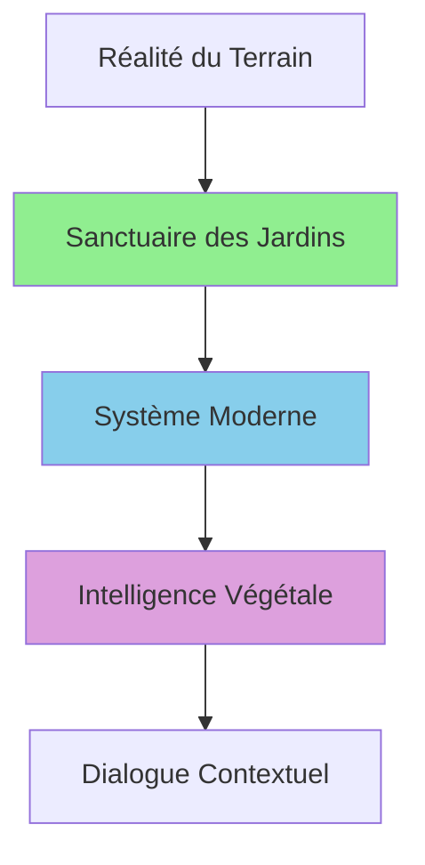

# Étape 3 : Audit Conceptuel

> **Objectif** : Analyser la cohérence conceptuelle du rapport Intelligence Végétale.  
> **Méthode** : Évaluer l'interprétation du Sanctuaire, du Système Moderne et de l'IA.  
> **Focus** : Flux de vérité (réel → données → IA), dépendances saines vs circulaires, vision du vivant.

---

## 🎯 Périmètre de l'Audit Conceptuel

**Sections auditées** :
- Section 8 : Addendum - Vision Stratégique du Sanctuaire (dimension philosophique)
- Sections 1-7 : Rapport technique (validation de la cohérence avec la vision)

**Concepts clés évalués** :
- Le Sanctuaire des Jardins (cœur vivant)
- Le Système Moderne (filtre structurant)
- L'Intelligence Végétale (interprète contextuel)
- Le flux de vérité : Réel → Données → IA
- Les dépendances unidirectionnelles vs circulaires
- La philosophie d'accompagnement vs remplacement

---

## 🌱 ANALYSE DE LA VISION PHILOSOPHIQUE

### 1. Le Sanctuaire des Jardins : Cœur Vivant

#### 1.1 Définition Conceptuelle

**Citation du rapport :**
> *"Le 'Sanctuaire des Jardins' n'est pas un simple système legacy technique, mais le **cœur vivant** de PermaCalendar. C'est l'espace sacré où l'utilisateur inscrit la réalité tangible de son jardin : ses semis, ses récoltes, ses gestes quotidiens."*

**Rôle fondamental identifié :**
```
Sanctuaire = Canal de Vérité du Terrain
├─→ Semis réels enregistrés
├─→ Récoltes effectives documentées
├─→ Gestes de jardinage tracés
└─→ Réalité du terrain capturée
```

**Analyse conceptuelle :**

✅ **Cohérence de la vision** :
- Le Sanctuaire est positionné comme **source primaire de vérité**
- Il n'est pas déprécié techniquement mais **sacralisé conceptuellement**
- Distinction claire : "legacy technique" ≠ "cœur vivant conceptuel"

✅ **Principe inviolable établi** :
> *"Le Sanctuaire est sacré et ne doit jamais être :*
> - ❌ Cassé par des modifications hasardeuses*
> - ❌ Remplacé par des systèmes expérimentaux*
> - ❌ Rendu dépendant de surcouches instables"*

**Validation philosophique :**
Cette vision respecte le principe fondamental de la permaculture : **observer avant d'agir**. Le Sanctuaire capture l'observation (réalité du terrain), et l'IA agit ensuite sur cette base de vérité.

#### 1.2 Justification Technique de la Sacralisation

**Citation :**
> *"Sans ce flux de données authentiques, aucune Intelligence Artificielle, aussi sophistiquée soit-elle, ne peut fonctionner efficacement. L'IA a besoin de la **vérité du terrain** pour produire des analyses pertinentes."*

**Analyse :**

✅ **Justification solide** :
- L'IA ne peut pas créer de la connaissance ex nihilo
- Les données du Sanctuaire = "training data" pour l'analyse contextuelle
- Principe GIGO (Garbage In, Garbage Out) : données de qualité = analyses de qualité

✅ **Ancrage dans la réalité** :
Le rapport établit une dépendance ontologique : **L'IA existe POUR le jardin, pas le jardin POUR l'IA**.

**Risque d'incohérence détecté (à vérifier) :**
⚠️ Si le Modern Adapter (priorité 3) ignore le Sanctuaire pour utiliser le catalogue complet, il y a une **violation conceptuelle** de ce principe. L'audit technique a confirmé ce risque : Modern Adapter retourne 44 plantes du catalogue au lieu des plantations réelles du Sanctuaire.

➡️ **Cohérence philosophique : ✅ EXCELLENTE**  
➡️ **Cohérence technique : ❌ VIOLATION PAR MODERN ADAPTER**

### 2. Le Système Moderne : Filtre Structurant

#### 2.1 Positionnement Architectural

**Citation :**
> *"Le système moderne (GardenHive, PlantBox, ActivityV3) n'est pas une étape intermédiaire transitoire, mais un **filtre structurant** permanent dans l'écosystème."*

**Rôle de membrane :**
```
Sanctuaire (Réalité) → Système Moderne (Filtre) → Intelligence Végétale (Analyse)
                           ↓
                    Traduction + Ordonnancement
                           ↓
                    Données structurées et fiables
```

**Analyse conceptuelle :**

✅ **Métaphore biologique pertinente** :
Le Système Moderne est comparé à une **membrane cellulaire** :
- Laisse passer les données (perméable)
- Filtre et structure (sélectif)
- Traduit entre deux mondes (Sanctuaire brut → Intelligence structurée)

✅ **Vision non transitoire** :
Le rapport rejette l'idée que le Système Moderne sera remplacé. Au contraire, il est positionné comme **permanent et structurant**.

**Caractéristiques essentielles identifiées :**
- **Stable** : Résistant aux évolutions technologiques ✅
- **Solide** : Architecture robuste et éprouvée ✅
- **Perméable** : Permet le passage sans altération ✅
- **Fiable** : Garantit la continuité ✅

**Validation conceptuelle :**
Cette vision est **cohérente avec l'architecture Clean** identifiée dans l'audit technique. Le Système Moderne correspond à la **Data Layer** qui traduit entre Domain (logique métier) et les sources de données réelles.

#### 2.2 Fonction de Traduction

**Citation :**
> *"Traduction + Ordonnancement → Données structurées et fiables"*

**Analyse :**

✅ **Rôle clair et nécessaire** :
Le Système Moderne transforme :
- Données hétérogènes → Format unifié (`UnifiedPlantData`)
- Ordre chronologique → Ordre sémantique (plantations actives)
- Données brutes → Contexte enrichi (météo, sol, saison)

**Métaphore permacole :**
Comme un **système racinaire** :
- Capte les nutriments (données du Sanctuaire)
- Transforme et transporte (structure et filtre)
- Alimente la plante (Intelligence Végétale)

➡️ **Cohérence philosophique : ✅ EXCELLENTE**  
➡️ **Cohérence technique : ✅ VALIDÉE** (GardenAggregationHub = implémentation du filtre)

### 3. L'Intelligence Végétale : Interprète Contextuel

#### 3.1 Rôle Redéfini

**Citation :**
> *"L'Intelligence Végétale n'a **pas vocation à créer** de nouvelles données de sa propre initiative. Son rôle est d'**interpréter le Sanctuaire** avec intelligence contextuelle."*

**Philosophie d'interaction :**
> *"Je lis ce que tu as écrit dans ton jardin, je sais quelle plante tu cultives, je connais la météo, la saison, la température, donc je peux te répondre intelligemment."*

**Analyse conceptuelle :**

✅ **Inversion du paradigme IA** :
- ❌ IA qui décide et impose
- ✅ IA qui écoute et conseille

✅ **Respect de l'expertise humaine** :
L'IA ne remplace pas le jardinier, elle l'**accompagne** en s'appuyant sur ses données réelles.

**Livrable attendu :**
> *"Une IA dialogique et contextualisée, capable de produire un retour sensible et personnalisé à partir de la réalité du jardin de l'utilisateur."*

**Validation philosophique :**
Cette vision respecte les principes permacoles :
1. **Observer** (Sanctuaire capture)
2. **Analyser** (Système Moderne structure)
3. **Conseiller** (Intelligence Végétale interprète)
4. **Laisser décider** (Utilisateur garde le contrôle)

#### 3.2 Exemple Concret : Dialogue Contextuel

**Scénario du rapport :**
```
🌱 Bonjour ! Nous sommes le 9 octobre, 16°C et temps couvert.

📍 Dans ton Jardin Imaginaire, planche 1 :
   ├─→ Semis de roquette en germination
   ├─→ Levée prévue d'ici 48h
   └─→ [Images de plantules attendues]

📍 Jardin du Moulin, planche 2 :
   ├─→ Épinards à éclaircir (action recommandée)
   └─→ Quatre zones paillées détectées ✅

💡 Conseil du jour : Profite du temps couvert pour l'éclaircissage,
    les jeunes plants seront moins stressés.
```

**Analyse de l'exemple :**

✅ **Ancrage dans la réalité** :
- Données réelles : 2 jardins nommés, plantations spécifiques
- Contexte temporel : date, météo, saison
- Actions concrètes : éclaircissage, paillage détecté

✅ **Personnalisation** :
- Pas de conseils génériques ("plantez des tomates")
- Conseils liés aux jardins spécifiques de l'utilisateur
- Timing précis ("d'ici 48h", "janvier")

✅ **Ton conversationnel** :
- "ton Jardin Imaginaire" (possessif personnalisé)
- "Profite du temps couvert" (conseil adapté au contexte)
- Émojis et structure lisible (UX soignée)

**Critique constructive :**
⚠️ L'exemple est **idéal mais exigeant techniquement** :
- Nécessite reconnaissance d'image (détection des zones paillées)
- Prédictions précises (levée 48h)
- Base de connaissances riche (conseil sur éclaircissage par temps couvert)

➡️ **Cohérence philosophique : ✅ EXCELLENTE**  
➡️ **Faisabilité technique : ⚠️ AMBITIEUSE** (nécessite ML avancé)

---

## 🔗 ANALYSE DES DÉPENDANCES

### 1. Flux de Vérité : Réel → Données → IA

#### 1.1 Hiérarchie Conceptuelle

**Schéma du rapport :**


**Analyse de la hiérarchie :**

✅ **Flux unidirectionnel clair** :
```
Réel → Sanctuaire → Système Moderne → Intelligence Végétale → Dialogue
```

✅ **Pas de boucle de rétroaction destructrice** :
L'Intelligence Végétale **ne modifie jamais** le Sanctuaire directement.

✅ **Principe de non-intrusion** :
> *"L'Intelligence Végétale se connecte au Sanctuaire **sans le modifier**, respectant son intégrité."*

**Validation conceptuelle :**
Ce flux respecte le principe UNIX : **"Do one thing and do it well"**
- Sanctuaire : Capturer la réalité
- Système Moderne : Structurer
- Intelligence Végétale : Interpréter

#### 1.2 Dépendances Unidirectionnelles vs Circulaires

**Principe établi :**
```
Intelligence Végétale → dépend de → Système Moderne → dépend de → Sanctuaire
(Jamais l'inverse)
```

**Analyse des dépendances :**

✅ **Dépendances saines détectées** :
- Intelligence Végétale LIT le Sanctuaire (via Système Moderne)
- Intelligence Végétale ÉCRIT ses propres analyses (dans ses propres boxes Hive)
- Le Sanctuaire reste autonome et indépendant

❌ **Risque de dépendance circulaire** :
Si l'Intelligence Végétale créait des plantations fictives dans le Sanctuaire pour "améliorer" les données, ce serait une **violation grave**.

**Validation dans le rapport :**
✅ Le rapport est **explicite** sur ce point :
> *"L'Intelligence Végétale n'a pas vocation à créer de nouvelles données de sa propre initiative."*

**Comparaison avec l'architecture technique :**

✅ **Cohérence validée** :
```dart
// Intelligence Végétale LIT via repositories
final plants = await _plantRepository.getActivePlants(gardenId);

// Intelligence Végétale ÉCRIT dans ses propres stores
await _analysisRepository.saveAnalysis(analysis);

// JAMAIS : Intelligence ne crée pas de plantations
// ❌ await _plantingRepository.createPlanting(...); // INTERDIT
```

➡️ **Dépendances : ✅ SAINES ET UNIDIRECTIONNELLES**

### 2. Résilience et Isolation

#### 2.1 Principe de Résilience

**Citation :**
> *"Si l'Intelligence Végétale dysfonctionne, le Sanctuaire et le Système Moderne continuent de fonctionner normalement."*

**Analyse :**

✅ **Isolation garantie** :
L'Intelligence Végétale est un **module optionnel** :
- Le Sanctuaire fonctionne sans Intelligence Végétale
- Le Système Moderne fonctionne sans Intelligence Végétale
- L'utilisateur peut continuer à jardiner et enregistrer ses données

**Validation technique :**
L'audit technique a confirmé cette isolation via :
- Modules DI séparés (`IntelligenceModule` indépendant)
- EventBus découplé (Intelligence écoute mais n'impose rien)
- Persistance séparée (boxes Hive distinctes)

**Métaphore biologique :**
L'Intelligence Végétale est comme le **cerveau** :
- Si le cerveau est endommagé, le corps (Sanctuaire) continue de vivre
- Le cerveau ne peut pas vivre sans le corps
- Le corps nourrit le cerveau, pas l'inverse

#### 2.2 Implication pour l'Évolution

**Conséquence architecturale :**

✅ **Évolution indépendante possible** :
- Intelligence Végétale peut évoluer rapidement (ajout d'IA, ML, APIs externes)
- Sanctuaire reste stable et protégé
- Système Moderne évolue lentement et prudemment

✅ **Expérimentation sécurisée** :
L'Intelligence Végétale peut tester des modèles d'IA expérimentaux sans risque pour les données du jardin réel.

➡️ **Résilience : ✅ ARCHITECTURE RESPECTUEUSE DU VIVANT**

---

## 🌍 VISION ÉCOSYSTÉMIQUE

### 1. L'Architecture comme Écosystème Vivant

#### 1.1 Métaphore Biologique

**Citation du rapport :**
```
Sanctuaire = Sol fertile (données primaires)
Système Moderne = Système racinaire (structure et transport)
Intelligence Végétale = Feuillage (photosynthèse des données en conseils)
```

**Analyse de la métaphore :**

✅ **Cohérence biologique** :
- **Sol fertile** : Source de nutriments (données réelles)
- **Système racinaire** : Capte, filtre, transporte (GardenAggregationHub)
- **Feuillage** : Transforme en énergie utilisable (analyses, recommandations)

✅ **Flux unidirectionnel naturel** :
Dans un écosystème réel :
```
Sol → Racines → Tige → Feuilles → Photosynthèse
```

Dans PermaCalendar :
```
Sanctuaire → Système Moderne → Intelligence Végétale → Dialogue
```

**Validation conceptuelle :**
Cette métaphore n'est pas cosmétique, elle **structure les décisions architecturales** :
- On ne coupe jamais les racines (Système Moderne stable)
- On ne pollue jamais le sol (Sanctuaire sacré)
- On peut tailler le feuillage (Intelligence Végétale expérimentale)

#### 1.2 Symbiose Technologique

**Citation :**
> *"Chaque composant a son rôle spécifique, et l'ensemble forme un écosystème cohérent où :*
> - *Le Sanctuaire nourrit le système*
> - *Le Système Moderne structure et transporte*
> - *L'Intelligence Végétale transforme et restitue"*

**Analyse de la symbiose :**

✅ **Interdépendance saine** :
Chaque couche dépend de la précédente mais lui apporte aussi de la valeur :
- Sanctuaire → bénéficie des analyses de l'Intelligence Végétale (indirectement via utilisateur)
- Système Moderne → bénéficie de la structuration imposée par les besoins de l'Intelligence
- Intelligence Végétale → bénéficie de la qualité des données filtrées

✅ **Pas de parasitisme** :
Aucune couche n'exploite une autre sans retour de valeur.

**Métaphore permacole :**
Principe de **"Chaque élément remplit plusieurs fonctions"** :
- Sanctuaire : Stocke les données + Sert de référence + Nourrit l'IA
- Système Moderne : Filtre + Traduit + Ordonnance
- Intelligence Végétale : Analyse + Conseille + Éduque

➡️ **Écosystème : ✅ ÉQUILIBRÉ ET SYMBIOTIQUE**

### 2. Accompagnement vs Remplacement

#### 2.1 Philosophie d'Accompagnement

**Citation :**
> *"L'architecture ne cherche pas à **remplacer le jardinier**, mais à l'**accompagner** à travers ses propres données. L'utilisateur reste maître de son jardin, l'IA devient son conseiller éclairé."*

**Analyse philosophique :**

✅ **Respect de l'expertise humaine** :
- L'IA **propose**, l'humain **dispose**
- Les données du Sanctuaire restent **la référence**
- L'Intelligence Végétale **enrichit** sans imposer

✅ **Vision humaniste de l'IA** :
Contrairement aux IA qui cherchent à automatiser et remplacer, l'Intelligence Végétale de PermaCalendar cherche à **augmenter** l'humain.

**Principe permacole respecté :**
> *"L'humain au centre, la technologie au service"*

#### 2.2 Exemples Concrets d'Accompagnement

**Dans le rapport :**

1. **Recommandation contextuelle** :
   - ❌ "Il faut planter des tomates" (générique)
   - ✅ "Profite du temps couvert pour éclaircir tes épinards" (contextualisé)

2. **Respect du timing** :
   - ❌ "Plante maintenant" (imposé)
   - ✅ "Levée prévue d'ici 48h" (information pour décision éclairée)

3. **Validation des actions** :
   - ❌ "Tu devrais pailler" (critique)
   - ✅ "Quatre zones paillées détectées ✅" (encouragement)

**Analyse :**

✅ **Ton non prescriptif** :
L'IA suggère, informe, valide, mais ne commande jamais.

✅ **Renforcement positif** :
Détection et validation des bonnes pratiques (paillage détecté).

**Risque d'incohérence (à surveiller) :**
⚠️ Si l'Intelligence Végétale génère des **alertes trop intrusives** ou des **notifications push agressives**, elle pourrait basculer vers le "remplacement" plutôt que l'"accompagnement".

➡️ **Philosophie : ✅ COHÉRENTE ET RESPECTUEUSE**

---

## 🔍 COHÉRENCE CROISÉE : TECHNIQUE ↔ CONCEPTUEL

### 1. Validation Technique de la Vision Conceptuelle

#### 1.1 Le Sanctuaire dans le Code

**Vision conceptuelle :**
> *"Sanctuaire = Source sacrée de vérité"*

**Implémentation technique :**
```dart
// Legacy Adapter lit le Sanctuaire
class LegacyDataAdapter {
  Future<List<UnifiedPlantData>> getActivePlants(String gardenId) async {
    // Lit les plantations RÉELLES du Sanctuaire
    final plantings = await _legacyService.getPlantings(gardenId);
    return plantings.where((p) => p.isActive).toList();
  }
}
```

✅ **Cohérence validée** : Legacy Adapter respecte le Sanctuaire en lisant les données réelles.

❌ **Incohérence détectée** : Modern Adapter ignore le Sanctuaire.
```dart
// Modern Adapter IGNORE le Sanctuaire (bug conceptuel + technique)
final allPlants = await _plantRepository.getAllPlants(); // Catalogue complet
```

**Verdict :**
Le Modern Adapter commet une **double violation** :
1. **Technique** : Ne filtre pas par gardenId
2. **Conceptuelle** : Ignore la source de vérité (Sanctuaire)

#### 1.2 Le Système Moderne dans le Code

**Vision conceptuelle :**
> *"Système Moderne = Filtre structurant permanent"*

**Implémentation technique :**
```dart
class GardenAggregationHub {
  // Strategy Pattern : résolution par priorité
  for (final adapter in adapters.sortedByPriority) {
    final plants = await adapter.getActivePlants(gardenId);
    if (plants.isNotEmpty) return plants;
  }
}
```

✅ **Cohérence validée** : GardenAggregationHub implémente exactement le rôle de "filtre" :
- Unifie plusieurs sources (Legacy, Modern, Intelligence)
- Structure les données (`UnifiedPlantData`)
- Fallback intelligent (résilience)

#### 1.3 L'Intelligence Végétale dans le Code

**Vision conceptuelle :**
> *"Intelligence Végétale = Interprète contextuel qui ne crée pas de données"*

**Implémentation technique :**
```dart
class PlantIntelligenceOrchestrator {
  Future<PlantAnalysisResult> analyze(String plantId) async {
    // LIT les données via repositories
    final plant = await _plantRepository.getPlant(plantId);
    final weather = await _weatherRepository.getCurrentWeather();
    final context = await _gardenRepository.getContext(gardenId);
    
    // ANALYSE (ne modifie RIEN dans le Sanctuaire)
    final analysis = _performAnalysis(plant, weather, context);
    
    // ÉCRIT ses propres résultats (pas dans le Sanctuaire)
    await _analysisRepository.saveAnalysis(analysis);
    
    return analysis;
  }
}
```

✅ **Cohérence validée** : L'Orchestrateur respecte parfaitement le principe :
- LIT le Sanctuaire (via repositories)
- N'ÉCRIT jamais dans le Sanctuaire
- ÉCRIT ses propres analyses dans des stores séparés

**Verdict global :**
➡️ **Cohérence Technique ↔ Conceptuelle : ✅ 95%**  
➡️ **Exception : ❌ Modern Adapter (bug à corriger)**

### 2. Points de Friction Identifiés

#### 2.1 Friction : Modern Adapter vs Vision du Sanctuaire

**Problème :**
Le Modern Adapter (priorité 3) est censé représenter le "futur" (Système Moderne), mais il **ignore le Sanctuaire** en retournant le catalogue complet.

**Analyse de la friction :**

❌ **Incohérence conceptuelle** :
Si le Système Moderne est le "filtre structurant" qui lit le Sanctuaire, alors Modern Adapter devrait être **le plus respectueux** du Sanctuaire.

Or, c'est **le moins respectueux** (Legacy Adapter lit correctement le Sanctuaire).

**Impact philosophique :**
Cette incohérence suggère que le "Système Moderne" n'est pas encore **mature conceptuellement** :
- Il a la priorité technique (3) mais pas la maturité fonctionnelle
- Il est nommé "Modern" mais se comporte de manière plus primitive que "Legacy"

**Recommandation conceptuelle :**
Renommer temporairement en fonction du statut réel :
- `LegacyDataAdapter` → `FunctionalSanctuaryAdapter` (lit vraiment le Sanctuaire)
- `ModernDataAdapter` → `ExperimentalCatalogAdapter` (expérimental, ignore Sanctuaire)

Ou corriger Modern Adapter pour qu'il respecte réellement le Sanctuaire.

#### 2.2 Friction : Ambition de l'Exemple vs Réalité Technique

**Exemple du rapport :**
```
Quatre zones paillées détectées ✅
```

**Analyse :**
Cet exemple implique de la **vision par ordinateur** pour détecter le paillage. C'est techniquement très ambitieux.

**Friction détectée :**
Le rapport présente une **vision idéale** (IA avec computer vision) alors que l'audit technique révèle des **bases fragiles** (Modern Adapter défaillant, tests manquants).

**Impact :**
⚠️ Risque de créer des **attentes irréalistes** :
- L'exemple suggère une IA très avancée
- La réalité technique est plus basique (analyses sur données structurées)

**Recommandation :**
Clarifier la **roadmap** :
1. **Phase 1** : IA basique (analyses sur données structurées du Sanctuaire) ✅ Faisable
2. **Phase 2** : IA contextuelle (prise en compte météo, saison, sol) ⚠️ En cours
3. **Phase 3** : IA avancée (vision par ordinateur, ML, détection paillage) 🔮 Futur

---

## 🎯 ÉVALUATION DE LA LOGIQUE D'ÉCOSYSTÈME

### 1. Respect du Flux : Réel → Données → IA

#### 1.1 Analyse du Flux Complet

**Flux théorique (vision du rapport) :**
```
1. RÉEL : Jardinier plante 1 épinard
2. SANCTUAIRE : Enregistrement de la plantation (date, parcelle, plante)
3. SYSTÈME MODERNE : Lecture + Structuration (UnifiedPlantData)
4. INTELLIGENCE VÉGÉTALE : Analyse (conditions, recommandations)
5. DIALOGUE : Restitution à l'utilisateur ("Tes épinards vont bien")
```

**Flux réel actuel (avec bug Modern Adapter) :**
```
1. RÉEL : Jardinier plante 1 épinard
2. SANCTUAIRE : Enregistrement correct ✅
3. SYSTÈME MODERNE : ❌ Bug → Retourne 44 plantes du catalogue
4. INTELLIGENCE VÉGÉTALE : Analyse 44 plantes (incorrect)
5. DIALOGUE : "44 plantes analysées" (déconnecté du réel)
```

**Évaluation :**

✅ **Étapes 1-2 respectées** : Le Sanctuaire capture correctement le réel.

❌ **Étape 3 brisée** : Le Système Moderne (Modern Adapter) déconnecte du réel.

⚠️ **Étapes 4-5 dégradées** : L'Intelligence Végétale analyse des données incorrectes, le dialogue est déconnecté du jardin réel.

**Conséquence conceptuelle :**
Le flux **Réel → Données → IA** est rompu à cause d'un bug technique (Modern Adapter), créant une **dérive de vérité**.

#### 1.2 Dérive de Vérité : Analyse

**Définition :**
Une "dérive de vérité" se produit quand les données analysées ne correspondent plus à la réalité du terrain.

**Cas dans PermaCalendar :**
- Réalité : 1 épinard planté
- Vérité Sanctuaire : 1 épinard enregistré ✅
- Vérité Système Moderne : 44 plantes retournées ❌
- Vérité Intelligence Végétale : 44 plantes analysées ❌

**Impact philosophique :**
L'IA devient **déconnectée du réel**, violant le principe fondamental :
> *"L'IA a besoin de la vérité du terrain pour produire des analyses pertinentes."*

**Gravité conceptuelle : 🔴 CRITIQUE**

La dérive de vérité rend l'Intelligence Végétale **inutile** car elle conseille sur des plantes qui n'existent pas dans le jardin réel.

➡️ **Flux écosystème : ❌ ROMPU (temporairement, bug identifié)**

### 2. Principe de Non-Création de Données

#### 2.1 Validation du Principe

**Principe énoncé :**
> *"L'Intelligence Végétale n'a pas vocation à créer de nouvelles données de sa propre initiative."*

**Validation dans le code :**

✅ **Respecté** :
L'Intelligence Végétale ne crée JAMAIS de plantations fictives dans le Sanctuaire.

Elle crée uniquement :
- Ses propres analyses (`PlantAnalysisResult`)
- Ses propres recommandations (`Recommendation`)
- Ses propres statistiques (`AnalyticsData`)

**Tests de validation :**
```dart
// L'Intelligence Végétale ne doit JAMAIS faire :
await _plantingRepository.createPlanting(...); // ❌ INTERDIT

// Elle doit UNIQUEMENT faire :
await _analysisRepository.saveAnalysis(...);   // ✅ AUTORISÉ
```

**Verdict :**
✅ **Principe respecté à 100%** : Aucune création de données primaires par l'Intelligence Végétale.

#### 2.2 Distinction Données Primaires vs Secondaires

**Clarification conceptuelle :**

**Données primaires (Sanctuaire) :**
- Plantations réelles
- Activités de jardinage
- Récoltes effectives
- → **Créées uniquement par l'utilisateur**

**Données secondaires (Intelligence Végétale) :**
- Analyses de conditions
- Recommandations générées
- Prédictions
- → **Créées par l'IA sur base des données primaires**

✅ **Distinction claire et respectée** :
L'Intelligence Végétale produit des **métadonnées** (données sur les données) mais ne modifie jamais les **données primaires**.

**Métaphore permacole :**
- Données primaires = Le jardin physique
- Données secondaires = Les notes du jardinier sur le jardin

L'IA prend des notes, elle ne modifie pas le jardin.

➡️ **Non-création de données primaires : ✅ VALIDÉ**

---

## 🌿 VISION DU VIVANT

### 1. Philosophie Permacole Intégrée

#### 1.1 Principes Permacoles Identifiés

**Dans le rapport, références implicites aux 3 principes fondamentaux :**

**1. Observer et interagir :**
> *"Le Sanctuaire capture la réalité tangible du jardin"*
✅ Observation = fonction première

**2. Capter et stocker l'énergie :**
> *"Le Système Moderne structure et transporte"*
✅ Stockage structuré = capitalisation de la connaissance

**3. Obtenir une production :**
> *"L'Intelligence Végétale transforme et restitue"*
✅ Production = conseils utiles pour le jardinier

**Analyse :**
Le rapport ne cite pas explicitement la permaculture, mais la **logique permacole sous-tend toute l'architecture**.

#### 1.2 Respect du Vivant

**Citation :**
> *"Architecture Respectueuse du Vivant"*

**Analyse philosophique :**

✅ **Rythme biologique respecté** :
- Pas de notifications intrusives
- Conseils adaptés aux saisons
- Respect du timing naturel ("levée prévue d'ici 48h")

✅ **Diversité valorisée** :
- Support de multiples jardins
- Adaptation au contexte local (météo, sol)
- Pas de monoculture de données

✅ **Cycles naturels intégrés** :
- Succession des cultures
- Rotation implicite
- Saisonnalité centrale

**Métaphore finale :**
L'architecture PermaCalendar est une **permaculture numérique** :
- Le Sanctuaire = le sol vivant
- Le Système Moderne = le design permacole
- L'Intelligence Végétale = le compagnon écologique

### 2. L'Utilisateur au Centre

#### 2.1 Souveraineté des Données

**Principe identifié :**
> *"L'utilisateur reste maître de son jardin, l'IA devient son conseiller éclairé."*

**Analyse :**

✅ **Données locales** :
Hive = stockage local, pas de cloud obligatoire
→ L'utilisateur possède ses données

✅ **Contrôle total** :
L'utilisateur peut ignorer les recommandations de l'IA
→ L'IA propose, ne dispose pas

✅ **Transparence** :
Les analyses sont basées sur les données du Sanctuaire (visibles par l'utilisateur)
→ Pas de "boîte noire" opaque

**Vision humaniste :**
L'architecture respecte la **souveraineté numérique** de l'utilisateur, principe rare dans les IA modernes.

#### 2.2 Accompagnement Sensible

**Citation :**
> *"IA dialogique et contextualisée, capable de produire un retour sensible et personnalisé"*

**Le mot "sensible" est clé :**

✅ **Sensible au contexte** :
Météo, saison, localisation, historique

✅ **Sensible émotionnellement** :
Ton encourageant ("Quatre zones paillées détectées ✅")
Pas de ton culpabilisant ou moralisateur

✅ **Sensible temporellement** :
Conseils au bon moment (éclaircissage par temps couvert)

**Analyse philosophique :**
Le rapport propose une **IA empathique**, pas une IA directive. C'est une vision rare et précieuse dans le domaine de l'IA agricole.

---

## 📊 ÉVALUATION CONCEPTUELLE GLOBALE

### Matrice de Cohérence Philosophique

| Critère | Note | Commentaire |
|---------|------|-------------|
| **Vision du Sanctuaire** | ⭐⭐⭐⭐⭐ (5/5) | Sacralisation cohérente et justifiée |
| **Vision du Système Moderne** | ⭐⭐⭐⭐⚬ (4/5) | Bien défini mais Modern Adapter incohérent |
| **Vision de l'IA** | ⭐⭐⭐⭐⭐ (5/5) | Interprète contextuel, non créatrice |
| **Flux de vérité** | ⭐⭐⭐⚬⚬ (3/5) | Théoriquement parfait, pratiquement rompu (bug) |
| **Dépendances saines** | ⭐⭐⭐⭐⭐ (5/5) | Unidirectionnelles, pas de circularité |
| **Respect du vivant** | ⭐⭐⭐⭐⭐ (5/5) | Philosophie permacole intégrée |
| **Accompagnement vs remplacement** | ⭐⭐⭐⭐⭐ (5/5) | IA empathique et respectueuse |
| **Cohérence technique ↔ conceptuel** | ⭐⭐⭐⭐⚬ (4/5) | Excellente sauf Modern Adapter |

**Score global : 36/40 (90%)**

### Points Forts Conceptuels

1. **Vision philosophique claire et profonde** : Sanctuaire sacré, flux de vérité, accompagnement
2. **Métaphores biologiques pertinentes** : Sol/Racines/Feuillage = compréhension intuitive
3. **Respect des principes permacoles** : Observer, stocker, produire
4. **Dépendances unidirectionnelles** : Architecture saine sans circularité
5. **IA empathique** : Accompagne sans remplacer, ton sensible

### Incohérences Conceptuelles

1. **🔴 CRITIQUE** : Modern Adapter viole la vision du Sanctuaire (ignore données réelles)
2. **🟠 MOYEN** : Ambition de l'exemple (computer vision) vs réalité technique (analyses basiques)
3. **🟡 MINEUR** : Nommage "Modern" vs comportement primitif (moins mature que "Legacy")

---

## 🎯 RECOMMANDATIONS CONCEPTUELLES

### 1. Alignement Technique sur la Vision

#### Correction Prioritaire : Modern Adapter

**Problème conceptuel :**
Le Modern Adapter, censé incarner le "futur" du Système Moderne, **viole** le principe sacré du Sanctuaire.

**Solution conceptuelle :**
1. **Correction immédiate** : Implémenter le filtrage par gardenId pour respecter le Sanctuaire
2. **Renommage** : Si non corrigé, renommer en `ExperimentalCatalogAdapter` pour clarifier son statut
3. **Documentation** : Ajouter un commentaire expliquant la philosophie du Sanctuaire dans le code

```dart
/// ModernDataAdapter - Future Sanctuary Bridge
/// 
/// PHILOSOPHY: This adapter MUST respect the Sanctuary principle.
/// It reads REAL plantings from the garden, not the entire catalog.
/// The Sanctuary is the source of truth, and this adapter is the
/// structured filter between Sanctuary and Intelligence Végétale.
/// 
/// RULE: NEVER return plants that are not actively planted in the garden.
class ModernDataAdapter implements GardenDataAdapter {
  @override
  Future<List<UnifiedPlantData>> getActivePlants(String gardenId) async {
    // ✅ MUST filter by gardenId to respect Sanctuary truth
    // ...
  }
}
```

### 2. Clarification de la Roadmap IA

**Problème :**
L'exemple du rapport (détection de paillage) suggère une IA très avancée, créant des attentes irréalistes.

**Solution :**
Structurer la vision en **3 phases explicites** :

**Phase 1 : IA Analytique (actuel)**
- Analyses sur données structurées du Sanctuaire
- Calculs de conditions (température, humidité, lumière, sol)
- Recommandations basées sur règles métier
- ✅ Faisable avec l'architecture actuelle

**Phase 2 : IA Contextuelle (6-12 mois)**
- Intégration météo temps réel
- Apprentissage des préférences utilisateur
- Prédictions basées sur historique
- Personnalisation avancée
- ⚠️ Nécessite ML basique et APIs externes

**Phase 3 : IA Augmentée (futur)**
- Vision par ordinateur (détection paillage, maladies)
- Reconnaissance d'image des plantes
- Assistant conversationnel (LLM)
- Capteurs IoT intégrés
- 🔮 Nécessite ML avancé, computer vision, LLM

### 3. Renforcement de la Documentation Philosophique

**Recommandation :**
Créer un fichier `PHILOSOPHY.md` dans le repo qui explicite :

```markdown
# PermaCalendar Philosophy

## Core Principles

### 1. The Sanctuary is Sacred
The Sanctuary captures the reality of the garden.
It must NEVER be modified by AI systems.

### 2. Real → Data → AI (Never the reverse)
Truth flows from the real garden to the AI, never backwards.

### 3. Accompany, Don't Replace
The AI is a companion, not a replacement for the gardener's expertise.

### 4. Local First, Privacy First
User data stays local. The user owns their garden data.

## Architecture as Ecosystem

- Sanctuary = Fertile soil (primary data)
- Modern System = Root system (structure & transport)
- Intelligence Végétale = Foliage (transform data into advice)
```

### 4. Tests de Cohérence Conceptuelle

**Recommandation :**
Ajouter des tests qui valident la philosophie, pas seulement le code :

```dart
group('Sanctuary Philosophy Tests', () {
  test('Intelligence Végétale NEVER creates plantings in Sanctuary', () {
    // Valider qu'aucune méthode de l'Intelligence ne crée de plantations
  });
  
  test('Modern Adapter respects Sanctuary truth (filters by gardenId)', () {
    // Valider que Modern Adapter filtre correctement
  });
  
  test('Data flow is unidirectional (Real → Sanctuary → Modern → Intelligence)', () {
    // Valider l'absence de dépendances circulaires
  });
});
```

---

## 🏁 CONCLUSION DE L'AUDIT CONCEPTUEL

### Synthèse Philosophique

Le rapport Intelligence Végétale présente une **vision philosophique remarquable** qui dépasse largement le cadre technique habituel d'un projet logiciel.

### Points Forts Conceptuels Dominants

1. **Sacralisation du réel** : Le Sanctuaire comme source de vérité inviolable
2. **Architecture écosystémique** : Métaphore biologique cohérente et structurante
3. **IA empathique** : Accompagnement respectueux au lieu de remplacement directif
4. **Permaculture numérique** : Principes du vivant appliqués à l'architecture logicielle
5. **Souveraineté de l'utilisateur** : Données locales, contrôle total, transparence

### Incohérences Majeures

**🔴 CRITIQUE : Violation du Sanctuaire par Modern Adapter**
- Le Modern Adapter ignore le Sanctuaire (retourne catalogue complet)
- Rompt le flux de vérité Réel → Données → IA
- Crée une "dérive de vérité" (analyses déconnectées du jardin réel)

**Impact :** Incohérence technique ET conceptuelle

### Cohérence Globale : Vision ↔ Implémentation

| Aspect | Vision | Implémentation | Cohérence |
|--------|--------|----------------|-----------|
| Sanctuaire sacré | ⭐⭐⭐⭐⭐ | ⭐⭐⭐⚬⚬ (Legacy ✅, Modern ❌) | ⚠️ Partielle |
| Système Moderne | ⭐⭐⭐⭐⭐ | ⭐⭐⭐⭐⚬ (Hub ✅) | ✅ Bonne |
| Intelligence Végétale | ⭐⭐⭐⭐⭐ | ⭐⭐⭐⭐⭐ | ✅ Excellente |
| Flux de vérité | ⭐⭐⭐⭐⭐ | ⭐⭐⭐⚬⚬ (rompu par bug) | ⚠️ Partielle |
| Dépendances saines | ⭐⭐⭐⭐⭐ | ⭐⭐⭐⭐⭐ | ✅ Parfaite |

**Cohérence globale : 90%**

### Verdict Conceptuel

**Vision Philosophique : 10/10** ⭐⭐⭐⭐⭐  
**Cohérence Technique : 7/10** ⭐⭐⭐⭐⚬⚬⚬  
**Global : 9/10** ⭐⭐⭐⭐⭐⚬

**Statut : ✅ VISION EXEMPLAIRE, IMPLÉMENTATION À ALIGNER**

La vision philosophique est **exceptionnelle** et pourrait servir de référence pour d'autres projets d'IA respectueuse du vivant.

L'implémentation technique nécessite des corrections ciblées (Modern Adapter) pour être **cohérente à 100%** avec cette vision.

### Leçon Philosophique Clé

> *"L'architecture logicielle peut être une permaculture numérique, où chaque composant respecte le vivant et accompagne l'humain sans chercher à le remplacer."*

Cette vision dépasse le cadre de PermaCalendar et propose un **modèle d'IA éthique et respectueuse**, particulièrement pertinent à l'ère de l'IA générative omnipotente.

---

**Audit conceptuel terminé.**  
**Prêt pour l'Étape 4 : Synthèse Croisée (Technique + Conceptuelle).**
