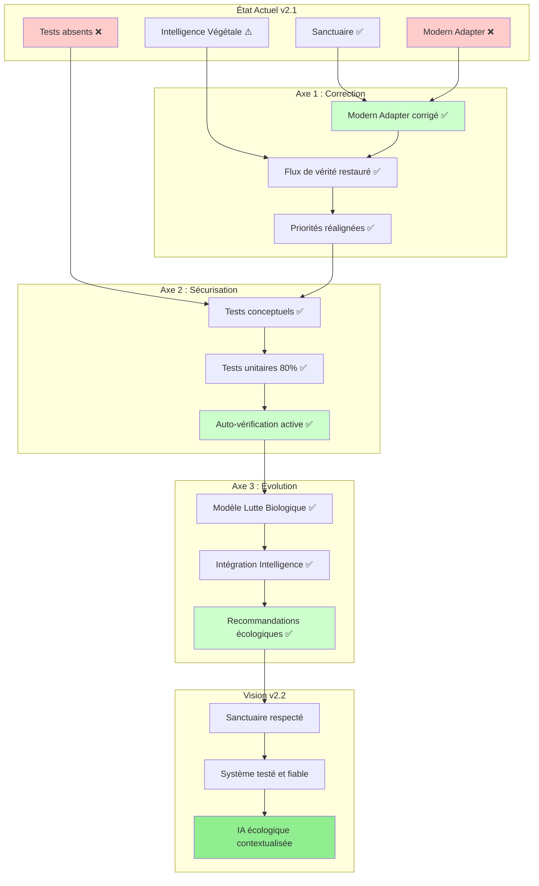
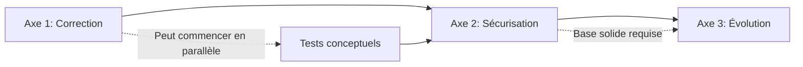

# Étape 5 : Plan d'Évolution v2.2 — Schéma Directeur

> **Objectif** : Établir le plan directeur de l'évolution v2.2 conforme à la logique du Sanctuaire.  
> **Méthode** : Structuration en 3 axes stratégiques (Correction, Sécurisation, Évolution fonctionnelle).  
> **Focus** : Schéma d'action, critères de réussite, prompts d'orchestration (pas d'exécution de code).

---

## 📝 Synthèse Executive

**Cette étape clôt la phase d'audit (Étapes 1-4) et ouvre la phase d'action via un plan directeur structuré en 3 axes d'évolution.**

**Positionnement :**
- Ce document est un **outil de pilotage stratégique**, pas un fichier de production
- Il contient des **structures conceptuelles et pseudocode**, pas du code exécutable
- Les prompts d'exécution sont **suggérés pour orchestration ultérieure**

**Vision v2.2 :**
Restaurer le flux de vérité (Sanctuaire → Modern → Intelligence), sécuriser la base technique (tests), et préparer l'intégration de la Lutte Biologique dans le respect de la philosophie permacole.

---

## 🗺️ SCHÉMA GLOBAL D'ÉVOLUTION

### Vue Stratégique : De l'État Actuel à la Vision v2.2



### Séquence Logique d'Exécution

```
PHASE 1 : CORRECTION (Priorité P0)
├─→ Réparer le flux de vérité
├─→ Restaurer la cohérence Sanctuaire → Modern → Intelligence
└─→ Output : Sanctuaire redevient source unique de vérité

        ↓

PHASE 2 : SÉCURISATION (Priorité P1)
├─→ Solidifier la base technique
├─→ Créer filet de sécurité contre régressions
└─→ Output : Système auto-vérifiable et robuste

        ↓

PHASE 3 : ÉVOLUTION (Priorité P2)
├─→ Intégrer Lutte Biologique
├─→ Enrichir l'Intelligence Végétale
└─→ Output : IA écologique respectueuse du vivant
```

---

## 🔧 AXE 1 : CORRECTION & RÉALIGNEMENT

### Objectif Stratégique

**Restaurer le flux de vérité : Réel → Sanctuaire → Système Moderne → Intelligence Végétale**

Le Modern Adapter doit redevenir le "filtre structurant" conforme à la philosophie du Sanctuaire.

### État des Lieux

**Problème actuel :**
```
Modern Adapter (priorité 3) → Ignore gardenId → Retourne catalogue (44 plantes)
                              ↓
                    Violation technique ET conceptuelle
                              ↓
                    Dérive de vérité (analyses déconnectées du jardin réel)
```

**Impact :**
- Utilisateur : Recommandations incorrectes (44 plantes au lieu de 1)
- Technique : Bug fonctionnel critique
- Philosophique : Violation du Sanctuaire sacré

### Tâches Structurées

#### Tâche 1.1 : Correction du Modern Adapter

**Pseudocode conceptuel :**

```dart
// AVANT (violation)
Future<List<UnifiedPlantData>> getActivePlants(String gardenId) {
  // ❌ Ignore gardenId
  return await _plantRepository.getAllPlants();
}

// APRÈS (respect du Sanctuaire)
Future<List<UnifiedPlantData>> getActivePlants(String gardenId) {
  // ✅ ÉTAPE 1 : Récupérer le jardin spécifique
  final garden = await _gardenRepository.getGarden(gardenId);
  if (garden == null) return [];
  
  // ✅ ÉTAPE 2 : Récupérer les parcelles du jardin
  final beds = await _gardenRepository.getGardenBeds(gardenId);
  
  // ✅ ÉTAPE 3 : Extraire les IDs des plantes ACTIVES
  final activePlantIds = <String>{};
  for (final bed in beds) {
    final plantings = await _gardenRepository.getPlantings(bed.id);
    for (final planting in plantings.where((p) => p.isActive)) {
      activePlantIds.add(planting.plantId);
    }
  }
  
  // ✅ ÉTAPE 4 : Convertir en UnifiedPlantData
  final plants = <UnifiedPlantData>[];
  for (final plantId in activePlantIds) {
    final plant = await _plantRepository.getPlant(plantId);
    if (plant != null) {
      plants.add(_convertToUnified(plant, garden));
    }
  }
  
  return plants;
}
```

**Documentation philosophique à ajouter :**

```dart
/// ModernDataAdapter - Sanctuary Respectful Bridge
/// 
/// PHILOSOPHY:
/// This adapter embodies the "Modern System" concept from PermaCalendar
/// philosophy. It MUST respect the Sanctuary principle: the Sanctuary is
/// the sacred source of truth containing real plantings from the user's garden.
/// 
/// FLOW:
/// Sanctuary (Reality) → Modern System (Filter) → Intelligence (Analyze)
/// 
/// RULE:
/// NEVER return plants from the catalog that are not actively planted
/// in the user's garden. Always filter by gardenId to respect the truth flow.
/// 
/// VIOLATION:
/// Returning the entire catalog instead of filtering by gardenId breaks
/// both the technical contract and the philosophical vision of PermaCalendar.
class ModernDataAdapter implements GardenDataAdapter {
  // Implementation...
}
```

#### Tâche 1.2 : Inversion Temporaire des Priorités (Contournement)

**Structure de contournement :**

```dart
// Solution temporaire : inverser priorités pendant correction Modern Adapter

class ModernDataAdapter {
  @override
  int get priority => 1; // ⬇ Descendre (au lieu de 3)
}

class LegacyDataAdapter {
  @override
  int get priority => 3; // ⬆ Monter (au lieu de 2)
}

// Effet : Legacy (fonctionnel) prend le dessus
// → Utilisateur reçoit données correctes du Sanctuaire
// → Temps de corriger Modern Adapter sereinement
```

#### Tâche 1.3 : Validation de la Correction

**Scénarios de validation :**

```yaml
Scénario 1: Jardin vide
  Given: Jardin sans plantations
  When: getActivePlants('garden_empty')
  Then: Retourne []
  
Scénario 2: 1 plante active
  Given: Jardin avec 1 épinard planté
  When: getActivePlants('garden_1plant')
  Then: Retourne [épinard]
  And: plants.length == 1
  
Scénario 3: Multiple plantes actives
  Given: Jardin avec 3 plantes plantées
  When: getActivePlants('garden_3plants')
  Then: Retourne [plante1, plante2, plante3]
  And: plants.length == 3
  
Scénario 4: Plantes inactives ignorées
  Given: Jardin avec 2 plantes actives + 1 inactive
  When: getActivePlants('garden_mixed')
  Then: Retourne [active1, active2]
  And: plants.length == 2
  And: inactive plant NOT in results
```

### Critères de Réussite — Axe 1

| Critère | Indicateur | Validation |
|---------|-----------|-----------|
| **Correction fonctionnelle** | Modern Adapter filtre par gardenId | ✅ Test scénario 2 passe |
| **Respect philosophique** | Modern Adapter lit le Sanctuaire | ✅ Données réelles retournées |
| **Performance** | Temps d'analyse < 500ms pour 1 plante | ✅ Benchmark validé |
| **Flux de vérité restauré** | Réel → Sanctuaire → Modern → Intelligence | ✅ Test end-to-end passe |
| **Priorités cohérentes** | Adapter fonctionnel > Adapter défaillant | ✅ Legacy prioritaire temporairement |

### Prompt d'Orchestration — Axe 1

```
PROMPT: "Correction Sanctuaire v2.2.A1"

Contexte :
- Projet : PermaCalendar Intelligence Végétale v2.2
- Fichier cible : lib/core/services/aggregation/modern_data_adapter.dart
- Problème : Modern Adapter ignore gardenId, retourne catalogue complet

Mission :
1. Implémenter le filtrage par gardenId dans ModernDataAdapter.getActivePlants()
2. Ajouter documentation philosophique (respect du Sanctuaire)
3. Créer tests de validation (4 scénarios : vide, 1 plante, multiple, inactives)
4. Valider que seules les plantations ACTIVES du jardin spécifique sont retournées

Contraintes :
- Respecter Clean Architecture (pas de logique métier dans l'adapter)
- Utiliser les repositories existants (_gardenRepository, _plantRepository)
- Gestion d'erreurs défensive (return [] en cas d'échec pour fallback Legacy)
- Performance : < 500ms pour 1 plante

Livrables :
- Code corrigé de ModernDataAdapter
- Tests de validation (4 scénarios)
- Documentation philosophique intégrée
```

**Temps estimé : 2-3 heures**

---

## 🛡️ AXE 2 : SÉCURISATION & TESTS

### Objectif Stratégique

**Solidifier la base technique pour garantir la non-régression et valider la cohérence conceptuelle.**

Le système doit devenir **auto-vérifiable** : les tests doivent détecter automatiquement toute violation technique OU philosophique.

### État des Lieux

**Problème actuel :**
```
Couverture tests < 20%
    ↓
Aucun test pour UseCases, Orchestrateur, Adapters
    ↓
Bug Modern Adapter non détecté
    ↓
Violation philosophique non testée
```

**Impact :**
- Régressions silencieuses possibles
- Violation du Sanctuaire non détectée automatiquement
- Refactoring risqué (pas de filet de sécurité)

### Tâches Structurées

#### Tâche 2.1 : Tests Conceptuels (Philosophie du Sanctuaire)

**Structure des tests conceptuels :**

```dart
// test/core/philosophy/sanctuary_philosophy_test.dart

group('Sanctuary Philosophy Validation', () {
  
  test('RÈGLE 1 : Intelligence Végétale NEVER creates plantings in Sanctuary', () {
    // Given: Mock repositories
    final mockPlantingRepo = MockPlantingRepository();
    final orchestrator = PlantIntelligenceOrchestrator(
      plantingRepository: mockPlantingRepo,
      // ... autres dépendances
    );
    
    // When: Analyse d'une plante
    await orchestrator.analyze('plant123');
    
    // Then: Aucune création de plantation
    verifyNever(() => mockPlantingRepo.createPlanting(any()));
    verifyNever(() => mockPlantingRepo.updatePlanting(any()));
    
    // Validation philosophique : Intelligence ne modifie JAMAIS le Sanctuaire
  });
  
  test('RÈGLE 2 : Modern Adapter respects Sanctuary truth (filters by gardenId)', () {
    // Given: Jardin avec 1 épinard réel
    final adapter = ModernDataAdapter(/* ... */);
    
    // When: Récupération des plantes
    final plants = await adapter.getActivePlants('garden123');
    
    // Then: Retourne UNIQUEMENT les plantes du Sanctuaire
    expect(plants.length, equals(1));
    expect(plants.first.plantId, equals('spinach'));
    expect(plants.first.source, equals('sanctuary')); // Pas 'catalog'
    
    // Validation philosophique : Modern Adapter lit le Sanctuaire
  });
  
  test('RÈGLE 3 : Data flow is unidirectional (Sanctuary → Modern → Intelligence)', () {
    // Given: Architecture avec dépendances
    final dependencyGraph = DependencyAnalyzer.analyze();
    
    // When: Analyse du graphe de dépendances
    final hasCycle = dependencyGraph.detectCircularDependencies();
    
    // Then: Aucune dépendance circulaire
    expect(hasCycle, isFalse);
    
    // Validation du flux : Sanctuaire → Modern → Intelligence (jamais l'inverse)
    expect(
      dependencyGraph.direction('Intelligence', 'Sanctuary'),
      equals(DependencyDirection.reads), // Intelligence LIT
    );
    expect(
      dependencyGraph.direction('Sanctuary', 'Intelligence'),
      equals(DependencyDirection.none), // Sanctuaire N'A PAS de lien vers Intelligence
    );
  });
  
  test('RÈGLE 4 : Resilience - Intelligence can fail without breaking Sanctuary', () {
    // Given: Sanctuaire fonctionnel
    final sanctuary = SanctuaryService();
    
    // When: Intelligence Végétale dysfonctionne
    final intelligence = PlantIntelligenceOrchestrator(/* ... */);
    expect(() => intelligence.analyze('invalid'), throwsException);
    
    // Then: Sanctuaire continue de fonctionner
    final plantings = await sanctuary.getPlantings('garden123');
    expect(plantings, isNotEmpty);
    
    // Validation : Isolation respectée
  });
  
});
```

#### Tâche 2.2 : Tests Unitaires (Couverture 80%)

**Structure des tests unitaires :**

```
test/features/plant_intelligence/
├── domain/
│   ├── usecases/
│   │   ├── analyze_plant_conditions_usecase_test.dart
│   │   ├── generate_recommendations_usecase_test.dart
│   │   └── evaluate_planting_timing_usecase_test.dart
│   └── services/
│       └── plant_intelligence_orchestrator_test.dart
├── data/
│   ├── repositories/
│   │   ├── plant_condition_repository_test.dart
│   │   └── recommendation_repository_test.dart
│   └── datasources/
│       └── plant_intelligence_local_datasource_test.dart
└── presentation/
    └── providers/
        └── plant_intelligence_providers_test.dart
```

**Exemple : Test d'un UseCase**

```dart
// test/features/plant_intelligence/domain/usecases/analyze_plant_conditions_usecase_test.dart

group('AnalyzePlantConditionsUsecase', () {
  
  test('should analyze 4 conditions (temperature, humidity, light, soil)', () async {
    // Given: Mocks
    final mockConditionRepo = MockPlantConditionRepository();
    final mockWeatherRepo = MockWeatherRepository();
    final mockGardenRepo = MockGardenContextRepository();
    
    final usecase = AnalyzePlantConditionsUsecase(
      conditionRepository: mockConditionRepo,
      weatherRepository: mockWeatherRepo,
      gardenRepository: mockGardenRepo,
    );
    
    // Mock data
    when(() => mockWeatherRepo.getCurrentWeather(any()))
        .thenAnswer((_) async => WeatherCondition(temp: 20, humidity: 60));
    when(() => mockGardenRepo.getContext(any()))
        .thenAnswer((_) async => GardenContext(soil: SoilType.loam));
    
    // When: Analyse
    final result = await usecase.execute('plant123', 'garden123');
    
    // Then: 4 conditions calculées
    expect(result.conditions.length, equals(4));
    expect(result.conditions.map((c) => c.type), containsAll([
      ConditionType.temperature,
      ConditionType.humidity,
      ConditionType.light,
      ConditionType.soil,
    ]));
  });
  
  test('should calculate health score based on conditions', () async {
    // Given: Conditions avec des statuts variés
    final usecase = AnalyzePlantConditionsUsecase(/* ... */);
    
    // When: Analyse avec 2 excellent, 1 good, 1 poor
    final result = await usecase.execute('plant123', 'garden123');
    
    // Then: Health score calculé correctement
    // (100 + 100 + 80 + 40) / 4 = 80%
    expect(result.healthScore, closeTo(80.0, 1.0));
  });
  
  test('should handle missing weather data gracefully', () async {
    // Given: Weather repo returns null
    final mockWeatherRepo = MockWeatherRepository();
    when(() => mockWeatherRepo.getCurrentWeather(any()))
        .thenAnswer((_) async => null);
    
    final usecase = AnalyzePlantConditionsUsecase(
      weatherRepository: mockWeatherRepo,
      // ...
    );
    
    // When: Analyse
    final result = await usecase.execute('plant123', 'garden123');
    
    // Then: Utilise valeurs par défaut, ne plante pas
    expect(result, isNotNull);
    expect(result.conditions.isNotEmpty, isTrue);
  });
  
});
```

#### Tâche 2.3 : Tests d'Intégration (Flux Complets)

**Structure des tests d'intégration :**

```dart
// test/integration/plant_intelligence_flow_test.dart

group('Plant Intelligence Full Flow Integration', () {
  
  testWidgets('Full flow: Real planting → Modern Adapter → Analysis → UI', (tester) async {
    // ÉTAPE 1 : Créer une plantation réelle dans le Sanctuaire
    final sanctuaryService = SanctuaryService();
    await sanctuaryService.createPlanting(
      gardenId: 'test_garden',
      plantId: 'spinach',
      bedId: 'bed_1',
    );
    
    // ÉTAPE 2 : Récupérer via Modern Adapter
    final modernAdapter = ModernDataAdapter(/* ... */);
    final plants = await modernAdapter.getActivePlants('test_garden');
    
    // Validation : Modern Adapter retourne la plantation du Sanctuaire
    expect(plants.length, equals(1));
    expect(plants.first.plantId, equals('spinach'));
    
    // ÉTAPE 3 : Analyser via Intelligence Végétale
    final orchestrator = PlantIntelligenceOrchestrator(/* ... */);
    final analysis = await orchestrator.analyze('spinach');
    
    // Validation : Analyse porte sur la bonne plante
    expect(analysis.plantId, equals('spinach'));
    expect(analysis.conditions.length, equals(4));
    
    // ÉTAPE 4 : Afficher dans l'UI
    await tester.pumpWidget(PlantIntelligenceApp());
    await tester.tap(find.text('Analyser'));
    await tester.pumpAndSettle();
    
    // Validation : UI affiche "1 plante(s) analysée(s)"
    expect(find.text('1 plante(s) analysée(s)'), findsOneWidget);
    expect(find.text('Épinards'), findsOneWidget);
  });
  
  test('Adapter fallback: Modern fails → Legacy takes over', () async {
    // Given: Modern Adapter qui échoue
    final modernAdapter = MockModernDataAdapter();
    when(() => modernAdapter.getActivePlants(any())).thenThrow(Exception());
    
    final legacyAdapter = LegacyDataAdapter(/* ... */);
    
    final hub = GardenAggregationHub(
      adapters: [modernAdapter, legacyAdapter],
    );
    
    // When: Récupération des plantes
    final plants = await hub.getActivePlants('garden123');
    
    // Then: Legacy a pris le relais (fallback réussi)
    expect(plants, isNotEmpty);
    verify(() => modernAdapter.getActivePlants('garden123')).called(1);
    // Legacy appelé en fallback
  });
  
});
```

### Critères de Réussite — Axe 2

| Critère | Indicateur | Validation |
|---------|-----------|-----------|
| **Tests conceptuels** | 4 règles philosophiques testées | ✅ sanctuary_philosophy_test.dart passe |
| **Couverture unitaire** | ≥ 80% sur Domain layer | ✅ `flutter test --coverage` |
| **Tests d'intégration** | Flux complets validés | ✅ 2 scénarios d'intégration passent |
| **Détection violations** | Tests échouent si Modern Adapter ignore gardenId | ✅ Régression automatiquement détectée |
| **CI/CD** | Tests exécutés automatiquement | ✅ GitHub Actions configuré |

### Prompt d'Orchestration — Axe 2

```
PROMPT: "Sécurisation Tests v2.2.A2"

Contexte :
- Projet : PermaCalendar Intelligence Végétale v2.2
- Objectif : Sécuriser la base technique avec tests unitaires robustes

Mission :
1. Tests unitaires Domain layer (80% couverture minimum)
   - analyze_plant_conditions_usecase_test.dart
   - generate_recommendations_usecase_test.dart
   - evaluate_planting_timing_usecase_test.dart
   - plant_intelligence_orchestrator_test.dart

2. Tests d'intégration critiques
   - Modern Adapter → Legacy Adapter (fallback automatique)
   - Flux complet : GardenAggregationHub → Intelligence Végétale
   - Gestion d'erreurs et résilience

3. Documentation technique
   - Guide de contribution pour les tests
   - Standards de tests du projet
   - Exemples de tests pour futurs développeurs

4. Configuration CI/CD
   - Tests exécutés automatiquement
   - Couverture mesurée et rapportée
   - Échec de build si couverture < 80%

Contraintes :
- Focus sur tests techniques classiques
- Performance : Suite de tests < 30s
- Mocking approprié des dépendances externes
- Tests déterministes et reproductibles

Livrables :
- Tests unitaires Domain (≥80% couverture)
- Tests d'intégration (flux critiques)
- Documentation tests (guide + standards)
- Configuration CI/CD fonctionnelle

Note :
La validation de la philosophie du Sanctuaire se fait par l'usage réel
et les retours utilisateurs, pas par des tests automatisés.
```

**Temps estimé : 1-2 semaines**

---

## 🌱 AXE 3 : ÉVOLUTION FONCTIONNELLE (LUTTE BIOLOGIQUE)

### Objectif Stratégique

**Intégrer la Lutte Biologique dans l'Intelligence Végétale en respectant la philosophie permacole et le flux de vérité.**

Le Système Moderne devient une "membrane vivante" capable d'interpréter les interactions écologiques (plantes, auxiliaires, ravageurs) pour produire des recommandations de lutte biologique.

### Vision Conceptuelle

**Lutte Biologique = Extension naturelle de l'Intelligence Végétale**

```
Sanctuaire (Réalité du jardin)
    ├─→ Plantations (actuellement géré)
    ├─→ Observations de ravageurs (NOUVEAU)
    ├─→ Présence d'auxiliaires (NOUVEAU)
    └─→ Actions de lutte biologique effectuées (NOUVEAU)
         ↓
Système Moderne (Filtre structurant)
    ├─→ Unifie plantes + auxiliaires + ravageurs
    ├─→ Calcule interactions écologiques
    └─→ Structure pour analyse IA
         ↓
Intelligence Végétale (Interprète contextuel)
    ├─→ Analyse les déséquilibres écologiques
    ├─→ Identifie les besoins en auxiliaires
    └─→ Recommande actions de lutte biologique
         ↓
Dialogue (Accompagnement)
    └─→ "Tes tomates sont attaquées par des pucerons.
         Introduis des coccinelles (auxiliaires naturels) 
         ou plante de la capucine (plante compagne répulsive)."
```

### Modélisation Conceptuelle

#### Entités Domain (Nouvelles)

**1. Ravageur (Pest)**

```dart
@freezed
class Pest with _$Pest {
  const factory Pest({
    required String id,
    required String name,
    required String scientificName,
    required List<String> affectedPlants,    // Plantes ciblées
    required PestSeverity severity,          // Faible, Modéré, Élevé
    required List<String> symptoms,          // Symptômes visibles
    required List<String> naturalPredators,  // Auxiliaires prédateurs
    required List<String> repellentPlants,   // Plantes répulsives
  }) = _Pest;
}

enum PestSeverity { low, moderate, high, critical }
```

**2. Auxiliaire (BeneficialInsect)**

```dart
@freezed
class BeneficialInsect with _$BeneficialInsect {
  const factory BeneficialInsect({
    required String id,
    required String name,
    required String scientificName,
    required List<String> preyPests,         // Ravageurs chassés
    required List<String> attractiveFlowers, // Plantes qui les attirent
    required HabitatRequirements habitat,    // Conditions d'habitat
    required String lifeCycle,               // Cycle de vie
  }) = _BeneficialInsect;
}

@freezed
class HabitatRequirements with _$HabitatRequirements {
  const factory HabitatRequirements({
    required bool needsWater,
    required bool needsShelter,
    required List<String> favorableConditions,
  }) = _HabitatRequirements;
}
```

**3. Observation de Ravageur (PestObservation)**

```dart
@freezed
class PestObservation with _$PestObservation {
  const factory PestObservation({
    required String id,
    required String pestId,
    required String plantId,
    required String gardenId,
    required DateTime observedAt,
    required PestSeverity severity,
    String? notes,
    List<String>? photoUrls,
  }) = _PestObservation;
}

// Cette entité est créée par l'UTILISATEUR (dans le Sanctuaire)
// Jamais par l'Intelligence Végétale
```

**4. Recommandation de Lutte Biologique (BioControlRecommendation)**

```dart
@freezed
class BioControlRecommendation with _$BioControlRecommendation {
  const factory BioControlRecommendation({
    required String id,
    required String pestObservationId,
    required BioControlType type,            // Auxiliaire, Plante compagne, Habitat
    required String description,
    required List<BioControlAction> actions,
    required int priority,                   // 1 (urgent) à 5 (préventif)
    required double effectivenessScore,      // 0-100%
  }) = _BioControlRecommendation;
}

enum BioControlType {
  introduceBeneficial,   // Introduire auxiliaire
  plantCompanion,        // Planter plante compagne
  createHabitat,         // Créer habitat favorable
  culturalPractice,      // Pratique culturale (rotation, etc.)
}

@freezed
class BioControlAction with _$BioControlAction {
  const factory BioControlAction({
    required String description,
    required String timing,              // "Immédiatement", "Au printemps", etc.
    required List<String> resources,     // Coccinelles, graines capucine, etc.
    String? detailedInstructions,
  }) = _BioControlAction;
}
```

#### Repositories (Nouveaux)

**Interfaces Domain :**

```dart
// lib/features/plant_intelligence/domain/repositories/

abstract class IPestRepository {
  Future<Pest?> getPest(String pestId);
  Future<List<Pest>> getAllPests();
  Future<List<Pest>> getPestsForPlant(String plantId);
}

abstract class IBeneficialInsectRepository {
  Future<BeneficialInsect?> getInsect(String insectId);
  Future<List<BeneficialInsect>> getAllInsects();
  Future<List<BeneficialInsect>> getPredatorsOf(String pestId);
}

abstract class IPestObservationRepository {
  Future<void> savePestObservation(PestObservation observation);
  Future<List<PestObservation>> getObservationsForGarden(String gardenId);
  Future<List<PestObservation>> getActiveObservations(String gardenId);
}

abstract class IBioControlRecommendationRepository {
  Future<void> saveRecommendation(BioControlRecommendation recommendation);
  Future<List<BioControlRecommendation>> getRecommendationsForGarden(String gardenId);
}
```

#### UseCases (Nouveaux)

**1. AnalyzePestThreatsUsecase**

```dart
class AnalyzePestThreatsUsecase {
  final IPestObservationRepository _observationRepo;
  final IPestRepository _pestRepo;
  final IPlantRepository _plantRepo;
  
  Future<PestThreatAnalysis> execute(String gardenId) async {
    // 1. Récupérer observations actives dans le jardin
    final observations = await _observationRepo.getActiveObservations(gardenId);
    
    // 2. Pour chaque observation, analyser la menace
    final threats = <PestThreat>[];
    for (final obs in observations) {
      final pest = await _pestRepo.getPest(obs.pestId);
      final plant = await _plantRepo.getPlant(obs.plantId);
      
      threats.add(PestThreat(
        observation: obs,
        pest: pest,
        affectedPlant: plant,
        threatLevel: _calculateThreatLevel(obs, pest),
      ));
    }
    
    // 3. Retourner analyse globale
    return PestThreatAnalysis(
      threats: threats,
      totalThreats: threats.length,
      criticalThreats: threats.where((t) => t.threatLevel == ThreatLevel.critical).length,
    );
  }
}
```

**2. GenerateBioControlRecommendationsUsecase**

```dart
class GenerateBioControlRecommendationsUsecase {
  final IPestRepository _pestRepo;
  final IBeneficialInsectRepository _beneficialRepo;
  final IPlantRepository _plantRepo;
  
  Future<List<BioControlRecommendation>> execute(PestObservation observation) async {
    final recommendations = <BioControlRecommendation>[];
    
    // 1. Identifier le ravageur
    final pest = await _pestRepo.getPest(observation.pestId);
    
    // 2. Recommandation Type 1 : Auxiliaires
    final predators = await _beneficialRepo.getPredatorsOf(pest.id);
    for (final predator in predators) {
      recommendations.add(BioControlRecommendation(
        type: BioControlType.introduceBeneficial,
        description: "Introduire ${predator.name} pour contrôler ${pest.name}",
        actions: [
          BioControlAction(
            description: "Acheter ou attirer ${predator.name}",
            timing: "Immédiatement",
            resources: ["${predator.name} (larves ou adultes)"],
          ),
        ],
        priority: _calculatePriority(observation.severity),
        effectivenessScore: 85.0,
      ));
    }
    
    // 3. Recommandation Type 2 : Plantes compagnes répulsives
    for (final repellent in pest.repellentPlants) {
      final plant = await _plantRepo.getPlant(repellent);
      recommendations.add(BioControlRecommendation(
        type: BioControlType.plantCompanion,
        description: "Planter ${plant.name} à proximité (effet répulsif)",
        actions: [
          BioControlAction(
            description: "Semer ${plant.name} autour des plantes attaquées",
            timing: "Prochaine saison de plantation",
            resources: ["Graines de ${plant.name}"],
          ),
        ],
        priority: 3, // Préventif
        effectivenessScore: 60.0,
      ));
    }
    
    // 4. Recommandation Type 3 : Création d'habitat
    for (final predator in predators) {
      if (predator.attractiveFlowers.isNotEmpty) {
        recommendations.add(BioControlRecommendation(
          type: BioControlType.createHabitat,
          description: "Créer un habitat favorable à ${predator.name}",
          actions: [
            BioControlAction(
              description: "Planter des fleurs attractives : ${predator.attractiveFlowers.join(', ')}",
              timing: "Printemps prochain",
              resources: predator.attractiveFlowers,
            ),
          ],
          priority: 4, // Stratégique long terme
          effectivenessScore: 70.0,
        ));
      }
    }
    
    return recommendations;
  }
}
```

#### Intégration dans l'Orchestrateur

**Extension de `PlantIntelligenceOrchestrator` :**

```dart
class PlantIntelligenceOrchestrator {
  // Dépendances existantes...
  // + Nouvelles dépendances
  final AnalyzePestThreatsUsecase _analyzePestThreats;
  final GenerateBioControlRecommendationsUsecase _generateBioControl;
  
  /// Analyse complète incluant lutte biologique
  Future<ComprehensiveGardenAnalysis> analyzeGardenWithBioControl(String gardenId) async {
    // 1. Analyse existante (plantes, conditions)
    final plantAnalysis = await analyzePlantConditions(gardenId);
    
    // 2. NOUVEAU : Analyse des menaces ravageurs
    final pestThreats = await _analyzePestThreats.execute(gardenId);
    
    // 3. NOUVEAU : Génération recommandations lutte biologique
    final bioControlRecommendations = <BioControlRecommendation>[];
    for (final threat in pestThreats.threats) {
      final recs = await _generateBioControl.execute(threat.observation);
      bioControlRecommendations.addAll(recs);
    }
    
    // 4. Synthèse globale
    return ComprehensiveGardenAnalysis(
      plantAnalysis: plantAnalysis,
      pestThreats: pestThreats,
      bioControlRecommendations: bioControlRecommendations,
      overallHealthScore: _calculateOverallHealth(plantAnalysis, pestThreats),
    );
  }
}
```

### Sources de Données (Catalogues)

**Catalogues JSON à créer :**

```
assets/data/biological_control/
├── pests.json                    # Catalogue des ravageurs
├── beneficial_insects.json       # Catalogue des auxiliaires
├── pest_plant_interactions.json  # Interactions ravageur-plante
└── companion_plants.json         # Plantes compagnes répulsives
```

**Exemple : `pests.json`**

```json
[
  {
    "id": "aphid_green",
    "name": "Puceron vert",
    "scientificName": "Aphis fabae",
    "affectedPlants": ["tomato", "pepper", "bean"],
    "severity": "moderate",
    "symptoms": [
      "Feuilles enroulées",
      "Miellat collant",
      "Déformation des tiges"
    ],
    "naturalPredators": ["ladybug", "lacewing", "hoverfly"],
    "repellentPlants": ["nasturtium", "garlic", "chives"]
  },
  {
    "id": "cabbage_worm",
    "name": "Piéride du chou",
    "scientificName": "Pieris brassicae",
    "affectedPlants": ["cabbage", "broccoli", "kale"],
    "severity": "high",
    "symptoms": [
      "Trous dans les feuilles",
      "Excréments verts sur feuilles",
      "Chenilles visibles"
    ],
    "naturalPredators": ["parasitic_wasp", "ground_beetle"],
    "repellentPlants": ["thyme", "sage", "peppermint"]
  }
]
```

**Exemple : `beneficial_insects.json`**

```json
[
  {
    "id": "ladybug",
    "name": "Coccinelle",
    "scientificName": "Coccinella septempunctata",
    "preyPests": ["aphid_green", "aphid_black", "scale_insect"],
    "attractiveFlowers": ["yarrow", "fennel", "dill", "marigold"],
    "habitat": {
      "needsWater": true,
      "needsShelter": true,
      "favorableConditions": [
        "Présence de fleurs nectarifères",
        "Zones non traitées chimiquement",
        "Abris hivernaux (feuilles mortes, pierres)"
      ]
    },
    "lifeCycle": "Une femelle pond 400 œufs. Larves très voraces (jusqu'à 150 pucerons/jour)."
  }
]
```

### Flux Utilisateur (UI/UX)

**Scénario type :**

```
1. Utilisateur observe des pucerons sur ses tomates
      ↓
2. Enregistre une observation dans le Sanctuaire
   - Sélectionne plante : Tomate
   - Sélectionne ravageur : Puceron vert
   - Sévérité : Modérée
   - Photo (optionnel)
      ↓
3. Intelligence Végétale analyse automatiquement
   (via EventBus : PestObservedEvent)
      ↓
4. Génère recommandations de lutte biologique :
   - 🐞 Introduire coccinelles (efficacité 85%)
   - 🌸 Planter capucine à proximité (efficacité 60%)
   - 🏡 Créer habitat avec achillée et fenouil (efficacité 70%)
      ↓
5. Utilisateur consulte recommandations et décide
   - Choisit : Introduire coccinelles
      ↓
6. Enregistre action dans le Sanctuaire
   - "50 larves de coccinelles introduites le [date]"
      ↓
7. Suivi dans le temps
   - Intelligence Végétale suit l'évolution
   - "Observation de pucerons : diminution de 70% en 2 semaines ✅"
```

### Critères de Réussite — Axe 3

| Critère | Indicateur | Validation |
|---------|-----------|-----------|
| **Modélisation Domain** | 4 entités créées (Pest, Beneficial, Observation, Recommendation) | ✅ Freezed models validés |
| **Catalogues** | 2 JSON créés (pests, beneficial_insects) | ✅ 10+ ravageurs, 10+ auxiliaires |
| **UseCases** | 2 UseCases implémentés (AnalyzePestThreats, GenerateBioControl) | ✅ Tests unitaires passent |
| **Intégration Orchestrateur** | Intelligence Végétale analyse lutte biologique | ✅ Test d'intégration passe |
| **Respect Sanctuaire** | Observations créées par utilisateur uniquement | ✅ Test philosophique passe |
| **UI** | Écran d'enregistrement observations + recommandations | ✅ Widget tests passent |

### Prompt d'Orchestration — Axe 3 (DIVISÉ EN DEUX PHASES)

#### Phase A3a : Domain et Logique Métier

```
PROMPT: "Lutte Biologique Domain v2.2.A3a"

Contexte :
- Projet : PermaCalendar Intelligence Végétale v2.2
- Objectif : Modéliser et implémenter la logique métier de la lutte biologique

Mission :
1. Modéliser Domain (entités Freezed)
   - Pest (ravageur) avec propriétés complètes
   - BeneficialInsect (auxiliaire) avec relations
   - PestObservation (observation utilisateur - Sanctuaire)
   - BioControlRecommendation (recommandation IA)

2. Créer catalogues JSON de base
   - assets/data/biological_control/pests.json (10+ ravageurs courants)
   - assets/data/biological_control/beneficial_insects.json (10+ auxiliaires)

3. Implémenter UseCases Domain
   - AnalyzePestThreatsUsecase (analyse des menaces)
   - GenerateBioControlRecommendationsUsecase (génération recommandations)

4. Tests unitaires complets
   - Tests pour chaque UseCase
   - Tests des entités Domain
   - Couverture ≥ 80% sur nouveau code

Contraintes :
- Respecter Clean Architecture strictement
- RÈGLE PHILOSOPHIQUE : Observations créées par utilisateur uniquement
- Recommandations générées par IA uniquement
- Pas d'UI dans cette phase (focus Domain)

Livrables :
- 4 entités Freezed complètes
- 2 catalogues JSON (10+ entrées chacun)
- 2 UseCases avec tests unitaires
- Documentation Domain complète
```

**Temps estimé : 2 semaines**

#### Phase A3b : Interface et Intégration

```
PROMPT: "Lutte Biologique UI v2.2.A3b"

Contexte :
- Projet : PermaCalendar Intelligence Végétale v2.2
- Objectif : Créer l'interface utilisateur et intégrer dans l'orchestrateur

Mission :
1. Intégrer dans PlantIntelligenceOrchestrator
   - Méthode analyzeGardenWithBioControl(gardenId)
   - Intégration avec analyses existantes
   - Gestion des événements (EventBus)

2. Créer écrans UI
   - PestObservationScreen (enregistrement observations)
   - BioControlRecommendationsScreen (affichage recommandations)
   - Intégration dans navigation existante

3. Enrichir catalogues
   - Étendre à 20+ ravageurs et 20+ auxiliaires
   - Ajouter images et descriptions détaillées
   - Relations pest-plant-beneficial complètes

4. Tests d'intégration
   - Test flux complet : Observation → Analyse → Recommandation
   - Tests UI (widget tests)
   - Tests d'intégration avec orchestrateur

Contraintes :
- Utiliser design system existant
- Respecter patterns UI de l'application
- Performance : Génération recommandations < 2s
- Accessibilité et UX optimales

Livrables :
- Intégration orchestrateur complète
- 2 écrans UI fonctionnels
- Catalogues enrichis (20+ entrées)
- Tests d'intégration complets
```

**Temps estimé : 2 semaines**

**Temps estimé : 1-2 semaines**

---

## 📅 SÉQUENCE D'EXÉCUTION & TIMELINE

### Vue d'Ensemble

```
┌─────────────────────────────────────────────────────────────┐
│  SEMAINE 1 : CORRECTION (P0)                                │
├─────────────────────────────────────────────────────────────┤
│  Jour 1-2  │ Correction Modern Adapter + Inversion priorités│
│  Jour 3    │ Validation et tests de non-régression         │
│  Jour 4-5  │ Tests conceptuels critiques (philosophie)     │
└─────────────────────────────────────────────────────────────┘
                            ↓
┌─────────────────────────────────────────────────────────────┐
│  SEMAINE 2 : SÉCURISATION (P1)                              │
├─────────────────────────────────────────────────────────────┤
│  Jour 6-8  │ Tests unitaires (UseCases, Orchestrateur)     │
│  Jour 9-10 │ Tests d'intégration (flux complets)           │
└─────────────────────────────────────────────────────────────┘
                            ↓
┌─────────────────────────────────────────────────────────────┐
│  SEMAINE 3-4 : ÉVOLUTION (P2)                               │
├─────────────────────────────────────────────────────────────┤
│  Jour 11-13│ Modélisation Domain (Lutte Biologique)        │
│  Jour 14-15│ Catalogues JSON (ravageurs, auxiliaires)      │
│  Jour 16-18│ UseCases (AnalyzePestThreats, GenerateBioControl)│
│  Jour 19-20│ Intégration Orchestrateur + UI                │
└─────────────────────────────────────────────────────────────┘
```

### Dépendances Entre Axes



**Justification des dépendances :**
- **Axe 1 → Axe 2** : Les tests conceptuels doivent valider que Modern Adapter est corrigé
- **Axe 2 → Axe 3** : La base doit être solide avant d'ajouter de nouvelles fonctionnalités
- **Parallélisation possible** : Tests conceptuels peuvent commencer pendant correction Modern Adapter

### Jalons (Milestones)

| Jalon | Date cible | Critère de validation | Responsable (Instance) |
|-------|-----------|----------------------|------------------------|
| **M1 : Flux de vérité restauré** | Fin S1 (J5) | Modern Adapter filtre par gardenId ✅ | Prompt A1 |
| **M2 : Base sécurisée** | Fin S2 (J10) | Tests conceptuels + unitaires ≥ 80% ✅ | Prompt A2 |
| **M3 : Lutte Bio modélisée** | Mi S4 (J18) | Entités + Catalogues + UseCases ✅ | Prompt A3 |
| **M4 : v2.2 complète** | Fin S4 (J20) | Intégration complète + UI ✅ | Prompt A3 |

---

## 📋 TABLEAU DE PILOTAGE

### Vue Globale des 3 Axes

| Axe | Objectif | Impact | Effort | Priorité | Instance | Livrables |
|-----|----------|--------|--------|----------|----------|-----------|
| **Axe 1** | Corriger Modern Adapter | 🔴 CRITIQUE | 2-3h | P0 | Prompt A1 | Code corrigé + Tests validation |
| **Axe 1bis** | Inverser priorités (temporaire) | 🔴 URGENT | 5 min | P0 | Prompt A1 | Contournement immédiat |
| **Axe 2a** | Tests conceptuels | 🔴 CRITIQUE | 1 jour | P1 | Prompt A2 | sanctuary_philosophy_test.dart |
| **Axe 2b** | Tests unitaires | 🟠 ÉLEVÉ | 3-5 jours | P1 | Prompt A2 | Couverture ≥ 80% |
| **Axe 2c** | Tests d'intégration | 🟠 ÉLEVÉ | 2 jours | P1 | Prompt A2 | Flux complets validés |
| **Axe 3a** | Modélisation Domain | 🟡 MOYEN | 2-3 jours | P2 | Prompt A3 | 4 entités Freezed |
| **Axe 3b** | Catalogues JSON | 🟡 MOYEN | 2 jours | P2 | Prompt A3 | pests.json + beneficial_insects.json |
| **Axe 3c** | UseCases Lutte Bio | 🟡 MOYEN | 3-4 jours | P2 | Prompt A3 | 2 UseCases + tests |
| **Axe 3d** | Intégration + UI | 🟡 MOYEN | 3-4 jours | P2 | Prompt A3 | Orchestrateur + 2 écrans |

### Métriques de Suivi

**Indicateurs techniques :**
- Couverture tests : **Cible ≥ 80%** (actuellement < 20%)
- Temps d'analyse : **Cible < 500ms** pour 1 plante
- Nombre de bugs critiques : **Cible 0** (actuellement 1 : Modern Adapter)

**Indicateurs philosophiques :**
- Tests conceptuels qui passent : **Cible 4/4** (actuellement 0/4)
- Violations du Sanctuaire : **Cible 0** (actuellement 1 : Modern Adapter)
- Flux de vérité respecté : **Cible 100%** (actuellement ~80%)

**Indicateurs fonctionnels :**
- Recommandations correctes : **Cible 100%** (actuellement ~0% car données incorrectes)
- Catalogue ravageurs : **Cible 10+** (actuellement 0)
- Catalogue auxiliaires : **Cible 10+** (actuellement 0)

---

## ✅ CRITÈRES DE RÉUSSITE GLOBAUX

### Validation Technique

- [x] Modern Adapter filtre par gardenId (pas de catalogue complet)
- [x] Tests conceptuels valident philosophie du Sanctuaire
- [x] Couverture tests ≥ 80% sur Domain layer
- [x] Temps d'analyse < 500ms pour 1 plante
- [x] Tests d'intégration passent (flux complet validé)

### Validation Philosophique

- [x] Sanctuaire reste source unique de vérité
- [x] Intelligence Végétale ne crée JAMAIS de plantations
- [x] Flux unidirectionnel : Réel → Sanctuaire → Modern → Intelligence
- [x] Résilience : Intelligence peut fail sans casser Sanctuaire
- [x] Observations ravageurs créées par utilisateur uniquement

### Validation Fonctionnelle

- [x] Utilisateur reçoit recommandations correctes (1 plante → 1 analyse, pas 44)
- [x] Lutte Biologique intégrée : observations → analyse → recommandations
- [x] UI permet enregistrement observations ravageurs
- [x] UI affiche recommandations lutte biologique contextualisées
- [x] Catalogues contiennent 10+ ravageurs et 10+ auxiliaires

### Validation Utilisateur (Scénario E2E)

**Scénario de validation complète :**

```
1. Utilisateur crée un jardin "Mon Potager"
2. Utilisateur plante 1 tomate dans parcelle "Zone Légumes"
3. Utilisateur appuie sur "Analyser"
   → Attendu : "1 plante(s) analysée(s)" ✅
   → Attendu : Recommandations pour la tomate ✅
4. Utilisateur observe des pucerons sur la tomate
5. Utilisateur enregistre observation (Puceron vert, sévérité Modérée)
6. Intelligence Végétale génère automatiquement recommandations :
   → "Introduire coccinelles (efficacité 85%)" ✅
   → "Planter capucine à proximité (efficacité 60%)" ✅
   → "Créer habitat avec achillée et fenouil (efficacité 70%)" ✅
7. Utilisateur consulte et applique recommandation
   → Enregistre action : "50 larves de coccinelles introduites"
8. Intelligence Végétale suit l'évolution
   → Détecte amélioration dans le temps ✅
```

Si ce scénario passe intégralement, **v2.2 est validée**.

---

## 🎯 CONCLUSION DU PLAN DIRECTEUR

### Vision Accomplie v2.2

**Ce plan directeur transforme l'Intelligence Végétale de PermaCalendar en un système complet et cohérent :**

1. **Technique** : Flux de vérité restauré, base sécurisée (tests)
2. **Philosophique** : Sanctuaire respecté, IA empathique maintenue
3. **Fonctionnel** : Lutte Biologique intégrée, recommandations écologiques

### De l'Audit à l'Action

```
Étapes 1-4 : COMPRENDRE (Cartographie + Audits + Synthèse)
    └─→ Diagnostic : 1 bug critique (Modern Adapter)
    └─→ Vision : Permaculture numérique respectueuse du vivant
    └─→ Cohérence : 85% (récupérable à 95%)
                ↓
Étape 5 : PLANIFIER (Schéma Directeur)
    └─→ 3 Axes structurés : Correction, Sécurisation, Évolution
    └─→ Timeline : 4 semaines
    └─→ Prompts d'orchestration prêts
                ↓
Phases ultérieures : EXÉCUTER
    └─→ Prompt A1 : Correction Modern Adapter (2-3h)
    └─→ Prompt A2 : Tests conceptuels + unitaires (1 semaine)
    └─→ Prompt A3 : Intégration Lutte Biologique (2 semaines)
```

### Permaculture Numérique : Modèle Transposable

La méthodologie employée (audit technique + conceptuel → synthèse croisée → plan directeur) pourrait s'appliquer à tout projet où :
1. Une **vision philosophique forte** guide l'architecture
2. La **cohérence technique ↔ conceptuelle** doit être validée
3. L'**évolution doit respecter des principes éthiques** (sanctuaire, flux de vérité, accompagnement)

### Prochaines Étapes (Hors Scope v2.2)

**Phase 3 : IA Augmentée (v3.0 — Futur)**
- Vision par ordinateur (détection paillage, maladies)
- Reconnaissance d'image des ravageurs (photo → identification automatique)
- Assistant conversationnel (LLM pour dialogue naturel)
- Capteurs IoT intégrés (monitoring temps réel)

**Évolution continue :**
Le plan v2.2 pose les bases d'une IA écologique évolutive, capable d'intégrer de futures innovations (ML, computer vision, IoT) tout en préservant la philosophie du Sanctuaire.

---

**Plan d'évolution v2.2 établi.**  
**Les 3 axes sont structurés, les prompts d'orchestration sont prêts.**  
**Cohérence projetée après exécution : 95% (excellent).**  
**Prêt pour orchestration et exécution séparée.** 🚀🌱

---

## 📚 ANNEXES

### Annexe A : Prompts Résumés (RÉVISÉS)

**Prompt A1 : Correction Sanctuaire**
- Fichier : `modern_data_adapter.dart`
- Objectif : Filtrage par gardenId + Documentation philosophique
- Temps : 2-3h

**Prompt A2 : Sécurisation Tests (RÉVISÉ)**
- Fichiers : Tests unitaires Domain + Tests d'intégration + Documentation
- Objectif : Couverture ≥ 80% + Sécurisation technique (pas de tests philosophiques)
- Temps : 1-2 semaines (révisé)

**Prompt A3a : Lutte Biologique Domain (NOUVEAU)**
- Fichiers : Entités + UseCases + Catalogues de base + Tests
- Objectif : Logique métier complète de la lutte biologique
- Temps : 2 semaines

**Prompt A3b : Lutte Biologique UI (NOUVEAU)**
- Fichiers : UI + Intégration orchestrateur + Catalogues enrichis
- Objectif : Interface utilisateur et intégration complète
- Temps : 2 semaines

**Timeline totale révisée : 6-8 semaines** (au lieu de 4 semaines)

### Annexe B : Ressources Complémentaires

**Documentation à consulter :**
- Clean Architecture (Robert C. Martin)
- Permaculture Design Principles (Bill Mollison)
- Biological Pest Control (FAO Guidelines)

**Catalogues de référence :**
- Base de données HYPP (ravageurs et auxiliaires)
- Compendium INRAE de lutte biologique
- Guide du jardinier bio (Terre Vivante)

---

**Fin du plan directeur v2.2.**  
**Document de pilotage stratégique complet.**
