# Diagrammes d'architecture PermaCalendar v2.1

**Date :** 8 octobre 2025  
**Version :** 2.1.0

---

## 📋 Table des matières

1. [Vue globale](#vue-globale)
2. [Clean Architecture - Couches](#clean-architecture---couches)
3. [Flux Intelligence Végétale](#flux-intelligence-végétale)
4. [Architecture Event-Driven](#architecture-event-driven)
5. [Injection de dépendances](#injection-de-dépendances)
6. [Structure des features](#structure-des-features)
7. [Flux de données complet](#flux-de-données-complet)

---

## 🌍 Vue globale

### Architecture générale

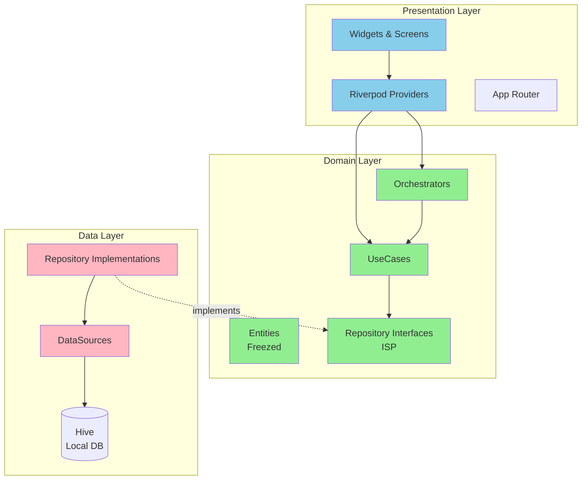

### Légende

| Couleur | Couche | Responsabilité |
|---------|--------|---------------|
| 🟢 Vert | **Domain** | Logique métier pure (indépendante) |
| 🔵 Bleu | **Presentation** | UI et state management |
| 🔴 Rose | **Data** | Accès aux données et persistance |

---

## 🏛️ Clean Architecture - Couches

### Dépendances unidirectionnelles

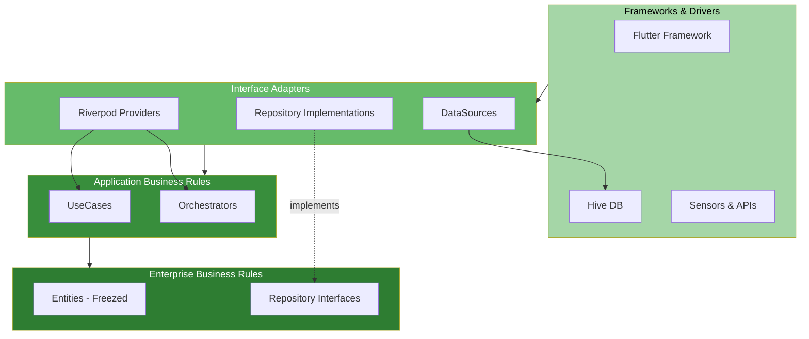

**Règle d'or :** Les flèches pointent toujours vers le centre (Domain). Les couches externes dépendent des couches internes, jamais l'inverse.

---

## 🌱 Flux Intelligence Végétale

### Vue d'ensemble du flux

```mermaid
sequenceDiagram
    participant User
    participant UI
    participant EventBus
    participant Observer
    participant Orchestrator
    participant Analyze as AnalyzeUseCase
    participant Timing as TimingUseCase
    participant Reco as RecoUseCase
    participant Repo as Repositories
    participant DB as Hive DB
    
    User->>UI: Ajoute une plantation
    UI->>EventBus: emit(PlantingAddedEvent)
    EventBus->>Observer: listen(event)
    Observer->>Orchestrator: generateIntelligenceReport(plantId, gardenId)
    
    Note over Orchestrator: Récupère contexte
    Orchestrator->>Repo: getPlant(plantId)
    Repo-->>Orchestrator: PlantEntity
    Orchestrator->>Repo: getGardenContext(gardenId)
    Repo-->>Orchestrator: GardenContext
    Orchestrator->>Repo: getCurrentWeather(gardenId)
    Repo-->>Orchestrator: WeatherCondition
    
    Note over Orchestrator: Orchestration des 3 UseCases
    
    Orchestrator->>Analyze: execute(plant, weather, garden)
    Analyze-->>Orchestrator: PlantAnalysisResult<br/>(4 conditions + santé)
    
    Orchestrator->>Timing: execute(plant, weather, garden)
    Timing-->>Orchestrator: PlantingTimingEvaluation<br/>(timing optimal?)
    
    Orchestrator->>Reco: execute(plant, analysis, weather, garden)
    Reco-->>Orchestrator: List<Recommendation><br/>(actions prioritaires)
    
    Note over Orchestrator: Combine les résultats
    Orchestrator->>Orchestrator: calculateIntelligenceScore()
    Orchestrator->>Orchestrator: createReport()
    
    Note over Orchestrator: Sauvegarde
    Orchestrator->>Repo: saveAnalysisResult(analysis)
    Repo->>DB: save
    Orchestrator->>Repo: saveRecommendations(recommendations)
    Repo->>DB: save
    
    Orchestrator-->>Observer: PlantIntelligenceReport
    Observer-->>EventBus: (event traité)
    EventBus-->>UI: (via providers)
    UI-->>User: Affiche rapport<br/>+ recommandations
```

### Détail des 3 UseCases

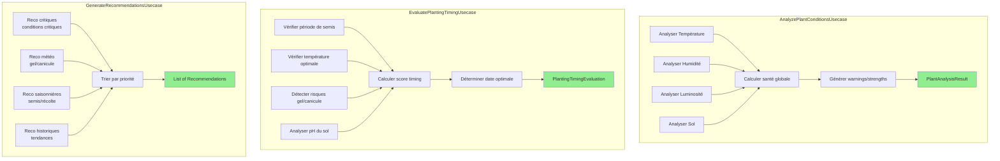

---

## 📡 Architecture Event-Driven

### GardenEventBus Pattern

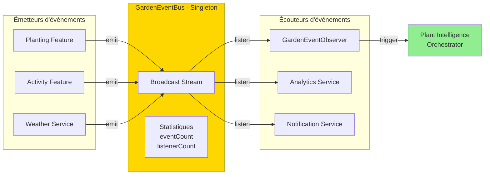

### Types d'événements

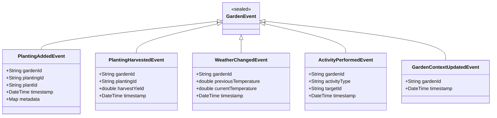

---

## 💉 Injection de dépendances

### Modules Riverpod

```mermaid
graph TB
    subgraph IntelligenceModule[IntelligenceModule - 11 providers]
        DS1[localDataSourceProvider]
        RI[repositoryImplProvider]
        
        subgraph ISP[Interfaces spécialisées - ISP]
            I1[conditionRepositoryProvider]
            I2[weatherRepositoryProvider]
            I3[gardenContextRepositoryProvider]
            I4[recommendationRepositoryProvider]
            I5[analyticsRepositoryProvider]
        end
        
        subgraph UC[UseCases]
            UC1[analyzeConditionsUsecaseProvider]
            UC2[evaluateTimingUsecaseProvider]
            UC3[generateRecommendationsUsecaseProvider]
        end
        
        Orch[orchestratorProvider]
        
        DS1 --> RI
        RI --> I1
        RI --> I2
        RI --> I3
        RI --> I4
        RI --> I5
        
        I1 --> Orch
        I2 --> Orch
        I3 --> Orch
        I4 --> Orch
        I5 --> Orch
        
        UC1 --> Orch
        UC2 --> Orch
        UC3 --> Orch
    end
    
    subgraph GardenModule[GardenModule - 5 providers]
        Hub[aggregationHubProvider]
        GRepo[gardenRepositoryProvider]
        Mig[dataMigrationProvider]
        MigCheck[isMigrationNeededProvider]
        MigStats[migrationStatsProvider]
    end
    
    subgraph Usage[Utilisation]
        AppInit[AppInitializer]
        Providers[Feature Providers]
        Widgets[Widgets]
    end
    
    Orch -.utilisé par.-> AppInit
    Orch -.utilisé par.-> Providers
    I2 -.utilisé par.-> Widgets
    Hub -.utilisé par.-> RI
    
    style IntelligenceModule fill:#E8F5E9
    style GardenModule fill:#E3F2FD
    style ISP fill:#C8E6C9
    style UC fill:#C8E6C9
```

### Flux d'initialisation

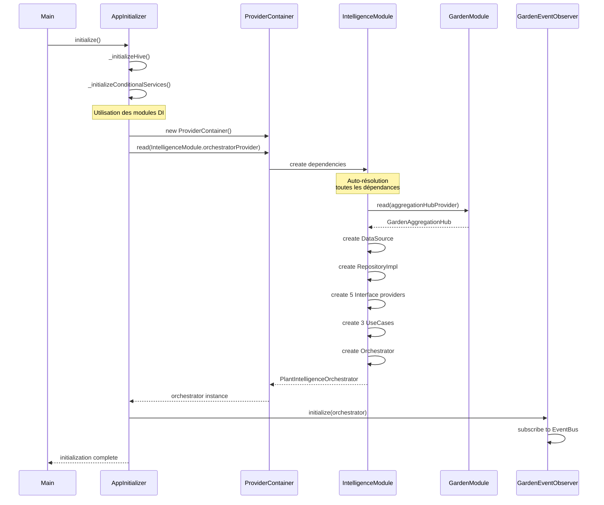

---

## 🗂️ Structure des features

### Feature Plant Intelligence (détaillée)

```mermaid
graph TB
    subgraph PlantIntelligence[features/plant_intelligence/]
        subgraph Domain[domain/]
            subgraph Entities[entities/]
                E1[plant_condition.dart]
                E2[analysis_result.dart]
                E3[intelligence_report.dart]
                E4[recommendation.dart]
                E5[weather_condition.dart]
                E6[garden_context.dart]
            end
            
            subgraph Repositories[repositories/]
                R1[i_plant_condition_repository.dart]
                R2[i_weather_repository.dart]
                R3[i_garden_context_repository.dart]
                R4[i_recommendation_repository.dart]
                R5[i_analytics_repository.dart]
                R6[plant_intelligence_repository.dart<br/>@Deprecated]
            end
            
            subgraph UseCases[usecases/]
                U1[analyze_plant_conditions_usecase.dart]
                U2[evaluate_planting_timing_usecase.dart]
                U3[generate_recommendations_usecase.dart]
            end
            
            subgraph Services[services/]
                S1[plant_intelligence_orchestrator.dart]
            end
        end
        
        subgraph Data[data/]
            subgraph DataSources[datasources/]
                DS1[plant_intelligence_local_datasource.dart]
            end
            
            subgraph RepoImpl[repositories/]
                RI1[plant_intelligence_repository_impl.dart]
            end
        end
        
        subgraph Presentation[presentation/]
            subgraph Providers[providers/]
                P1[plant_intelligence_providers.dart]
            end
            
            subgraph Screens[screens/]
                SC1[intelligence_dashboard_screen.dart]
            end
            
            subgraph Widgets[widgets/]
                W1[intelligence_report_widget.dart]
            end
        end
    end
    
    U1 --> R1
    U1 --> R2
    U2 --> R2
    U2 --> R3
    U3 --> R4
    
    S1 --> U1
    S1 --> U2
    S1 --> U3
    
    RI1 -.implements.-> R1
    RI1 -.implements.-> R2
    RI1 -.implements.-> R3
    RI1 -.implements.-> R4
    RI1 -.implements.-> R5
    
    RI1 --> DS1
    
    P1 --> S1
    SC1 --> P1
    W1 --> P1
    
    style Domain fill:#C8E6C9
    style Data fill:#FFCCBC
    style Presentation fill:#BBDEFB
```

---

## 🔄 Flux de données complet

### Plantation → Analyse → UI

```mermaid
graph TD
    Start([Utilisateur plante<br/>une tomate])
    
    Start --> A1[PlantingProvider.createPlanting]
    A1 --> A2[Sauvegarder dans Hive]
    A2 --> A3[Émettre PlantingAddedEvent]
    
    A3 --> B1{GardenEventBus}
    B1 -->|broadcast| C1[GardenEventObserver.listen]
    
    C1 --> C2{Type d'événement?}
    C2 -->|PlantingAdded| D1[Déclencher analyse]
    
    D1 --> E1[PlantIntelligenceOrchestrator<br/>.generateIntelligenceReport]
    
    E1 --> F1[Récupérer contexte]
    F1 --> F2[getPlant<br/>getGarden<br/>getWeather]
    
    F2 --> G1[AnalyzeUseCase.execute]
    G1 --> G2[PlantAnalysisResult<br/>4 conditions + santé]
    
    G2 --> H1[EvaluateTimingUseCase.execute]
    H1 --> H2[PlantingTimingEvaluation<br/>timing optimal?]
    
    H2 --> I1[GenerateRecommendationsUseCase.execute]
    I1 --> I2[List of Recommendations<br/>actions prioritaires]
    
    I2 --> J1[Combiner résultats]
    J1 --> J2[PlantIntelligenceReport]
    
    J2 --> K1[Sauvegarder résultats]
    K1 --> K2[Conditions → Hive<br/>Recommendations → Hive<br/>Analysis → Hive]
    
    K2 --> L1[Notifier UI via providers]
    L1 --> L2[IntelligenceDashboard<br/>se rafraîchit]
    
    L2 --> End([Utilisateur voit<br/>recommandations])
    
    style Start fill:#90EE90
    style B1 fill:#FFD700
    style J2 fill:#87CEEB
    style End fill:#90EE90
```

### Légende du flux

| Étape | Composant | Couche |
|-------|-----------|--------|
| 🟢 Start/End | User Action | - |
| 🟡 EventBus | Communication | Infrastructure |
| 🔵 Report | Résultat final | Domain |
| 🔴 Hive | Persistance | Data |

---

## 📊 Métriques d'architecture

### Statistiques du projet

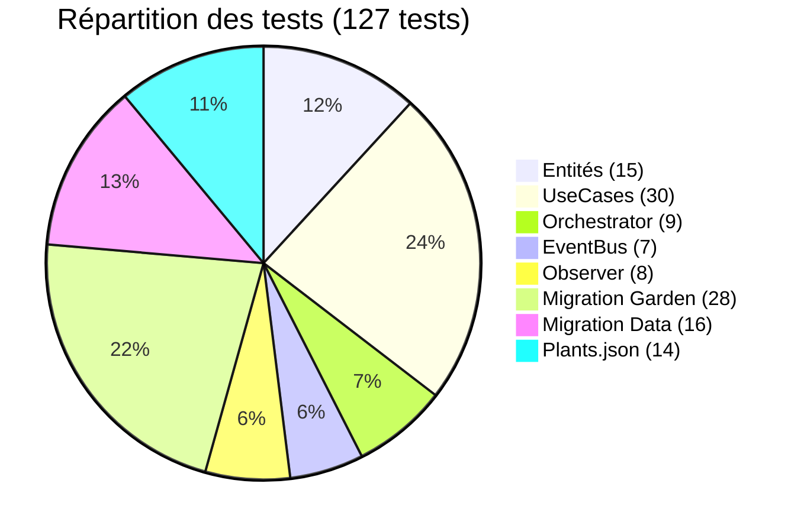

### Couverture de tests par couche

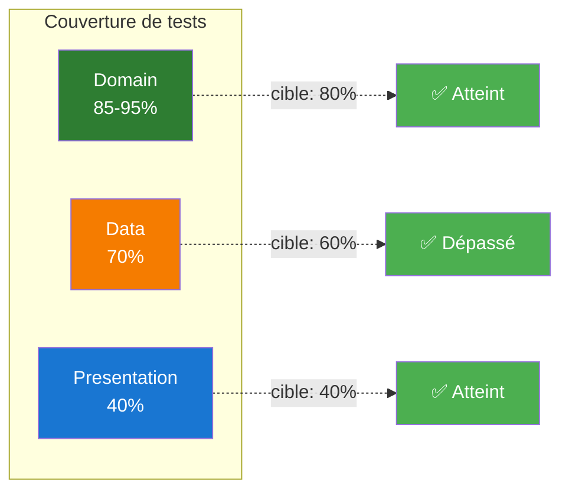

---

## 🎯 Évolution du projet

### Timeline des refactorings (Prompts 1-10)

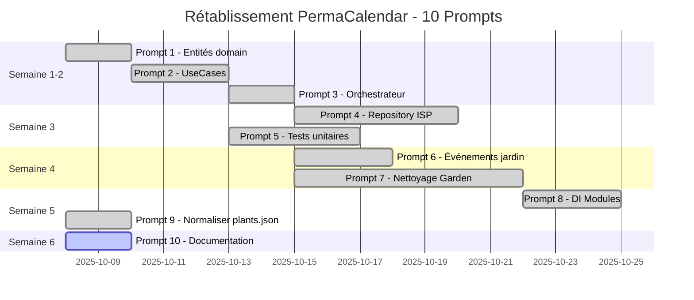

### Avant / Après

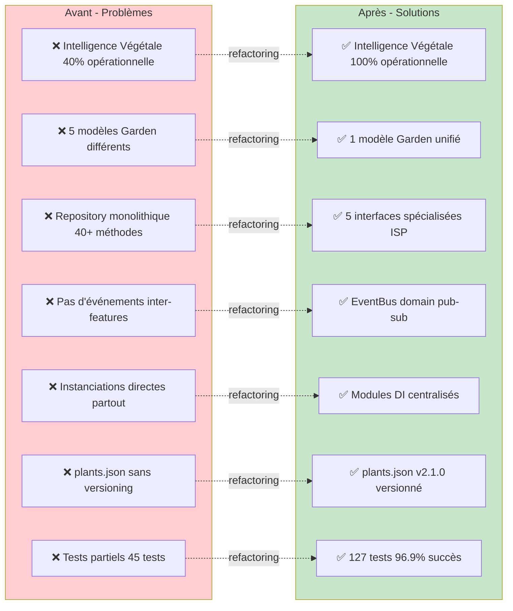

---

## 🎉 Conclusion

L'architecture de PermaCalendar v2.1 est maintenant **Clean**, **testable**, **maintenable** et **évolutive**.

**Principes respectés :**
- ✅ Clean Architecture (3 couches)
- ✅ SOLID complet (ISP ajouté)
- ✅ Event-Driven Architecture
- ✅ Dependency Injection centralisée
- ✅ Feature-based organization

**Métriques :**
- 127 tests (96.9% de succès)
- Couverture domain : 85-95%
- Intelligence Végétale : 100% opérationnelle
- Documentation complète

---

**🌱 Une architecture saine pour un jardin florissant ! ✨**

---

**Liens :**
- [ARCHITECTURE.md](../../ARCHITECTURE.md) - Documentation complète
- [README.md](../../README.md) - Guide de démarrage
- [RETABLISSEMENT_PERMACALENDAR.md](../../RETABLISSEMENT_PERMACALENDAR.md) - Guide de refactoring
